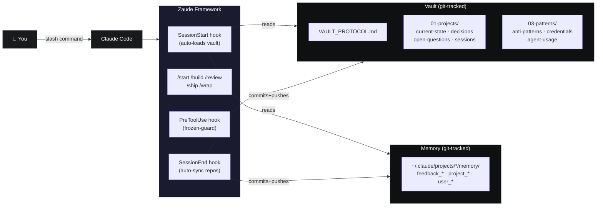
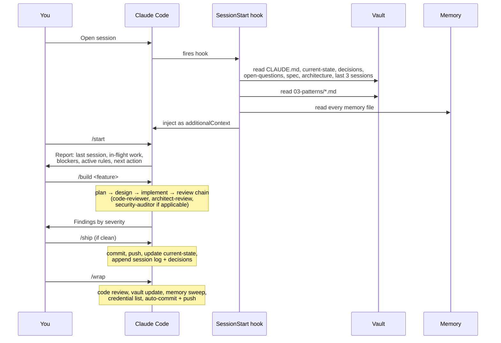

<div align="center">


# Zaude

### Don't vibe code. Zaude code.

**Persistent memory, durable workflow, and production discipline for Claude Code.**

[](./LICENSE)
[](./CHANGELOG.md)
[](https://claude.com/claude-code)
[](#)
[](./CONTRIBUTING.md)

[Install](#-install-in-one-paste) · [Docs](./docs/) · [Architecture](./docs/03-architecture.md) · [Philosophy](./docs/11-best-practices.md) · [Examples](./examples/)

</div>

---

## The problem

Claude Code is genuinely capable, but out of the box every session starts cold.

- No memory of past sessions.
- No enforced review before shipping.
- No record of why decisions were made.
- No discipline around credentials, destructive actions, or agent usage.
- You end up **vibe coding** — accepting whatever it produces, shipping without review, forgetting why you chose the approach, repeating the same mistakes next session.

That's fine for a weekend hack. It's **not fine** for a production project.

---

## What Zaude gives you

A complete framework layered on top of Claude Code — installed in `~/.claude/` and backed by a git-tracked vault — that enforces production discipline mechanically.

| # | Feature | What it does |
|---|---|---|
| 🧠 | **Persistent memory** | SessionStart hook auto-loads the full project vault + feedback rules on every session. No more cold starts. |
| 🔄 | **Append-only decision log** | Every architectural choice recorded with rationale. Future-you never wonders why you picked X over Y. |
| 📦 | **Slash-command workflow** | `/start` · `/build` · `/review` · `/ship` · `/wrap` — review chain runs automatically, gates on CRITICAL/HIGH findings. |
| 🛡️ | **Review gates** | Code review + security audit + architecture review run before commit. You cannot ship garbage by accident. |
| 🔐 | **Credential hygiene** | Credentials pasted inline are scanned at session end and listed for rotation. Never written to the vault. |
| 🚫 | **Frozen zones** | PreToolUse hook blocks writes to paths you marked read-only. Prevents Claude from touching legacy / vendor / production code. |
| 📝 | **Session logs** | Every session produces a dated log: what shipped, what was decided, what was learned, what to rotate. |
| 🗂️ | **Structured vault** | `01-projects/` + `03-patterns/` + `VAULT_PROTOCOL.md`. Portable, git-trackable, machine-readable. |
| 🤖 | **Agent orchestration** | Mechanical triggers for `code-reviewer`, `architect-review`, `security-auditor`, `workflow-orchestrator`, `design-bridge`, `backend-developer`, `frontend-developer`. |
| 🚀 | **Auto-sync** | SessionEnd hook commits + pushes both the vault and your Claude-config repo. No orphaned state. |

---

## ⚡ Install in one paste

**Prerequisites:** [Claude Code](https://claude.com/claude-code) installed, `git` available, Python 3 available, a GitHub account, and `gh` CLI authenticated (`gh auth login`).

Open a new Claude Code session anywhere and paste the entire contents of [`install/setup-prompt.md`](./install/setup-prompt.md). Claude will:

1. Clone Zaude's templates.
2. Create your vault at `~/zaude-vault` (or a path you pick).
3. Install hooks, commands, and `settings.json` into `~/.claude/`.
4. Write `~/.zaude/config.json` with your paths.
5. Scaffold your first project interactively.
6. Create two private GitHub repos (vault + claude-config) and push.
7. Verify the hook fires with a live test.

Or if you prefer a script:

```bash
# macOS / Linux / WSL
curl -fsSL https://raw.githubusercontent.com/ziadmomen10/zaude/main/install/install.sh | bash
```

```powershell
# Native Windows PowerShell
irm https://raw.githubusercontent.com/ziadmomen10/zaude/main/install/install.ps1 | iex
```

Full installation guide: [**docs/02-installation.md**](./docs/02-installation.md)

---

## 🏗 Architecture

Zaude sits between you and Claude Code. Everything in blue is what Zaude adds; everything in grey is what Claude Code already provides.



The critical insight: **hooks enforce; skills suggest.** Anything Zaude guarantees ("context is always loaded", "review always runs", "frozen paths are always blocked") lives in a hook. Anything Zaude merely documents ("how /start reports back", "when to invoke which agent") lives in a skill or a pattern file.

Full architecture walkthrough: [**docs/03-architecture.md**](./docs/03-architecture.md)

---

## 📚 The session lifecycle



---

## 🎯 Who Zaude is for

**A good fit if you:**
- Work on multiple projects in Claude Code and keep re-explaining context
- Ship production code and want review gates that can't be skipped
- Have more than one session per project per week and lose track of decisions
- Want memory that survives laptop loss without any manual copying
- Believe AI-assisted development still benefits from discipline

**Not for you if:**
- You're doing throwaway scripts or weekend hacks — Zaude is overhead
- You use Claude Code for a single-session task and won't come back
- You don't use git (Zaude is built on git for both vault and config)
- You're not ready to commit to a workflow convention

---

## 🆚 vs. alternatives

| | Raw Claude Code | CLAUDE.md alone | [Aider](https://aider.chat) | [Cursor](https://cursor.sh) | **Zaude** |
|---|---|---|---|---|---|
| Persistent cross-session memory | ❌ | ⚠️ manual | ❌ | ⚠️ basic | ✅ **mechanical** |
| Append-only decision log | ❌ | ⚠️ manual | ❌ | ❌ | ✅ |
| Review gates before commit | ❌ | ⚠️ manual | ❌ | ❌ | ✅ **enforced** |
| Frozen-zone protection | ❌ | ❌ | ❌ | ❌ | ✅ |
| Version-controlled config | ❌ | ⚠️ per-project | ❌ | ❌ | ✅ **both vault + config** |
| Works with any editor | ✅ | ✅ | ⚠️ terminal-only | ❌ | ✅ |

---

## 📖 Documentation

| Doc | Topic |
|---|---|
| [01 — Introduction](./docs/01-introduction.md) | What Zaude is, the problem it solves, the vibe-coding opposition |
| [02 — Installation](./docs/02-installation.md) | Step-by-step install on Mac, Linux, Windows |
| [03 — Architecture](./docs/03-architecture.md) | How all the pieces fit together |
| [04 — Vault pattern](./docs/04-vault.md) | Directory layout, file formats, update discipline |
| [05 — Slash commands](./docs/05-commands.md) | Every command explained with examples |
| [06 — Hooks](./docs/06-hooks.md) | What each hook does, when it fires, how to customize |
| [07 — Memory system](./docs/07-memory.md) | The 4 memory types and auto-memory rules |
| [08 — Agents](./docs/08-agents.md) | Agent triggers, install instructions for wshobson + VoltAgent |
| [09 — MCP servers](./docs/09-mcps.md) | Obsidian, Playwright, GitHub — optional integrations |
| [10 — Workflow](./docs/10-workflow.md) | Session lifecycle walkthrough |
| [11 — Best practices](./docs/11-best-practices.md) | Do's and don'ts — the philosophy |
| [12 — Troubleshooting](./docs/12-troubleshooting.md) | Common issues and fixes |
| [13 — Customization](./docs/13-customization.md) | Adapting Zaude for your workflow |

---

## 🙋 FAQ

**Is this a plugin?** No. Zaude is a set of files + conventions you install into Claude Code's existing extension points (hooks, slash commands, CLAUDE.md). Nothing is monkey-patched.

**Will it work with my existing Claude Code setup?** Yes — Zaude adds files to `~/.claude/` and creates a new vault directory. If you already have a `CLAUDE.md`, Zaude's template won't overwrite it.

**Do I need the 18 agents (wshobson + VoltAgent)?** No. Zaude works without them — you just won't get the automated review chain. Install them separately for the full experience. See [docs/08-agents.md](./docs/08-agents.md).

**What about the Anthropic API?** Zaude doesn't use the API directly. It works inside Claude Code, which has its own auth.

**Private vs public vault?** Both supported. Most users start private. You can flip to public on your own GitHub repo anytime.

**Can I use this with Cursor / Windsurf / Aider?** Not today. Zaude is specifically designed around Claude Code's hook system. Future versions may support other agents if there's demand.

---

## 🛠 Contributing

PRs welcome — see [CONTRIBUTING.md](./CONTRIBUTING.md).

Priority areas:
- Cross-platform install script improvements (Windows-native testing especially)
- Additional pattern files for common project types (React + Supabase, Rails, Django, Go services, etc.)
- Troubleshooting entries from real users
- Translations of the setup prompt and README

---

## 📜 License

[MIT](./LICENSE) — use, modify, ship, sell. Attribution appreciated, not required.

---

## 🙏 Credits

Built by **[Ziad Momen](https://github.com/ziadmomen10)** at UltaHost, codified with Claude Opus.

Inspired by:
- [wshobson/agents](https://github.com/wshobson/agents) — the agent patterns
- [VoltAgent/awesome-claude-code-subagents](https://github.com/VoltAgent/awesome-claude-code-subagents) — orchestration patterns
- [VoltAgent/awesome-design-md](https://github.com/VoltAgent/awesome-design-md) — DESIGN.md pattern
- Everyone in the [Claude Code](https://claude.com/claude-code) community who's shared a hook script or slash command

---

<div align="center">

**Don't vibe code. Zaude code.**

⭐ [Star this repo](https://github.com/ziadmomen10/zaude) if Zaude helps you ship better.

</div>
