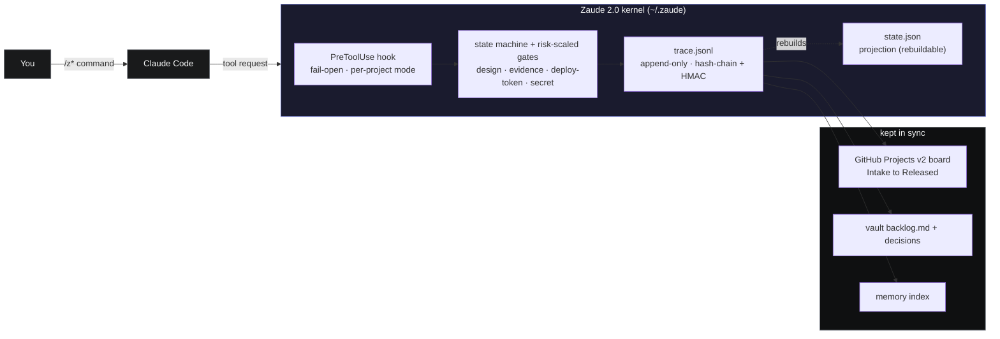

<div align="center">


# Zaude&trade;

### Don't vibe code. Zaude code.

**A Claude Code framework for people who ship to production.**

[](https://github.com/ziadmomen10/zaude/actions/workflows/ci.yml)
[](./LICENSE)
[](./TRADEMARK.md)
[](./CHANGELOG.md)
[](https://claude.com/claude-code)
[](#)
[](./CONTRIBUTING.md)

[What's new in 2.0](#whats-new-in-20) · [Quickstart](#quickstart) · [How it feels](#a-real-session-with-zaude-2) · [Architecture](#architecture) · [Docs](./docs/) · [FAQ](#faq)

</div>

---

## Why this exists

Claude Code is capable. Use it on a real project for a few weeks and you hit three walls:

1. **Every new session starts cold.** Claude forgets everything you did last week.
2. **Nothing stops you from shipping unreviewed code.** It'll happily write, commit, and push on request.
3. **Three weeks later, neither of you remembers why you chose approach X over Y.** The decisions live in conversation logs you can't search.

Zaude 1 closed those holes with hooks, slash commands, and vault conventions — the rule was **hooks enforce, skills suggest. If it matters, it's in a hook.** It worked. But a slash command can still be skipped: say "just ship it" and the review never runs.

**Zaude 2.0 finishes the thought.** The whole workflow becomes a deterministic **kernel** that gates Claude Code's *tools*, not its prompts. The LLM can ask for a tool; a Python `PreToolUse` hook decides whether it's allowed based on where the work actually is in its lifecycle. "Just ship it" stops being a bad habit and becomes **structurally impossible** — the deploy tool won't run until review + verification produced a release token, and that's checked in code, not vibes.

---

## What's new in 2.0

| | Zaude 1 (still here, in [`docs/`](./docs/)) | **Zaude 2.0 (the engine)** |
|---|---|---|
| Enforcement | A few hooks (frozen-guard, vault-sync, freshness) | A **workflow state machine** + risk-scaled gates over every tool call |
| Source of truth | Vault markdown + session logs | **Tamper-evident `trace.jsonl`** (hash-chain + HMAC); `state.json` is a rebuildable projection |
| "Done" | Convention | An **evidence gate** — can't reach Released without passing tests + verification |
| Small work | Same ceremony as big work | A **risk-tier fast lane** — trivial work flows; only T3/T4 gets the full lifecycle |
| Backlog | In your head / a doc | A **GitHub Projects v2 board** (Intake → promote → ship), synced to trace + vault + memory |
| Config | Hand-maintained files | One **`policy.json`** that *generates* the slash commands, agents, and the hook |
| Setup | `install/install.sh` | A **portable kernel** + `install-zaude2.sh` / `.ps1` + `zaude update` |

Zaude 2.0 keeps everything Zaude 1 stood for — persistent memory, durable workflow, production discipline — and makes the workflow part *enforced by an engine* instead of *honored by convention*.

---

## Quickstart

**You need:** Claude Code, `git`, and Python 3.

```bash
git clone https://github.com/ziadmomen10/zaude
bash zaude/install-zaude2.sh                          # lays the kernel into ~/.zaude
python "$HOME/.zaude/bin/zaude.py" gen                # generate the /z* commands + agents
python "$HOME/.zaude/bin/zaude.py" install --yes      # optional: wire them into ~/.claude (z-prefixed)
```

Windows: `powershell -ExecutionPolicy Bypass -File zaude\install-zaude2.ps1`.

The hook **fails open** — projects without a `.zaude/` directory are completely untouched, and you onboard new projects in **shadow mode** first (it logs what it *would* gate, blocks nothing) before you promote to enforce. Add a GitHub PAT at `~/.zaude/secrets/github-pat` (never committed) to light up the PM board.

> Looking for Zaude 1 (the markdown/hooks framework)? It's unchanged and fully documented in [`docs/`](./docs/) and [`install/`](./install/).

---

## A real session with Zaude 2

```text
$ cd ~/ultahr && claude

> /zstart
  Project ultahr — state: Released · risk T2 · 2 ideas in Intake · backlog board synced

# you drop an idea into your Intake column (GitHub or one command)
> /zintake "export the employee directory as CSV for payroll"
  intake ZI-004 added.

# you say "work on it" — the agent does the PM busywork
> /zpromote ZI-004 ...
  ZI-004 -> Feature ZA-2026-00002 (user story + acceptance criteria + 3 tech-tasks). Backlog.

# the agent tries to write code on a fresh, risky task...
  [Zaude BLOCKED] src/export.py — design-before-impl: high-risk work needs /design + /approve first.

# ...follows the process (or, for small work, /zfast collapses it to one step)
> /zapprove ...
> ...implement... run tests...  8/8 green
> /zship
  refused — review ledger not clean. (runs the panel, fixes, retries)
  Released. deploy token issued. board card -> Released. trace: 14 signed rows.
```

You can't write source on risky work before it's designed. You can't ship before tests pass. The board, the vault, and the signed trace stay in sync the whole time. For a one-line fix, `/zfast` + `/zfast-ship` does it in two commands — the engine is light by default and only tightens when the work is actually risky.

---

## Architecture



One append-only, signed trace is the source of truth; everything else (state, the board, the vault mirror, the memory index) is a projection of it. The LLM narrates; the hooks decide. Deeper walkthrough in [**docs/15-zaude-2-engine.md**](./docs/15-zaude-2-engine.md).

---

## Compared to the alternatives

| | Raw Claude Code | `CLAUDE.md` alone | Zaude 1 | **Zaude 2.0** |
|---|---|---|---|---|
| Cross-session memory | None | Manual | Mechanical | **Mechanical + signed** |
| Append-only decision log | No | Manual | Yes | **Tamper-evident trace** |
| Review gate before commit | No | Manual | Enforced (skippable cmd) | **Tool-gated; un-skippable** |
| "Done" requires evidence | No | No | No | **Yes (evidence gate)** |
| Risk-scaled (small work flows) | n/a | n/a | No | **Yes (fast lane)** |
| GitHub Projects backlog | No | No | No | **Yes (synced both ways)** |
| Portable install + update | Manual | Manual | install.sh | **kernel + `zaude update`** |

---

## Documentation

Zaude 1's full user guide is in [`docs/`](./docs/) (chapters 01–14) and stays accurate. Zaude 2.0 adds:

| | Chapter | Topic |
|---|---|---|
| 15 | [The 2.0 engine](./docs/15-zaude-2-engine.md) | Kernel, state machine, trace, gates, fast lane, install/update |

The original chapters (architecture, vault, commands, hooks, memory, agents, workflow, best practices) describe the conventions Zaude 2.0 builds on and still honors.

---

## FAQ

**Is Zaude 2.0 a plugin?** No — same as Zaude 1. Nothing is installed *inside* Claude Code. The kernel is a set of `~/.zaude/` Python files (stdlib only) plus one `PreToolUse` hook. Uninstall with `zaude uninstall`.

**Will it touch my existing projects?** No. The hook fails open: any directory without a `.zaude/` marker is untouched. You onboard projects deliberately, in shadow mode first.

**Does the engine slow Claude down?** The hook runs only on file-mutating tools and targets <150 ms. Non-onboarded projects exit instantly.

**Does Zaude call the Anthropic API?** No. It runs entirely inside Claude Code.

**Do I lose Zaude 1?** No. v1's hooks, commands, templates, and docs are all still here. v2 is the engine; you can run the v1 conventions alongside it.

**Multiple machines?** Yes — `git clone` + `install-zaude2.sh`, or `zaude update --source https://github.com/ziadmomen10/zaude`. The PAT lives only in `~/.zaude/secrets` and is never committed.

---

## Contributing

[`CONTRIBUTING.md`](./CONTRIBUTING.md) has the full guide. Opening a PR implies the lightweight contributor agreement: your code lands under MIT, the Zaude name stays with the project.

---

## License and name

**Code:** [MIT](./LICENSE). Use it, fork it, ship it, sell it — attribution appreciated.

**Zaude™:** an unregistered trademark of Ziad Momen. If you fork and substantially modify, rename your fork. See [TRADEMARK.md](./TRADEMARK.md).

---

## Credits

Built by **[Ziad Momen](https://github.com/ziadmomen10)** at UltaHost.

Agent patterns adapted from [wshobson/agents](https://github.com/wshobson/agents) and [VoltAgent/awesome-claude-code-subagents](https://github.com/VoltAgent/awesome-claude-code-subagents). Thanks to the [Claude Code](https://claude.com/claude-code) community.

---

<div align="center">

**Don't vibe code. Zaude code.**

If Zaude saves you a session's worth of re-explaining, consider [starring the repo](https://github.com/ziadmomen10/zaude).

</div>
