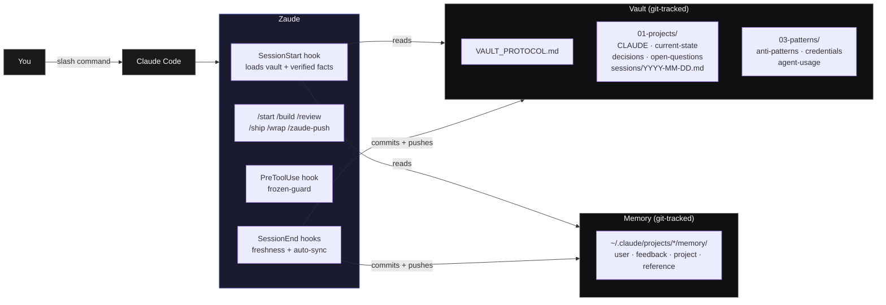

<div align="center">


# Zaude&trade;

### Don't vibe code. Zaude code.

**A Claude Code framework for people who ship to production.**

[](https://github.com/ziadmomen10/zaude/actions/workflows/ci.yml)
[](./LICENSE)
[](./TRADEMARK.md)
[](./CHANGELOG.md)
[](https://claude.com/claude-code)
[](#)
[](./CONTRIBUTING.md)

[Quickstart](#quickstart) · [How it feels](#a-real-session-with-zaude) · [Architecture](#architecture) · [Docs](./docs/) · [FAQ](#faq)

</div>

---

## Why this exists

Claude Code is capable. Use it on a real project for a few weeks and you hit three walls:

1. **Every new session starts cold.** Claude forgets everything you did last week.
2. **Nothing stops you from shipping unreviewed code.** It'll happily write, commit, and push on request.
3. **Three weeks later, neither of you remembers why you chose approach X over Y.** The decisions live in conversation logs you can't search.

Zaude closes those holes. It isn't a plugin — there's nothing installed *inside* Claude Code. It's a set of hooks, slash commands, and vault conventions that layer on top and give you mechanical discipline:

- Your project context auto-loads on every session. No more re-explaining.
- A code review runs before any commit. Every time. You can't accidentally skip it.
- Every architectural decision lands in an append-only log, tracked in git.
- Secrets you paste get flagged for rotation at session end. They never touch the vault.
- Paths you mark "frozen" get blocked at the tool-call level. Claude literally cannot edit them.

The unifying rule: **hooks enforce, skills suggest.** If it matters, it's in a hook.

---

## Quickstart

**You need:** Claude Code, `git`, Python 3, a GitHub account, and `gh` CLI (`gh auth login`).

**Path A — one paste, interactive walkthrough.**

Open a new Claude Code session. Paste the block from [`install/setup-prompt.md`](./install/setup-prompt.md). Claude asks where your vault should live, what to name your first project, whether to set up frozen zones — then runs each install step after showing you what it's about to do. You approve each one. Takes about 5 minutes.

**Path B — shell script, non-interactive.**

```bash
# macOS / Linux / WSL
curl -fsSL https://raw.githubusercontent.com/ziadmomen10/zaude/main/install/install.sh | bash
```

```powershell
# Windows native PowerShell
irm https://raw.githubusercontent.com/ziadmomen10/zaude/main/install/install.ps1 | iex
```

Both paths end the same way: two new private GitHub repos (your vault and your Claude-config), hooks installed in `~/.claude/`, and a live verification that the SessionStart hook fires. Full walkthrough with troubleshooting in [**docs/02-installation.md**](./docs/02-installation.md).

---

## A real session with Zaude

This is what a typical workflow looks like after install:

```text
$ cd ~/my-app
$ claude

> /start

Reading vault... (hook already loaded it; this is just the report)

  Project:      my-app
  Last session: 2026-04-15 — shipped password reset end-to-end
  In flight:    forgot-password rate-limit design (open-questions Q3)
  Blockers:     none
  Next action:  decide rate-limit strategy (in-memory vs Redis)

Ready.

> /build add a password strength meter to the signup form

Plan (workflow-orchestrator):
  1. design-bridge — brief DESIGN.md rules for form components
  2. frontend-developer — component design (props, file paths, classes)
  3. implement
  4. code-reviewer on the diff
  5. architect-review REVIEW mode

[walks each step, agents report back inline, no surprises]

Findings:
  HIGH     none
  MEDIUM   1 — consider extracting the strength algorithm into a hook
  LOW      2 — naming nits

Recommend /ship? (your call)

> /ship

Review chain clean.
Commit: e7d9c3a — feat(signup): password strength meter
Pushed to main.
Vault: current-state.md + sessions/2026-04-17.md updated, decisions.md
appended with the extraction decision, freshness block regen'd, gate green.
Vault pushed.

Credentials to rotate this session: none.

> /wrap

Final code-reviewer pass... clean.
Memory sweep... one new feedback memory captured.
Status-freshness block regenerated.
Validator gate: OK.
Vault committed + pushed.

Session wrapped. Safe to close.
```

No prompts about context. No risk of an unreviewed commit. Every decision captured.

---

## What you actually get

| Piece | What it does | Where it lives |
|---|---|---|
| **SessionStart hook** | On every session open: reads `CLAUDE.md`, `current-state.md`, `decisions.md`, `open-questions.md`, last 3 session logs, cross-project patterns, and local memory. Injects all of it as `additionalContext` before Claude's first turn. | `hooks/session-start-vault.py` |
| **Status-freshness enforcement** *(new in v0.3.0)* | `/wrap` regenerates a machine-readable verified-facts block at the top of `current-state.md`. Next `/start` shows those facts above the narrative prose, so Claude can't anchor to stale summaries. A validator gate in `/wrap` refuses to commit a stale block. | `hooks/lib/freshness_parse.py` + `regen-freshness.py` + `current-state-freshness.py` |
| **Slash commands** | `/start` — report where you left off. `/build <feature>` — run the full chain (plan → design → implement → review). `/review` — review the current diff only. `/ship` — review then commit + push + update vault. `/wrap` — close the session cleanly. | `commands/` |
| **Frozen zones** | `PreToolUse` hook blocks Edit/Write to paths whose names match your `frozen_zones` list. Override requires you to say so in plain English. | `hooks/frozen-guard.py` |
| **Vault pattern** | Opinionated layout: `01-projects/<slug>/{CLAUDE,current-state,decisions,open-questions,spec,architecture}.md` + `sessions/YYYY-MM-DD.md` + `03-patterns/` shared rules. Portable, git-trackable, diffable. | `~/zaude-vault/` |
| **Memory system** | Four memory types (user, feedback, project, reference). Auto-memory writes during the session; `/wrap` sweeps for anything that slipped past. Tracked in a separate git repo from the vault. | `~/.claude/projects/<cwd>/memory/` |
| **Auto-sync** | SessionEnd hook commits and pushes both the vault and your Claude-config repo. Framework improvements flow upstream to Zaude via `/zaude-push` (PR-only, never direct to main). | `hooks/session-end-vault-sync.sh` + `install/zaude-sync.sh` |
| **Agent orchestration** | Triggers for 29 agents at v0.5 target. As of v0.5 PR 2: 24 shipped (18 core + `debugger`, `postgres-pro`, `sql-pro`, `python-pro`, `prompt-engineer`, `refactoring-specialist`). Remaining 5 specialists — `react-specialist`, `docker-expert`, `documentation-engineer`, `accessibility-tester`, `mcp-developer` — land across PRs 3-4. Core set: `code-reviewer`, `architect-review`, `security-auditor`, `workflow-orchestrator`, `design-bridge`, `backend-developer`, `frontend-developer`, plus infra/language specialists. Write-capable specialists ship `-readonly` variants for Zaude's read-only commands. | `agents/` |

---

## Architecture



Two git repositories, four hooks, six slash commands, and the idea that anything the framework guarantees must live in a hook — not a prompt Claude can skip. Deeper walkthrough in [**docs/03-architecture.md**](./docs/03-architecture.md).

---

## Who should use Zaude

**A good fit if you:**
- Run more than one Claude Code session per project per week.
- Ship to production and want review gates that can't be skipped.
- Hit the cold-start problem every session and are tired of re-explaining context.
- Want your decision history to survive a laptop loss without manual backups.

**Skip it if you:**
- Use Claude Code for throwaway scripts or weekend hacks — Zaude is overhead.
- Don't use git. The whole framework sits on git.
- Want something you install and forget. Zaude expects you to engage with the workflow.

---

## Compared to the alternatives

| | Raw Claude Code | `CLAUDE.md` alone | [Aider](https://aider.chat) | [Cursor](https://cursor.sh) | **Zaude** |
|---|---|---|---|---|---|
| Cross-session memory | None | Manual | None | Basic | **Mechanical** |
| Append-only decision log | No | Manual | No | No | **Yes** |
| Review gate before commit | No | Manual | No | No | **Enforced** |
| Status-freshness enforcement | No | No | No | No | **Yes** (v0.3) |
| Frozen-zone protection | No | No | No | No | **Yes** |
| Version-controlled config | No | Per-project | No | No | **Both vault + config** |
| Works with any editor | Yes | Yes | Terminal-only | No | **Yes** |

Zaude doesn't replace Claude Code. It adds the layer that makes Claude Code usable on production projects without babysitting.

---

## Documentation

Full user guide in [`docs/`](./docs/). Read in order if you're new; cherry-pick if you know what you need.

| | Chapter | Topic |
|---|---|---|
| 01 | [Introduction](./docs/01-introduction.md) | The problem, the opposition to vibe coding |
| 02 | [Installation](./docs/02-installation.md) | macOS / Linux / WSL / Windows — 5-10 min |
| 03 | [Architecture](./docs/03-architecture.md) | How hooks, commands, vault, memory fit together |
| 04 | [Vault pattern](./docs/04-vault.md) | Directory layout, file formats, update discipline |
| 05 | [Slash commands](./docs/05-commands.md) | Each command explained with examples |
| 06 | [Hooks](./docs/06-hooks.md) | What each hook does and when it fires |
| 07 | [Memory system](./docs/07-memory.md) | The 4 memory types and auto-memory rules |
| 08 | [Agents](./docs/08-agents.md) | Installing and using wshobson + VoltAgent |
| 09 | [MCP servers](./docs/09-mcps.md) | Obsidian, Playwright, GitHub — optional |
| 10 | [Workflow](./docs/10-workflow.md) | Session lifecycle walkthrough |
| 11 | [Best practices](./docs/11-best-practices.md) | Do's, don'ts, philosophy |
| 12 | [Troubleshooting](./docs/12-troubleshooting.md) | Common issues and fixes |
| 13 | [Customization](./docs/13-customization.md) | Adapting Zaude for your workflow |
| 14 | [Auto-sync](./docs/14-auto-sync.md) | Propagating framework improvements upstream via PR |

See also: [`examples/`](./examples/) — a complete worked example (the `notekit` project) that shows the vault layout, session logs, and a realistic series of `/build` + `/ship` cycles.

---

## FAQ

**Is Zaude a plugin?** No. Everything lives at Claude Code's existing extension points — hooks, slash commands, `CLAUDE.md`. Nothing is monkey-patched. Uninstall by deleting the files.

**Will it break my existing Claude Code setup?** No. The installer adds files to `~/.claude/` and never overwrites an existing `CLAUDE.md`. You can run Zaude alongside your current config.

**Do I need all 29 agents?** No. Zaude works without them — you just lose the automated review chain in `/build`. The core is 18 (14 wshobson + 4 core VoltAgent); the 11 v0.5 specialists are additive and land incrementally across v0.5 PRs. Skill files degrade gracefully when an agent isn't installed. See [docs/08-agents.md](./docs/08-agents.md).

**Does Zaude call the Anthropic API?** No. Zaude runs entirely inside Claude Code, which has its own authentication.

**Public or private vault?** Both work. Most users start private (the installer defaults to private). You can flip to public on your GitHub repo anytime.

**Does it work with Cursor / Windsurf / Aider?** Not today. Zaude is built around Claude Code's hook system specifically. Other agents are future work if there's demand.

**Can I use Zaude on multiple machines?** Yes. Both the vault and the Claude-config are git repos — clone them on your second machine, update `~/.zaude/config.json` with local paths, done.

**What if I lose my laptop?** You lose nothing. The vault, config, and memory files are all in private GitHub repos you push to after every session. Clone them back and you're where you left off.

---

## Contributing

[`CONTRIBUTING.md`](./CONTRIBUTING.md) has the full guide. Priority areas:

- Native Windows testing (the install script and hooks have been tested mainly on Git Bash / WSL)
- Pattern files for common stacks: React + Supabase, Rails, Django, Go services, Next.js
- Troubleshooting entries from real installs that hit edge cases
- Translations of the setup prompt and key docs

Opening a PR implies the contributor agreement in `CONTRIBUTING.md` — the deliberately lightweight version: your code lands under MIT, the Zaude name stays with the project.

---

## License and name

**Code:** [MIT](./LICENSE). Use it, fork it, ship it, sell it — attribution appreciated.

**Zaude™:** an unregistered trademark of Ziad Momen. If you fork and substantially modify, rename your fork. See [TRADEMARK.md](./TRADEMARK.md) for the policy.

Same split as Rust, Python, Linux, Kubernetes: permissive code license, protected name. The goal is keeping "Zaude" meaningful for people who adopt it — not restricting legitimate use.

---

## Credits

Built by **[Ziad Momen](https://github.com/ziadmomen10)** at UltaHost.

Agent patterns adapted from [wshobson/agents](https://github.com/wshobson/agents) and [VoltAgent/awesome-claude-code-subagents](https://github.com/VoltAgent/awesome-claude-code-subagents). `DESIGN.md` convention from [VoltAgent/awesome-design-md](https://github.com/VoltAgent/awesome-design-md). Thanks to the [Claude Code](https://claude.com/claude-code) community for every shared hook script and slash command that informed this design.

---

<div align="center">

**Don't vibe code. Zaude code.**

If Zaude saves you a session's worth of re-explaining, consider [starring the repo](https://github.com/ziadmomen10/zaude).

</div>
