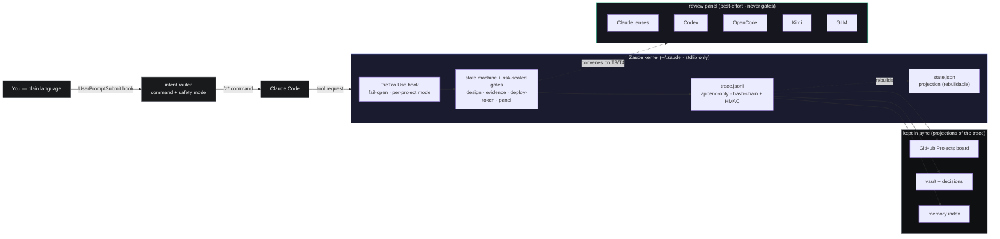

<div align="center">


# Zaude&trade;

### Don't vibe code. Zaude code.

**The autonomous, self-governing layer on top of Claude Code — for people who ship to production.**

[](https://github.com/ziadmomen10/zaude/actions/workflows/ci.yml)
[](./LICENSE)
[](./TRADEMARK.md)
[](#what-is-zaude-3)
[](#version)
[](https://claude.com/claude-code)
[](#)

[Quickstart](#quickstart) · [What is Zaude 3](#what-is-zaude-3) · [How you use it](#how-you-actually-use-it) · [The review panel](#the-model-diverse-review-panel) · [Commands](#command-reference) · [Architecture](#architecture) · [Docs](./docs/) · [FAQ](#faq)

</div>

---

Zaude turns Claude Code into a workflow that **enforces quality, remembers everything, and drives itself.** It's not a plugin and it never calls an API — it's a small, stdlib-only Python **kernel** plus a few Claude Code hooks. You describe what you want in plain language; Zaude routes it to the right step, walks a signed review→verify→ship lifecycle you can't accidentally skip, and reviews the result with a **panel of different AI models**. Then it picks up next session right where you left off, with the reasons intact.

---

## Quickstart

**Prerequisites:** [Claude Code](https://claude.com/claude-code), `git`, Python 3.

**1 — Install the kernel** (≈30 s, fully reversible with `zaude uninstall`):

```bash
git clone https://github.com/ziadmomen10/zaude
bash zaude/install-zaude2.sh                        # lay the kernel into ~/.zaude
python "$HOME/.zaude/bin/zaude.py" gen              # generate the /z* commands + agents
python "$HOME/.zaude/bin/zaude.py" install --yes    # wire them into ~/.claude (z-prefixed)
```
*Windows:* `powershell -ExecutionPolicy Bypass -File zaude\install-zaude2.ps1`, then the same `gen` + `install`.

**2 — Onboard one project** (the kernel ignores every project that hasn't been onboarded):

```bash
cd ~/my-app && claude
> /zonboard --mode shadow     # scaffold + watch: logs what it WOULD gate, blocks NOTHING
# …work normally for a while, build trust…
> /zonboard                   # re-run to switch enforcement ON (enforce is the default)
```

**3 — Just talk to it.** No command memorization — describe the goal and routing does the rest:

```text
> where did we leave off?
> add a CSV export of the employee directory for payroll
> ship it
```

That's the whole loop. Everything below explains what's happening under the hood.

> Optional: drop a GitHub PAT at `~/.zaude/secrets/github-pat` to light up the [PM board](#command-reference), and authenticate any [review-panel seats](#the-model-diverse-review-panel) you want.

<a name="version"></a>
> **Version note.** **Zaude 3** is the current *generation* (autonomous, intent-routed, model-diverse review). The enforcement *kernel* it runs on is independently versioned — currently **v0.2.0**. The installer is named `install-zaude2.*` because it installs that enforcement-kernel lineage; the legacy `install.sh` / `install.ps1` are the original **Zaude 1** (conventions-only) installer.

---

## Why this exists

Use Claude Code on a real project for a few weeks and you hit four walls:

1. **Every session starts cold** — it forgets what you did last week.
2. **Nothing stops it shipping unreviewed code** — say "just ship it" and it will.
3. **One reviewer, one blind spot** — a single model misses what a different model would catch.
4. **You babysit the workflow** — typing the same commands, re-explaining the same decisions.

**Zaude 1** closed the memory + workflow gaps by *convention*. **Zaude 2** turned the workflow into an *enforcement engine* — a signed state machine that gates Claude Code's *tools*, so process can't be skipped, only logged-and-waived. **Zaude 3** makes that engine **autonomous and self-reviewing**.

---

## What is Zaude 3

Three capabilities turn the enforcement engine into something that runs *itself*:

### 🧭 Intent routing — say what you want, not which command
You don't memorize the dozens of slash-commands. A `UserPromptSubmit` hook reads every plain-language request, maps it to the right command, and tags it with a **safety mode**:

| Mode | When | Behavior |
|---|---|---|
| **auto** | read-only / safe | runs and reports |
| **propose** | mutating | does the work, keeps going; hard-stops only on a real risk |
| **confirm** | destructive / irreversible | **always asks first — structurally; a destructive command can never auto-run** |

You type a `/command` only to *override* the routing. Kill switch: `~/.zaude/disabled` or `ZAUDE_DISABLE=1` silences it instantly.

### 🔀 Adaptive flows — ceremony scaled to risk
One size never fit all work. Zaude opens a **task-typed flow** (`bugfix` / `audit` / `research` / `grooming` / `build`) that records only the stages that matter and honestly marks the ones that don't. A trivial fix takes the **fast lane** (two commands); an auth migration walks the full design → review → verify → ship chain. Risk tiers **T0–T4** decide which — light by default, strict only when the work is actually risky.

### 👥 A model-diverse review panel — five seats, no single point of failure
High-risk work is reviewed by **five independent seats**, each forming its own verdict: **Claude lenses** (code-reviewer / architect-review / security-auditor) + **Codex** (GPT) + **OpenCode** + **Kimi** (Moonshot) + **GLM** (Zhipu). Uncorrelated models catch what one model can't. They're *best-effort* — a missing or rate-limited reviewer never blocks you — but an **available** reviewer can't be *silently* dropped on risky work. [Details ↓](#the-model-diverse-review-panel)

**The foundation under all three** is the Zaude 2 kernel: an append-only, hash-chained + HMAC'd **`trace.jsonl`** is the single source of truth; `state.json`, the GitHub board, the vault, and the memory index are all rebuildable **projections** of it. The LLM narrates; the kernel decides. A forged or hand-edited transition fails closed.

Plus the **operator-learning layer**: a **persona** that learns to *decide as you would* (advisory only — it never overrides an explicit instruction or a safety gate) and a searchable **collective memory** of lessons and decisions. Both are operator-private, secret-redacted, and never pushed.

---

## How you actually use it

The point of Zaude 3 is that you **stop driving the workflow by hand.** A real session:

```text
$ cd ~/my-app && claude

> where did we leave off?
  [Zaude route] /zstart (auto)
  Project my-app — state: Released · risk T2 · 2 ideas in Intake · board synced.

> add a CSV export of the employee directory for payroll
  [Zaude route] /zbuild (propose)
  → plan → design (architect-review) → risk T2 → implement → tests 8/8 green
  → review panel: Claude + Codex + Kimi + GLM … 1 HIGH (Codex) fixed → clean
  → verified. ready to ship.

> ship it
  [Zaude route] /zship (confirm)  ⚠ destructive — confirm? (y/N)
```

The kernel keeps you honest:

- You **can't write source on high-risk work** before it's designed and approved (the `PreToolUse` hook blocks the edit).
- You **can't reach a release token** without a recorded passing test exit code + a verification record (the evidence gate — *driver-attested*, cross-checked by the `evidence-verifier` agent; the kernel can't run your tests for you).
- The panel **can't be silently skipped** on T3/T4 work.

For a one-line fix the fast lane collapses all of it to `/zfast` + `/zfast-ship`. Every transition lands in the signed trace, and the board, vault, decision log, and memory stay in sync — so next session (after a `git clone` + install on a new machine, or in place) it resumes with the reasons intact.

> Prefer to drive manually? Every step is still a real command (`/zplan`, `/zdesign`, `/zreview`, …). Routing is a convenience, not a cage.

---

## The model-diverse review panel

The headline Zaude 3 upgrade. On T3/T4 work, `/zreview` convenes up to five seats — each reviews independently, then Claude (as lead) synthesizes the verdicts:

| Seat | Model | Role | Authenticate with |
|---|---|---|---|
| **Claude lenses** | session model | code-reviewer · architect-review · security-auditor | *(none — built in)* |
| **Codex** | GPT (5.x) | second, uncorrelated correctness reviewer | `codex login` |
| **OpenCode** | provider-agnostic | model-diverse breadth (Gemini / GPT / local) | `opencode auth login` |
| **Kimi** | Moonshot `kimi-for-coding` | whole-repo / long-spec comprehension | `kimi login` |
| **GLM** | Zhipu / z.ai | extra diverse voice (via a `claude-glm` drop-in) | z.ai key → `~/.zaude/secrets/zai` |

**Honest by design.** Seats are best-effort and **never gate** — the ship gate reads only your *unresolved CRITICAL/HIGH* count, which the driver folds verdicts into. A genuinely-unavailable reviewer (not installed / not logged in / out of credit) is recorded and skipped without blocking. But an **available-but-skipped** seat on risky work blocks a "clean" review until you actually run it or record a deliberate `--skip-<seat>-ack`. Check any seat with `/zcodex`, `/zopencode`, `/zkimi`, `/zglm`. **Add seats one at a time** — the panel widens, the contract stays identical, and zero external seats just means the Claude lenses review alone.

---

## Command reference

You rarely type these (routing does) — but here's the map. `/z*` slash commands wrap `python "$HOME/.zaude/bin/zaude.py" <cmd>`.

| Group | Commands |
|---|---|
| **Setup / resume** | `/zonboard` · `/zstart` · `/zstatus` · `/zdoctor` |
| **Lifecycle** | `/zclarify` → `/zprioritize` → `/zplan` → `/zdesign` → `/zclassify-risk` → `/zapprove` → `/zimplement` → `/ztest` → `/zreview` → `/zverify` → `/zshippable` → `/zship` → `/zclose` |
| **Fast / adaptive** | `/zfast` · `/zfast-ship` · `/zflow` · `/zflow-finish` |
| **Autonomous build** | `/zbuild` (plan→…→verify, driven to done-with-evidence) · `/znext` · `/zdod` |
| **Board (multi-item)** | `/zboard` · `/zintake` · `/zpromote` · `/zitem-activate` · `/zboard-next` · `/zboard-dod` · `/zpm-sync` |
| **Review seats** | `/zcodex` · `/zopencode` · `/zkimi` · `/zglm` |
| **Memory / persona** | `/zremember` · `/zrecall` · `/zpersona` |
| **Integrity** | `/ztrace-verify` · `/zrepair` · `/zwaive` (logged gate bypass) |

---

## Architecture



Deeper dives: [**docs/15** — the enforcement kernel](./docs/15-zaude-2-engine.md), [**docs/16** — routing, persona & memory](./docs/16-operator-learning-layer.md), [**docs/17** — the agent ecosystem](./docs/17-agent-ecosystem.md), [**docs/18** — the threat model](./docs/18-threat-model.md) (what the gates honestly do and don't defend).

---

## Compared to the alternatives

| | Raw Claude Code | `CLAUDE.md` alone | Zaude 1 | Zaude 2 | **Zaude 3** |
|---|---|---|---|---|---|
| Cross-session memory | None | Manual | Mechanical | Mechanical + signed | **+ persona + recall** |
| Review before commit | No | Manual | Skippable command | Tool-gated | **5-model panel; no silent skip** |
| "Done" requires evidence | No | No | No | Yes | **Yes (attested + agent-checked)** |
| Risk-scaled / fast lane | n/a | n/a | No | Yes | **Yes + adaptive task flows** |
| Drives itself | No | No | No | No | **Yes — intent-routed + autonomous loop** |
| Source of truth | — | files | vault md | signed trace | **signed trace (+ per-item sub-traces)** |

---

## FAQ

**Is this a plugin?** No. Nothing is installed *inside* Claude Code — the kernel is `~/.zaude/` Python (stdlib only) plus a couple of hooks. Uninstall: `zaude uninstall`.

**Will it touch my existing projects?** No. The hook fails open: any directory without a `.zaude/` marker is untouched. You onboard deliberately, and shadow mode lets you watch before it gates anything.

**Does Zaude call the Anthropic API?** No — it runs entirely inside Claude Code. (The *review seats* call their own providers only when you've authenticated them, and never block you if you haven't.)

**Do the extra review models cost money?** Only the ones you enable, and only if your plan with that provider is metered. No external seats configured = the Claude lenses review alone. Nothing is required.

**Does the autonomy ever do something destructive on its own?** No. Destructive commands are *structurally* `confirm`-mode — they can never auto-run. The persona is advisory only; an explicit instruction and a safety gate always win.

**Where do persona / memory live — are they pushed?** Operator-private under `.zaude/persona/` and `.zaude/memory/` (gitignored), every persisted string secret-redacted, never committed or synced.

**Do I lose Zaude 1 / 2?** No — the kernel is additive. The v1 conventions and the v2 engine are all still here and documented in [`docs/`](./docs/).

**Multiple machines?** `git clone` + `install-zaude2.sh`, or `zaude update --source https://github.com/ziadmomen10/zaude`. Secrets live only in `~/.zaude/secrets/` and are never committed.

---

## License and name

**Code:** [MIT](./LICENSE). Use it, fork it, ship it, sell it — attribution appreciated.
**Zaude™:** an unregistered trademark of Ziad Momen. Fork and substantially modify ⇒ rename your fork. See [TRADEMARK.md](./TRADEMARK.md).

## Credits

Built by **[Ziad Momen](https://github.com/ziadmomen10)** at UltaHost. Agent patterns adapted from [wshobson/agents](https://github.com/wshobson/agents) and [VoltAgent/awesome-claude-code-subagents](https://github.com/VoltAgent/awesome-claude-code-subagents). Thanks to the [Claude Code](https://claude.com/claude-code) community.

---

<div align="center">

**Don't vibe code. Zaude code.**

</div>
