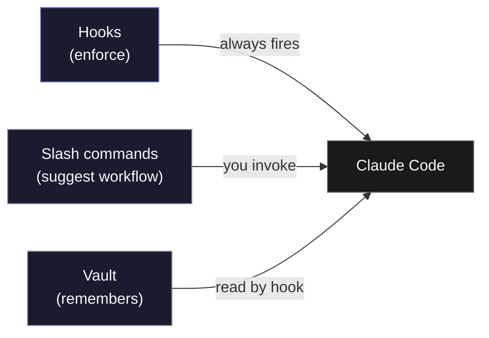

# 01 — Introduction

> **Don't vibe code. Zaude code.**

Zaude is a framework for [Claude Code](https://claude.com/claude-code) that replaces "the model kinda remembers" with mechanical guarantees. Memory, review gates, decision history, credential hygiene, and frozen-path protection — all enforced at the hook level, not asked nicely in a prompt.

This doc covers **what Zaude is**, **why it exists**, **who it's for**, and the **mental model** that makes the rest of the docs click.

---

## The short version

Claude Code forgets everything between sessions. Zaude adds three things: a **vault** that remembers your project across sessions, **slash commands** that drive a standard plan → design → implement → review workflow, and **hooks** that mechanically enforce the automatic parts — context loading at session start, writes blocked for frozen paths, vault synced to GitHub at session end, and (new in v0.3) a verified-facts block that stops the model from citing stale prose.

---

## The problem Zaude solves: vibe coding

"Vibe coding" is the failure mode Zaude exists to prevent.

You open a new Claude Code session. You describe a feature. Claude produces code. You glance at it, accept it, ship it. Next week you open a new session in the same project — Claude has no memory of what was built, why, or what was broken last time. You describe context again. Claude produces code again. You accept it again. Over weeks the project drifts: decisions are undocumented, the same bugs reappear, credentials linger in commit history, legacy code gets silently rewritten, review steps get skipped because "it looked fine."

That loop works for a weekend hack. It fails hard on anything you actually care about.

| Symptom | Root cause | Zaude's fix |
|---|---|---|
| "Wait, why did we choose X?" | No decision log | Append-only `decisions.md` |
| "I thought we fixed that bug last month" | No session history | Dated `sessions/YYYY-MM-DD.md` logs |
| "Claude edited the legacy module again" | No write-path enforcement | `PreToolUse` frozen-guard hook |
| "I pasted the API key three sessions ago and nobody rotated it" | No credential ledger | `/wrap` credential sweep |
| "Did anyone actually code-review this?" | Review steps are suggestions, not gates | `/review` + `/ship` chain with CRITICAL/HIGH gates |
| "I need to re-explain the whole project again" | No persistent context | `SessionStart` hook auto-loads vault |

The fixes aren't novel. What's novel is that Zaude makes them **mechanical** — you don't have to remember to run them, they happen by default because a hook fires or a slash command insists on them.

---

## What Zaude is (and isn't)

**Zaude is** a bundle of files and conventions you install into Claude Code's existing extension points:

- **Hooks** at `~/.claude/hooks/` — small Python and shell scripts that run on session start, before tool calls, and on session end
- **Slash commands** at `~/.claude/commands/` — eight commands (`/start`, `/build`, `/review`, `/decision-map`, `/e2e-test`, `/microscope`, `/ship`, `/wrap`) that drive the standard workflow
- **A global `CLAUDE.md`** at `~/.claude/CLAUDE.md` — the base behavior template
- **A vault** (by default at `~/zaude-vault/`) — a git-tracked directory of per-project knowledge
- **A config file** at `~/.zaude/config.json` — paths, project mappings, frozen zones

**Zaude is not**:

- A plugin — nothing is monkey-patched; Claude Code loads each piece through its documented extension points
- A replacement for Claude Code — you still use Claude Code normally, Zaude just fills in the gaps
- A model or an LLM — Zaude doesn't call any API directly; it runs inside whatever model Claude Code is configured for
- A dependency of your project repos — the vault is a separate repo; your project repos stay untouched
- Locked to one stack — the framework is language-agnostic (examples cover React, Rails, Go, Python, etc.)

---

## The mental model: hooks enforce, skills suggest, vault remembers

Everything Zaude does maps to one of three roles. Internalizing this is the single most useful thing when reasoning about the framework.



### Hooks enforce

Anything Zaude guarantees — "context is always loaded at session start", "frozen paths are always blocked", "the vault is always pushed at session end" — lives in a hook. Hooks are executed by the Claude Code harness itself, not by the LLM, so they fire 100% of the time regardless of whether the model "remembers" to do them.

The Zaude hooks:

| Hook | Fires on | Script | What it does |
|---|---|---|---|
| `SessionStart` | New session opens | `session-start-vault.py` | Reads the vault + memory and injects `additionalContext`. Prepends `=== VERIFIED FACTS ===` above the vault dump so stale prose can't anchor Claude to the wrong state. |
| `PreToolUse` | Every `Edit` / `Write` call | `frozen-guard.py` | Denies writes to paths containing any frozen-zone substring |
| `SessionEnd` (observability) | Session exits cleanly | `current-state-freshness.py` | Logs whether the `<!-- status-freshness -->` block in `current-state.md` is fresh. Can't block the session — that's what `/wrap` step 9 is for. |
| `SessionEnd` (sync) | Session exits cleanly | `session-end-vault-sync.sh` | `git add -A && git commit && git push` for vault + config |

### Skills suggest

Anything Zaude documents but cannot technically force — "run the review chain before committing", "design before coding", "trigger `security-auditor` on auth changes" — lives in a slash command or a pattern file. These are markdown instructions the model reads when you invoke them. They're fine for workflow documentation and for cases where the model has enough context to do the right thing; they're **not** fine for mechanical guarantees.

The six slash commands:

| Command | Role |
|---|---|
| `/start` | Report where you left off (uses hook-injected context, does not re-read) |
| `/build` | Run the plan → design → implement → review chain |
| `/review` | Read-only review of uncommitted changes |
| `/ship` | Review → commit → push → vault update |
| `/wrap` | End-of-session: code review, vault refresh, freshness regen + gate, memory sweep, credential list, push |
| `/zaude-push` | Open a PR against the Zaude framework with any local improvements you want upstream |

### Vault remembers

The vault is a plain directory of markdown files, organized by project. In **v1** it's the source of truth for "what we know about this project" — read by the `SessionStart` hook, written by `/ship` / `/wrap`. In **v2** the signed trace (`.zaude/trace.jsonl`) is the source of truth and the vault is a _generated projection_: regenerate it with `zaude vault-sync` (via `/zwrap`), and never hand-edit `current-state.md`.

```
vault-root/
├── VAULT_PROTOCOL.md           ← reading order + conventions
├── 01-projects/
│   └── <project-slug>/
│       ├── CLAUDE.md
│       ├── current-state.md
│       ├── decisions.md        ← append-only
│       ├── open-questions.md
│       ├── spec.md
│       ├── architecture.md
│       └── sessions/
│           └── YYYY-MM-DD.md
└── 03-patterns/                ← cross-project rules
    └── anti-patterns.md
```

No databases. No binary formats. No service you log into. Just markdown files under git.

---

## Who Zaude is for

Zaude makes sense if **all three** of these are true:

1. You work on projects that live longer than one session.
2. You care about the code beyond "it runs".
3. You already use (or are willing to use) `git` and have GitHub access.

Concretely:

| You are... | Zaude fit? |
|---|---|
| A solo founder shipping a production app with Claude Code | Strong fit |
| An engineer using Claude Code for side projects you come back to weekly | Strong fit |
| A tech lead coordinating multiple Claude Code sessions across services | Strong fit |
| A consultant juggling several client codebases | Strong fit — each client gets its own vault project |
| A student working through a tutorial across multiple sessions | Reasonable fit if you want to build the habit |
| Someone doing throwaway automation scripts | Overhead — skip Zaude |
| Someone running one single-session experiment | Skip Zaude |
| Someone who doesn't use git | Not compatible — Zaude is built on git |
| Someone using Cursor / Windsurf / Aider | Not today — Zaude targets Claude Code's hook system |

### Good-fit red flags

You're probably a good fit if any of these sentences made you nod:

- "I keep re-explaining the same context to Claude every session."
- "I shipped something last month and I'm no longer sure why I chose that approach."
- "I pasted an API key into chat three weeks ago and I don't remember if I rotated it."
- "Claude 'helpfully' rewrote my legacy module again. I just wanted it to add a button."
- "I meant to run the security auditor but forgot."
- "My project knowledge lives in my head and three Slack DMs."

### Bad-fit red flags

Skip Zaude if:

- You're scripting a one-off data migration you'll never revisit.
- Your project is ephemeral: a hackathon submission, an exam answer, a code kata.
- You aren't willing to commit two new git repos (vault + claude-config).
- You want magic — Zaude adds discipline, not intelligence.

---

## The philosophy: mechanical over aspirational

Zaude's design bias is that **anything that should happen reliably must happen mechanically**. Three examples of how that plays out:

### Mechanical: auto-loading context

A CLAUDE.md that says "at session start, read these files" is aspirational — the model might skip it, might read only the first few, might read them in the wrong order. Zaude instead reads them in a Python hook that runs outside the model's control, then injects the content as `additionalContext`. The model literally sees the vault in its first-turn prompt. No way to miss it.

### Mechanical: frozen zones

A CLAUDE.md that says "don't edit files in `vendor/`" is a rule Claude Code can try to follow. But "try to" is not a guarantee. Zaude ships a `PreToolUse` hook that returns `permissionDecision: "deny"` if the file path contains any frozen-zone substring. The edit fails at the harness level. The model is told why.

### Mechanical: vault sync

A CLAUDE.md that says "commit the vault at session end" is a habit. Zaude ships a `SessionEnd` shell script that runs `git add -A && git commit && git push` on both the vault and the Claude-config directory. No remembering. No "I'll commit it later."

This doesn't make Zaude rigid. You can delete any hook, disable any slash command, change any pattern file. What Zaude commits to is that **whatever you want to happen automatically has a mechanism to make it automatic**, not just a note asking nicely.

---

## How this compares to alternatives

| | Raw Claude Code | CLAUDE.md alone | Aider | Cursor | **Zaude** |
|---|---|---|---|---|---|
| Persistent cross-session memory | No | Manual | No | Basic | Mechanical |
| Append-only decision log | No | Manual | No | No | Yes |
| Review gates before commit | No | Manual | No | No | Enforced |
| Frozen-zone protection | No | No | No | No | Yes |
| Version-controlled config | No | Per-project | No | No | Vault + config both |
| Works with any editor | Yes | Yes | Terminal only | No | Yes |

Zaude doesn't replace Claude Code — it thickens it. If you already like Claude Code's UX, Zaude keeps all of it and adds a disciplined layer underneath.

---

## What you'll notice on day one

Install takes 5-10 minutes. After it runs:

- Every new session opens with a `=== VERIFIED FACTS ===` block (from `/wrap`'s last run) and a `=== VAULT CONTEXT FOR <your-project> ===` block injected by the hook. The model sees your project before you type anything.
- `/start` produces a one-paragraph "here's where we left off" report — not a generic greeting.
- `/build <feature>` runs the full chain: plan → design → implement → review. Review gates stop on CRITICAL / HIGH findings automatically.
- When you close the session, the vault and Claude-config auto-commit and push. You'll see a fresh commit in GitHub without lifting a finger.

What you **won't** experience:

- Any change to how Claude Code itself works. Same chat, same tools.
- A new UI, dashboard, or subscription.
- Any API charge. Zaude doesn't call Anthropic directly.
- Lock-in. Plain markdown, a few hundred lines of Python and bash. You can read the whole framework in an afternoon and rip out any piece you don't want.

---

## What's next

| Topic | Go to |
|---|---|
| Install Zaude on your machine | [02 — Installation](./02-installation.md) |
| Understand how the pieces fit together | [03 — Architecture](./03-architecture.md) |
| Learn the vault layout and file formats | [04 — Vault pattern](./04-vault.md) |
| Master the eight slash commands | [05 — Commands](./05-commands.md) |

If you're unsure whether Zaude is worth the setup cost, read the [architecture doc](./03-architecture.md) next — it walks through a complete session so you can judge whether the ergonomics match what you want.
