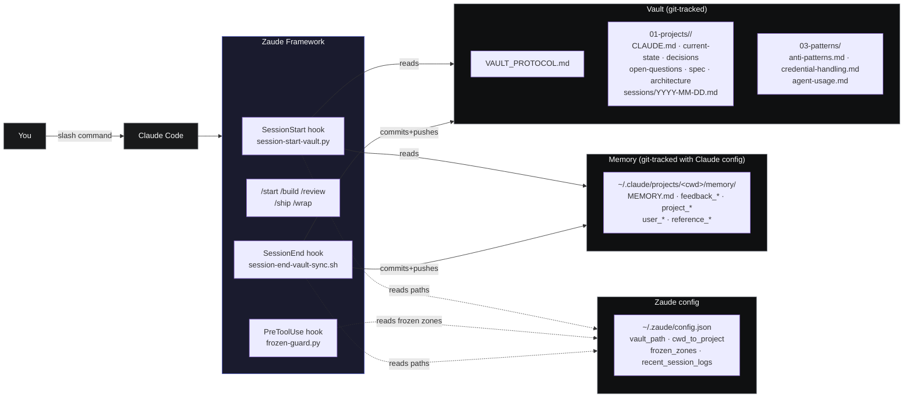
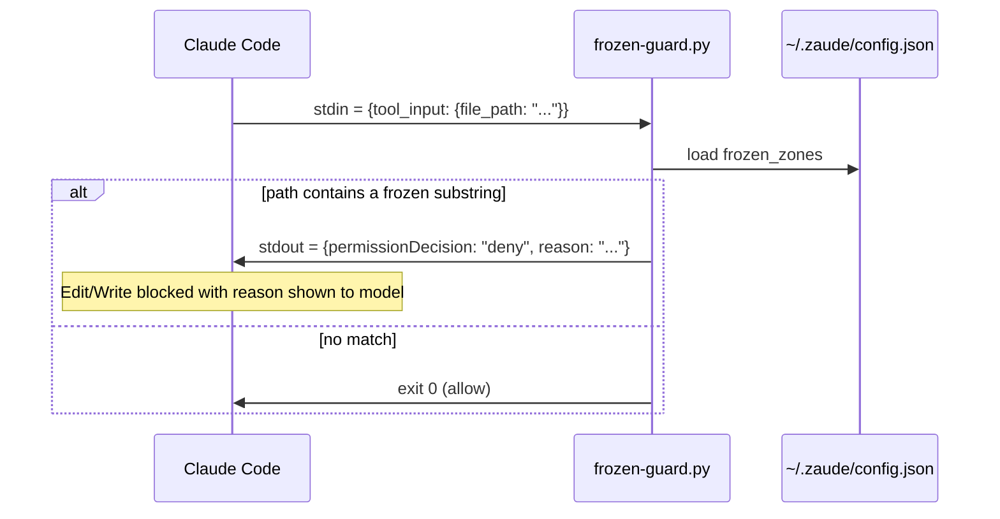
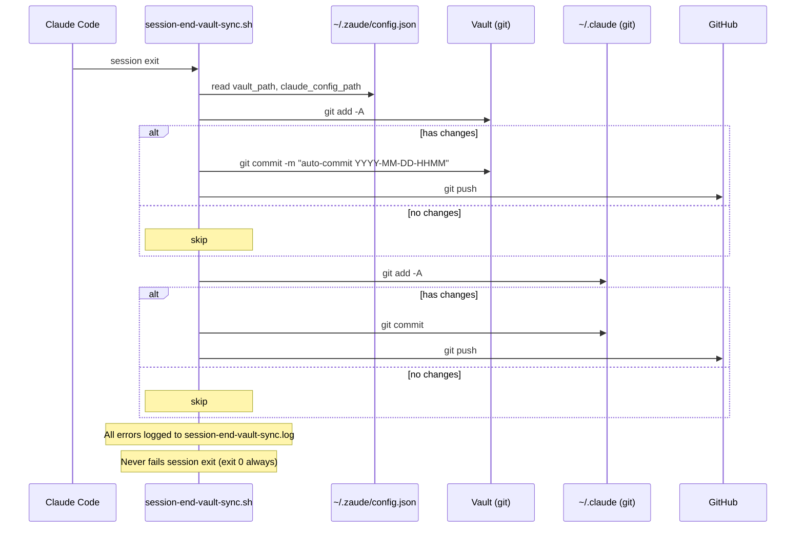
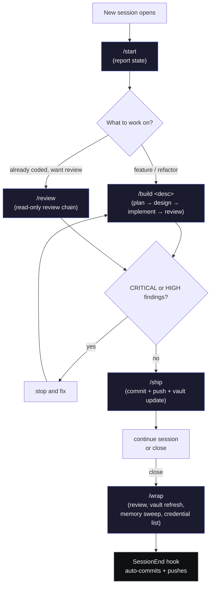

# 03 — Architecture

This doc walks through **how Zaude is put together**: which piece is responsible for what, when each piece runs, and how they communicate. Read this after installing if you want to know what you just put on your machine.

---

## High-level view

Zaude is a thin layer that sits between you and Claude Code. It doesn't replace anything — it hooks into three extension points Claude Code already exposes (session-start, pre-tool-use, session-end) and drives a workflow via slash commands.



---

## The core insight: three roles

Everything in the diagram above plays one of three roles.

| Role | Pieces | Guarantee |
|---|---|---|
| **Enforcement** | Hooks (`session-start-vault.py`, `frozen-guard.py`, `session-end-vault-sync.sh`) | Runs mechanically, every time, outside the model's control |
| **Suggestion** | Slash commands (`/start`, `/build`, `/review`, `/ship`, `/wrap`), `CLAUDE.md`, pattern files | Read by the model when invoked; relies on the model doing the right thing |
| **Persistence** | Vault, memory directory, `~/.zaude/config.json` | Plain files on disk; git-tracked; survive restarts and machine loss |

If you only take one thing from this doc: **if something must always happen, it has to live in a hook**. If it's workflow guidance, a slash command is the right home.

---

## The three hooks, in detail

### `SessionStart` — `session-start-vault.py`

Fires when a new Claude Code session opens. Its job is to **load your entire project context** and inject it as `additionalContext` so the model sees it on the very first turn.

```mermaid
sequenceDiagram
    participant CC as Claude Code
    participant H as session-start-vault.py
    participant CFG as ~/.zaude/config.json
    participant V as Vault (fs)
    participant M as Memory (fs)

    CC->>H: stdin = {cwd: "/path/to/project"}
    H->>CFG: load vault_path, cwd_to_project, etc.
    H->>V: walk up from cwd; match against 01-projects/
    V-->>H: project slug detected
    H->>V: read CLAUDE.md, current-state, open-questions,<br/>spec, architecture, decisions
    H->>V: read last N session logs (default 3)
    H->>V: read all 03-patterns/*.md
    H->>M: read all memory files for this cwd
    H->>CC: stdout = {hookSpecificOutput: {additionalContext: "..."}}
    Note over CC: Injected into model's context window
```

What it reads, in order:

1. `01-projects/<project>/CLAUDE.md`
2. `01-projects/<project>/current-state.md`
3. `01-projects/<project>/open-questions.md`
4. `01-projects/<project>/spec.md`
5. `01-projects/<project>/architecture.md`
6. `01-projects/<project>/decisions.md` + any `decisions-archive-*.md`
7. Last N session logs (default 3, configurable via `recent_session_logs`)
8. All `.md` files under `03-patterns/`
9. `~/.claude/projects/<encoded-cwd>/memory/MEMORY.md` + every other `.md` in that directory

Project detection walks up from the cwd for 5 levels, matching the basename against either the `cwd_to_project` map or a direct subdirectory of `01-projects/`.

The hook is **defensive by design**: if the config file is missing, if the vault directory doesn't exist, if the project can't be detected, it silently prints `{}` and the session opens normally. It never blocks session start.

### `PreToolUse` — `frozen-guard.py`

Fires before every `Edit` or `Write` tool call. Checks the file path against the `frozen_zones` list in `~/.zaude/config.json`. If the path contains any frozen substring, it returns a `deny` decision.



Example config:

```json
{
  "frozen_zones": ["vendor/", "legacy-billing-service/", "production-env"]
}
```

An attempt to write to `/home/you/my-app/vendor/legacy.js` returns:

```
BLOCKED: /home/you/my-app/vendor/legacy.js is inside the frozen zone 'vendor/'.
This path is read-only by Zaude configuration (~/.zaude/config.json).
If you genuinely intend to modify this file, tell Claude in plain language
to override the frozen guard and retry, or remove the zone from
~/.zaude/config.json.
```

Override is a plain-language instruction from you — the model has to re-invoke the tool after you confirm you actually want the write. This is the replacement for Claude Code's permission prompt when `--dangerously-skip-permissions` is active.

### `SessionEnd` — `session-end-vault-sync.sh`

Fires when the session exits cleanly. Its job is to **auto-commit and push** both the vault and the Claude-config repo so no state is left orphaned on your machine.



Failures (no remote, push rejected, commit blocked by pre-commit hook) are logged to `~/.claude/hooks/session-end-vault-sync.log` and swallowed. The session always closes cleanly.

---

## The five slash commands

Slash commands are markdown files under `~/.claude/commands/`. When you type `/<name>`, Claude Code loads that file and treats it as a prompt. Zaude ships five.



Full details on each command in [05 — Commands](./05-commands.md). In brief:

| Command | Mnemonic | Role |
|---|---|---|
| `/start` | "where are we?" | Report on hook-injected context |
| `/build` | "do the work" | Plan → design → implement → review chain |
| `/review` | "is it clean?" | Read-only review of uncommitted diff |
| `/ship` | "send it" | Review → commit → push → vault update |
| `/wrap` | "good night" | End-of-session housekeeping |

---

## Walk-through: a full session

### Moment 1 — You open a new session

You open Claude Code in `/home/you/my-app`.

1. Claude Code fires `SessionStart` with `{"cwd": "/home/you/my-app"}` on stdin.
2. `session-start-vault.py` loads `~/.zaude/config.json`, finds `"my-app": "my-app"` in `cwd_to_project`, confirms `~/zaude-vault/01-projects/my-app/` exists.
3. It reads every file in the vault project folder, the last 3 session logs, all patterns, and all memory files.
4. It prints a JSON object with the concatenated content as `additionalContext`.
5. Claude Code injects that content into the first-turn system reminder.

You see a system reminder that starts with `=== VAULT CONTEXT FOR my-app ===`. The model now knows your project.

### Moment 2 — You run `/start`

6. Claude Code loads `~/.claude/commands/start.md` and feeds it as your first user turn.
7. The prompt instructs the model to report — not to re-read files — using the already-injected context.
8. Model outputs: "Last session summary: you finished the OAuth refactor. In-flight: migration from sessions to JWT. Blockers: Q3 is still open on refresh-token strategy. Next action: implement the token-refresh middleware."

### Moment 3 — You run `/build add a token-refresh middleware`

9. Claude Code loads `~/.claude/commands/build.md`.
10. The prompt instructs the model to invoke `workflow-orchestrator` to decompose the feature.
11. Because the work touches backend, the model invokes `backend-developer` to design the API/service/schema shape.
12. The model implements the code.
13. The model invokes `code-reviewer`, then `security-auditor` (because the diff touches auth), then `architect-review` in REVIEW mode.
14. Findings are reported by severity. If there are CRITICAL or HIGH findings, the model stops and reports. Otherwise it asks for your approval.

### Moment 4 — You run `/ship`

15. The command re-runs the review chain as a safety check.
16. If clean, the model drafts a commit message and commits.
17. `git push` to your project repo's `main`.
18. The model updates `~/zaude-vault/01-projects/my-app/current-state.md`.
19. The model appends to today's `sessions/YYYY-MM-DD.md`.
20. The model appends any new decisions to `decisions.md`.
21. The model commits the vault with `session YYYY-MM-DD: <summary>` and pushes.
22. Final report includes the commit hash of both repos plus any credentials you pasted in-session (first 4 / last 4 only) that need rotation.

### Moment 5 — You close the session

23. Claude Code fires `SessionEnd`.
24. `session-end-vault-sync.sh` reads config, walks into the vault and `~/.claude/`, runs `git add -A && git commit && git push` on each.
25. If there was any stray uncommitted change in the vault (maybe you edited `current-state.md` manually), it gets caught by this net. If the Claude-config repo had new memory files written during the session, those get pushed too.
26. The session ends cleanly. You can close your laptop.

### Next day

You open a new session. `SessionStart` fires. The vault now has one more session log and one more decision entry. The model opens with full knowledge of what happened yesterday. Zero cold-start.

---

## The two-repo model

Zaude uses **two private GitHub repos**, not one. This is intentional.

| Repo | What lives in it | Why |
|---|---|---|
| `zaude-vault` | Project knowledge: CLAUDE.md, current-state.md, decisions.md, open-questions.md, sessions/, patterns/ | Portable across machines. You can clone it on any device and the SessionStart hook will find it. |
| `zaude-claude-config` | Your `~/.claude/` directory: hooks, commands, agents, skills, global CLAUDE.md, settings.json, memory files | Configuration-as-code. If your laptop dies, a fresh clone + `~/.zaude/config.json` restores your entire Zaude setup. |

### Why separate?

Because they have different lifecycles and different sensitivities.

| | Vault | Claude-config |
|---|---|---|
| Updated by | `/wrap`, `/ship`, manual | `install.sh`, hooks you tweak, new memory |
| Content shape | Project-scoped markdown | Tool + config files |
| Who else might touch it | Only you | Only you |
| Safe to share | Sometimes (review for confidential content first) | Almost never (may contain session transcripts in memory) |
| Break / replace lifecycle | Rarely edited manually | Rewritten when Zaude upgrades |

Keeping them separate lets you:

- Share the vault with a teammate for a specific project without exposing your global config
- Reset your Claude-config to defaults without losing project knowledge
- Track Zaude upgrades independently of project history

### What's in each

**`zaude-vault/`**:
```
VAULT_PROTOCOL.md
01-projects/
  my-app/
    CLAUDE.md
    current-state.md
    decisions.md
    open-questions.md
    spec.md
    architecture.md
    sessions/
      2026-04-10.md
      2026-04-12.md
      ...
  another-project/
    ...
03-patterns/
  anti-patterns.md
  credential-handling.md
  agent-usage.md
```

**`~/.claude/` (as `zaude-claude-config`)**:
```
CLAUDE.md
settings.json
.gitignore
commands/
  start.md · build.md · review.md · ship.md · wrap.md
hooks/
  session-start-vault.py · frozen-guard.py · session-end-vault-sync.sh
agents/       ← your installed agent files (optional)
skills/       ← your installed skills (optional)
projects/
  -home-you-my-app/
    memory/
      MEMORY.md
      feedback_*.md
      project_*.md
      ...
```

The `.gitignore` in `~/.claude/` is curated — it **denies everything** then **allow-lists** the files that should be tracked. This prevents session transcripts, credentials files, and logs from being committed.

---

## The config file: `~/.zaude/config.json`

One JSON file controls how hooks find things. All three hooks read from it.

```json
{
  "vault_path": "~/zaude-vault",
  "projects_subdir": "01-projects",
  "patterns_subdir": "03-patterns",
  "cwd_to_project": {
    "my-app": "my-app",
    "api-service": "payment-api"
  },
  "frozen_zones": ["vendor/", "legacy-billing"],
  "recent_session_logs": 3,
  "claude_config_path": "~/.claude"
}
```

| Key | Used by | Purpose |
|---|---|---|
| `vault_path` | SessionStart, SessionEnd | Absolute (or `~`-relative) path to the vault |
| `projects_subdir` | SessionStart | Subfolder under `vault_path` containing project folders |
| `patterns_subdir` | SessionStart | Subfolder under `vault_path` for cross-project pattern files |
| `cwd_to_project` | SessionStart | Map of cwd basename → vault project slug when they differ |
| `frozen_zones` | PreToolUse | List of path substrings to block Edit/Write on |
| `recent_session_logs` | SessionStart | How many recent session logs to include (default 3) |
| `claude_config_path` | SessionStart, SessionEnd | Path to `~/.claude/` for memory reads and config push |

---

## What happens when each piece fails

Zaude's design principle: **fail soft, log loud**. Nothing in Zaude should break Claude Code.

| Failure | Behavior |
|---|---|
| Config file missing | SessionStart prints `{}`, PreToolUse allows everything, SessionEnd skips. Session works normally. |
| Vault path doesn't exist | SessionStart prints `{}`. `/start` notices missing `=== VAULT CONTEXT ===` block and tells you to fix `cwd_to_project`. |
| Memory directory missing | SessionStart still loads vault; just skips memory. |
| Python not on PATH | Session opens without the hook firing. Claude Code logs a warning. |
| SessionEnd `git push` rejected | Logged to `session-end-vault-sync.log`; commit stays local; next session's SessionEnd retries. |
| Frozen zone blocks a legitimate write | Model explains the block; you tell it in plain language to override OR you edit the zone out of config. |
| `/build` agent chain fails mid-way | Model reports the failing step. You decide whether to retry, adjust the spec, or drop the work. |

There is no single point of failure that silently corrupts your vault or strands commits. Every mechanical action is idempotent (safe to re-run) and every destructive-looking action (push, commit) is guarded by `--no-force-push` and `--no-skip-hooks` discipline.

---

## Design principles

If you want to extend Zaude — write new hooks, add new slash commands, define new patterns — these are the principles the existing code follows.

1. **Hooks are enforcement; skills are suggestion.** If the behavior must happen, put it in a hook. If it's guidance, put it in a slash command or pattern file.
2. **Hooks fail silently, never block session start.** Print `{}` and exit 0 on any error.
3. **Config is a single JSON file.** Don't add a second one. Don't parse env vars.
4. **Vault files are plain markdown.** No YAML frontmatter required (except for memory files). No databases.
5. **Vault discipline is append-only where it matters.** `decisions.md` and `sessions/*.md` are history; `current-state.md` is a snapshot.
6. **Never force-push either repo.** Always `git fetch` first and stop if remote has new commits.
7. **Credentials are ephemeral.** Never write them to vault files or commits. List them at `/wrap` for rotation.
8. **The model isn't a database.** Memory for long-term facts lives in files, not in the model's "remembered" state.

---

## What's next

| Topic | Go to |
|---|---|
| Learn the vault layout and update discipline | [04 — Vault pattern](./04-vault.md) |
| See every slash command in depth | [05 — Commands](./05-commands.md) |
| Reinstall or uninstall | [02 — Installation](./02-installation.md) |
| Read the original motivation | [01 — Introduction](./01-introduction.md) |

See also: [`VAULT_PROTOCOL.md`](../templates/vault/VAULT_PROTOCOL.md) for the reading order, and [`anti-patterns.md`](../templates/vault/03-patterns/anti-patterns.md) for the cross-project rules loaded by the SessionStart hook.
