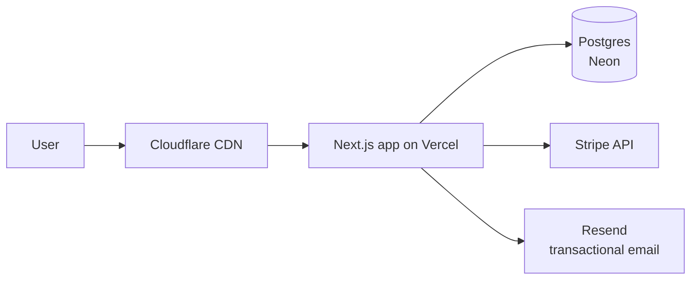
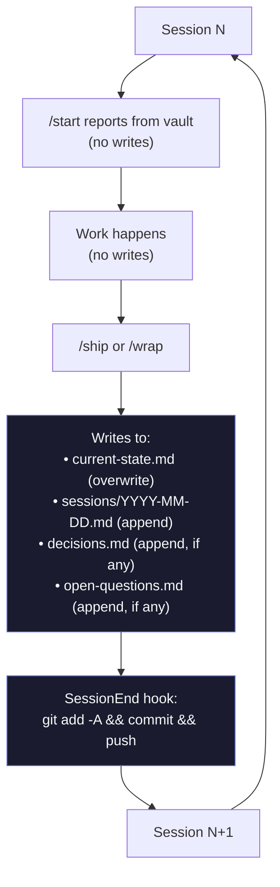

# 04 — Vault pattern

The vault is the **single source of truth** for everything Zaude knows about your projects. It's a plain directory of markdown files, git-tracked, that the `SessionStart` hook reads at the beginning of every session and that `/wrap` / `/ship` write to at the end.

This doc covers the vault layout, the role of each file, the update discipline (append-only vs overwrite-freely), and examples you can adapt.

---

## Directory layout

```
zaude-vault/
├── VAULT_PROTOCOL.md           ← reading order + conventions
├── 01-projects/                ← one subdirectory per project
│   ├── my-app/
│   │   ├── CLAUDE.md
│   │   ├── current-state.md
│   │   ├── decisions.md
│   │   ├── open-questions.md
│   │   ├── spec.md
│   │   ├── architecture.md
│   │   └── sessions/
│   │       ├── 2026-04-01.md
│   │       ├── 2026-04-05.md
│   │       └── 2026-04-10.md
│   └── another-project/
│       └── ...
├── 03-patterns/                ← cross-project rules
│   ├── anti-patterns.md
│   ├── credential-handling.md
│   └── agent-usage.md
└── 04-knowledge/               ← optional: reference material
    └── ...
```

The numeric prefixes (`01-`, `03-`, `04-`) are conventional — they keep the folders in a predictable order in file listings.

---

## The `01-projects/<slug>/` files

Every project you track in Zaude gets a folder under `01-projects/`. The folder name is the **project slug** — lowercase, dashes, no spaces. The slug matches either the cwd basename or whatever you mapped it to in `cwd_to_project`.

Inside the folder, the files break into two classes:

| Update discipline | Files |
|---|---|
| **Append-only** (never edit past entries) | `decisions.md`, `open-questions.md`, `sessions/*.md` |
| **Overwrite-freely** (snapshot that always reflects the current state) | `current-state.md`, `CLAUDE.md`, `spec.md`, `architecture.md` |

### `CLAUDE.md` — project-specific rules

The project's behavioral override. Read by the SessionStart hook and layered **on top of** the global `~/.claude/CLAUDE.md`.

Put things here that are specific to this project and that you want the model to see every session:

- Stack: language, framework, package manager, notable libs
- Conventions: file-naming, test-runner, commit-message style
- Project-specific guardrails ("never touch `infra/terraform/prod/`", "always rebuild the docker image after changing `package.json`")
- Commands the user expects to work: "to run tests: `bun test`", "to start dev: `bun dev`"

**Update discipline:** overwrite freely. This is a living spec.

**Example:**

```markdown
# CLAUDE.md — my-app

Next.js 14 + TypeScript + Tailwind + Drizzle + PostgreSQL. Bun for everything.

## Stack specifics
- Next.js App Router (yes, we accept the tradeoffs)
- Drizzle ORM — never write raw SQL outside migrations
- Tailwind + shadcn/ui — don't import standalone UI libraries
- Bun runtime — `bun install` / `bun test` / `bun run dev`

## Conventions
- Route handlers live at `app/api/*/route.ts`
- Server components are the default; client components are opt-in with `"use client"`
- Tests live next to source as `*.test.ts`
- Commit messages: imperative mood, no "add", use "introduce" / "rename" / "fix" / "remove"

## Guardrails
- Never touch `drizzle/migrations/` manually — always generate with `bun drizzle-kit generate`
- Never edit `app/api/auth/*` without invoking `security-auditor`
- Never add a new top-level dependency without asking first
```

### `current-state.md` — what exists right now

The single most-read file. Overwritten every time `/wrap` or `/ship` runs. Its job is to be the **latest possible snapshot** of what's built, what's in flight, what's broken, and what to do next.

**Update discipline:** overwrite freely. This is not history.

**Sections** (suggested, not enforced):

- Status: latest commit hash, what's deployed/merged
- What exists: bullet list of shipped features
- In-flight: work partially done, stopped where?
- Known issues: bugs noticed but not fixed, with rough severity
- Blocked on: questions or external dependencies (reference `open-questions.md` Q numbers)
- Next action: the single sentence that tells the next session "start here"

**Example:**

```markdown
# Current State — my-app

**Status:** commit `a3f8c21` on `main`. Deployed to production 2026-04-10.

## What exists
- OAuth login (Google + GitHub)
- User dashboard at `/app/dashboard`
- Billing via Stripe subscriptions (monthly + annual)
- Admin tools at `/admin` (role-gated)

## In-flight
- JWT refresh-token middleware. Designed but not merged. Branch: `feat/jwt-refresh`.
  Stopped at writing the refresh endpoint — still deciding whether to
  rotate refresh tokens on every use (see Q3).

## Known issues
- Dashboard loader flickers on first paint in Safari. Not user-blocking.
  Probably a hydration mismatch in `DashboardShell.tsx`.
- Stripe webhook signature check logs a warning in dev but not in prod — false alarm.

## Blocked on
- Q3 (refresh token rotation strategy) — decision pending.

## Next action
Finish the refresh endpoint and write integration tests. Then run /review and /ship.
```

### `decisions.md` — append-only history of architectural choices

Every notable decision goes here with a date, a rationale, and implications. The SessionStart hook reads the whole file every session, so the model can always answer "why did we pick X?"

**Update discipline:** **append-only**. Never edit a past entry. If you reverse a decision, add a new entry that references the old one and explains the shift.

**Entry format** (from `VAULT_PROTOCOL.md`):

```markdown
## YYYY-MM-DD — One-line decision title

**Decision:** One paragraph describing what you decided.

**Rationale:** Why this, not the alternatives. Name the constraints that forced it.

**Implications:** What this means for future work. What it blocks / unblocks / changes downstream.
```

**Example:**

```markdown
# Decisions — my-app

## 2026-03-15 — Use Drizzle, not Prisma

**Decision:** Use Drizzle ORM for all database access. Prisma was considered and rejected.

**Rationale:** Drizzle has zero runtime overhead (no separate engine process), type-safe query
builder matches our existing TypeScript conventions, and its migration story is plain SQL files
we can review. Prisma's schema.prisma DSL felt like a second language to learn and its
migration state machine made small schema changes feel risky.

**Implications:** All database code goes through `db/schema.ts`. No raw SQL in route handlers —
always the query builder. Migrations are generated with `bun drizzle-kit generate` and committed
as-is.

## 2026-03-22 — Next.js App Router, accepting the tradeoffs

**Decision:** Commit to App Router despite the Pages Router being more mature.

**Rationale:** New features ship to App Router first. Server components materially reduce the
client bundle for data-heavy pages. The team is already fluent in the new patterns from side work.

**Implications:** No mixing Pages and App Router; `app/` only. Any third-party library that
assumes Pages Router (Next-auth v4 in particular) needs to be replaced with an App-compatible
equivalent (Auth.js v5).

## 2026-04-10 — Reverse of 2026-03-22 Next.js App Router decision

**Decision:** Move to Remix. App Router stays only for the admin subdomain.

**Rationale:** Two production bugs traced to App Router's implicit behavior (unexpected client
re-render during streaming, and a caching edge case that served stale user data). After two weeks
evaluating Remix, its mental model of "nested routes = nested data" matched our team's shape
better, and the cache story is explicit.

**Implications:** Full rewrite of `/app` to Remix over 6 weeks. Admin subdomain stays on Next
to avoid scope creep. New OAuth integration needed in Remix.
```

Note the third entry reverses the second — you don't edit the March 22 entry, you add a new one that explicitly supersedes it. This gives future-you (and future-Claude) a complete timeline.

### `open-questions.md` — unresolved items

Numbered questions (Q1, Q2, Q3, …) that were opened during work but haven't been answered. The model reads these at session start so it knows what's ambiguous.

**Update discipline:** **append-only** for new questions. Resolution is marked **in place** by appending `— RESOLVED YYYY-MM-DD` to the heading; don't delete or renumber.

**Entry format:**

```markdown
## Q<N> — Short title (SEVERITY)

**What:** One sentence.
**Why it matters:** Who's blocked / what breaks.
**Options:** Numbered list of resolution paths.
**Recommended:** The one to pick and why.
```

Severity: `CRITICAL`, `HIGH`, `MEDIUM`, `LOW`, `deferred`.

**Example:**

```markdown
# Open Questions — my-app

## Q1 — Session timeout duration (MEDIUM) — RESOLVED 2026-03-20

**What:** How long should an idle session stay valid before forcing re-login?
**Why it matters:** Too short = user friction; too long = stale-session security risk.
**Options:**
1. 30 minutes (industry standard for banking apps)
2. 24 hours (SaaS default)
3. 30 days (convenience, with refresh rotation)
**Recommended:** (3) with refresh rotation — resolved 2026-03-20.

## Q2 — Admin subdomain on separate auth? (HIGH)

**What:** Should `/admin` use the same OAuth flow, or require a stronger 2FA-only flow?
**Why it matters:** Admins have access to all user data. A compromised admin OAuth
token is catastrophic.
**Options:**
1. Same OAuth — trust the OAuth provider's 2FA
2. Separate hardware-key-only flow via WebAuthn
3. OAuth + mandatory TOTP on top
**Recommended:** (3) — not all admins can buy hardware keys but all can use TOTP. Keep
OAuth for convenience; enforce TOTP at the admin middleware.

## Q3 — JWT refresh token rotation on every use? (HIGH)

**What:** Should refresh tokens be single-use-and-rotate, or multi-use until expiry?
**Why it matters:** Single-use is more secure (replay attacks detected), but adds a DB
write on every refresh and breaks mobile clients that refresh concurrently.
**Options:**
1. Single-use (rotate on every use)
2. Multi-use (rotate every N days)
3. Multi-use + detect replay
**Recommended:** Haven't decided. Research needed on mobile SDK concurrency.
```

### `spec.md` — what this project is

Optional but recommended. A plain-language description of the product/service: the user story, the business constraints, the non-goals. The SessionStart hook reads it.

**Update discipline:** overwrite freely. When the spec changes, update here.

**Example:**

```markdown
# Spec — my-app

## What it is
A team collaboration tool for small remote engineering teams (5-50 people).

## Primary users
- Engineering managers who need visibility without micromanagement
- Individual contributors who want to log their work quickly

## Core features
1. Weekly check-ins (async writeups)
2. Goal tracking (OKRs, lightweight)
3. 1-on-1 note sharing

## Non-goals
- Not a project manager (no Kanban, no Gantt)
- Not a doc tool (no pages, no wikis)
- Not chat (integrate with Slack, don't replace it)

## Business constraints
- Ship the MVP by 2026-Q3
- Self-serve signup from day one (no sales team)
- Free tier for teams ≤ 5
```

### `architecture.md` — how it's built

Optional. The technical companion to `spec.md`. Describes services, data flow, external dependencies, deployment topology.

**Update discipline:** overwrite freely. When you introduce a new service or change the data model, update here.

**Example:**

```markdown
# Architecture — my-app

## Topology



## Data flow
- All writes go through server actions in `app/api/*`
- Auth via Auth.js + JWT cookies (httpOnly, secure, sameSite=lax)
- Stripe webhooks land at `app/api/webhooks/stripe` and update the `subscription` table

## External dependencies
- Vercel (hosting)
- Neon (Postgres)
- Stripe (billing)
- Resend (email)
- Auth.js + Google + GitHub OAuth

## Deployment
- `main` → production (auto-deploy on merge)
- `preview/*` branches → ephemeral Vercel previews
- No staging — previews are the staging
```

### `sessions/YYYY-MM-DD.md` — per-session work log

One file per day of work (not one file per session — if you have multiple sessions on the same day, append to the existing file). Records what was shipped, what decisions were made, what was learned.

**Update discipline:** append-only for new entries within the day. **Never edit a previous day's log.** Each file is immutable after the day closes.

**Entry format:**

```markdown
# YYYY-MM-DD — Short title

## Summary
One paragraph.

## Commits shipped
- `abc1234` — short description

## Key decisions
- (Mirror of entries appended to decisions.md)

## Lessons / corrections
- (Anything the user corrected or validated)

## Credentials exposed
- (Anything to rotate, shown first-4 / last-4 only)
```

**Example:**

```markdown
# 2026-04-10 — Move to Remix

## Summary
Spent the session scoping the migration off App Router to Remix for the main app.
Kept admin on Next. Decided rewrite order (auth first, then dashboard, then billing).

## Commits shipped
- `a3f8c21` (vault) — decision: revert App Router
- `b91d2ee` (my-app) — scaffold Remix in `apps/web-remix/` with Auth.js v5

## Key decisions
- 2026-04-10 decision in vault: move to Remix, admin stays on Next

## Lessons / corrections
- User pushed back on my first plan to rewrite everything simultaneously. Correct.
  Sequential rewrite (auth → dashboard → billing) is less risky. Updated current-state.md.
- User reminded me: don't introduce new dependencies without asking. I installed
  `@remix-run/dev` without flagging it. Won't do it again.

## Credentials exposed
- STRIPE_SECRET_KEY (sk_live_...xyz) — ROTATE: pasted into chat while debugging webhook.
```

---

## The `03-patterns/` files — cross-project rules

Files under `03-patterns/` are **global rules that apply to every project**. The SessionStart hook reads them on every session regardless of which project's cwd you're in.

Use this directory for things like:

- `anti-patterns.md` — "don't do these things across any project" (see [the template](../templates/vault/03-patterns/anti-patterns.md))
- `credential-handling.md` — credential discipline
- `agent-usage.md` — which agent to invoke when

Keep pattern files short — each rule should fit on a laptop screen. The point is the model reads them all, every session — long walls of text defeat the purpose.

---

## Append-only vs overwrite-freely: the discipline

Zaude splits files into two modes. Getting this right is the single most important vault habit.

| File | Mode | Why |
|---|---|---|
| `decisions.md` | Append-only | Decisions are history. Rewriting them loses the "why". |
| `sessions/*.md` | Append-only (within day), immutable (after day closes) | Work history. |
| `open-questions.md` | Append-only (new questions get new numbers; resolutions marked in place) | Numbers are load-bearing. Deleting a Q3 and re-numbering Q4→Q3 breaks references in session logs. |
| `current-state.md` | Overwrite-freely | Snapshot of "now". The point is that it's current, not historical. |
| `CLAUDE.md` | Overwrite-freely | Living config. |
| `spec.md` | Overwrite-freely | Living description. |
| `architecture.md` | Overwrite-freely | Living diagram. |

The mental model: **if it records what we did or decided, it's append-only. If it describes what we have or want, it's freely editable.**

---

## How the vault evolves

Session by session, here's what changes:



Over a month you might see:

- `current-state.md`: rewritten 12-ish times (once per /wrap)
- `decisions.md`: grew by 4-5 entries
- `open-questions.md`: grew by 2-3 new Q's, some marked RESOLVED
- `sessions/`: 12 new dated files
- `CLAUDE.md`: edited maybe twice (stack additions, convention changes)
- `spec.md`, `architecture.md`: edited once each when scope expanded

---

## When to create a new project vs append to an existing one

Rule of thumb: **one vault project = one git repo**.

| Scenario | New project or append? |
|---|---|
| New microservice in a monorepo with one existing vault project | Append — the vault project represents the monorepo |
| New microservice in its own repo | New vault project |
| Spin-off fork of an existing project | New vault project |
| Experimental branch that might not land | Append (track in current-state.md "In-flight") until merged; then it's just part of the project |
| Client work vs your own work | New vault project per client |
| Personal script you run once a week | Usually not worth a vault project. Use a shared "ops" project instead. |

### Creating a new project

1. Create the folder: `mkdir ~/zaude-vault/01-projects/new-project`
2. Copy the `_template` content (or copy from an existing project and blank out the specifics):
   ```
   CLAUDE.md current-state.md decisions.md open-questions.md spec.md architecture.md
   sessions/
   ```
3. Add the mapping to `~/.zaude/config.json`:
   ```json
   "cwd_to_project": {
     "new-project": "new-project"
   }
   ```
4. Open a new Claude Code session in the project's directory. The SessionStart hook should now load the new project's vault.
5. Fill in `spec.md`, `CLAUDE.md`, and the skeleton of `current-state.md` — then run `/wrap` to commit and push.

---

## Anti-patterns to avoid

Things that erode the vault's usefulness. Catch yourself doing any of these.

| Anti-pattern | Why it's bad | Instead |
|---|---|---|
| Editing an old entry in `decisions.md` | Loses the "why" trail; the next person (or future-you) can't reconstruct context | Add a new entry that explicitly reverses/updates the old one |
| Deleting a resolved open question | Breaks Q-number references in session logs | Mark `— RESOLVED YYYY-MM-DD` in place |
| Letting `current-state.md` become a log | It's supposed to be a snapshot, not a history | Move historical context into `sessions/*.md`; keep `current-state.md` short |
| Writing credentials into any vault file | Git history preserves them forever | List for rotation at `/wrap`, never write |
| Skipping `spec.md` because "everyone knows what the project does" | The model doesn't. The SessionStart hook reads `spec.md`. | Even a 3-bullet spec is infinitely better than nothing |
| One giant `CLAUDE.md` with every rule | The model reads the whole file every session — long files dilute signal | Move cross-project rules to `03-patterns/`; keep `CLAUDE.md` tight |
| Treating pattern files as durable notes | Pattern files are loaded on every session for every project — cost is global | Keep each pattern file short (< 100 lines ideal) |

---

## Example: reading the vault from outside Claude Code

The vault is just markdown. You can read it however you like.

```bash
# Open today's session log
$EDITOR ~/zaude-vault/01-projects/my-app/sessions/$(date +%F).md

# Grep for a past decision
grep -r "2026-04-10" ~/zaude-vault/01-projects/my-app/decisions.md

# See the whole decision log at a glance
cat ~/zaude-vault/01-projects/my-app/decisions.md

# See every open question across all projects
find ~/zaude-vault/01-projects -name "open-questions.md" -exec echo "=== {} ===" \; -exec cat {} \;
```

Many users open the vault as an Obsidian or VSCode workspace for visual navigation. There's nothing Zaude-specific about that — it's just markdown.

---

## What's next

| Topic | Go to |
|---|---|
| Learn the commands that write to the vault | [05 — Commands](./05-commands.md) |
| Understand how the SessionStart hook reads the vault | [03 — Architecture](./03-architecture.md) |
| Read the underlying protocol spec | [`VAULT_PROTOCOL.md`](../templates/vault/VAULT_PROTOCOL.md) |
| See the cross-project rules template | [`anti-patterns.md`](../templates/vault/03-patterns/anti-patterns.md) |

See also: [02 — Installation](./02-installation.md) for creating your first vault project.
