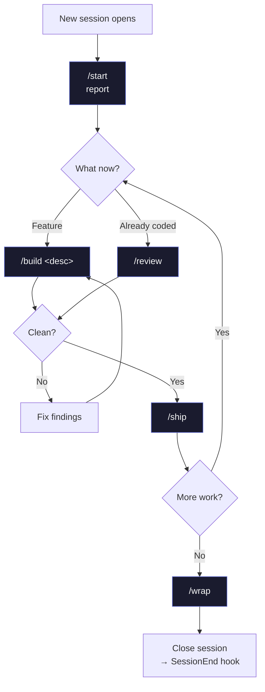
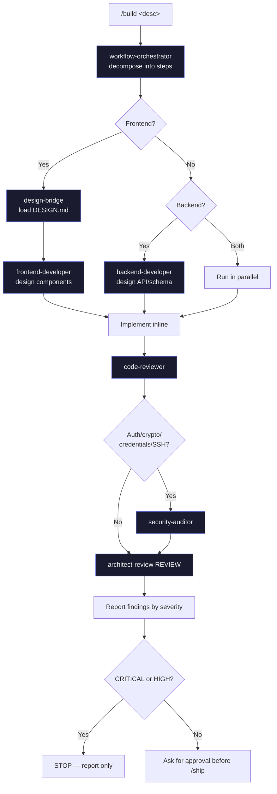
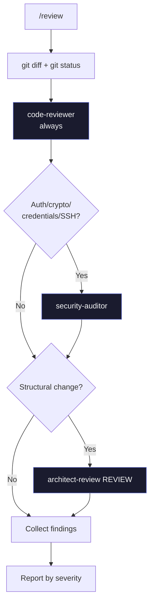
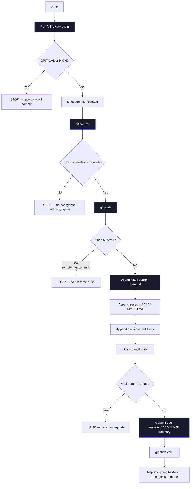
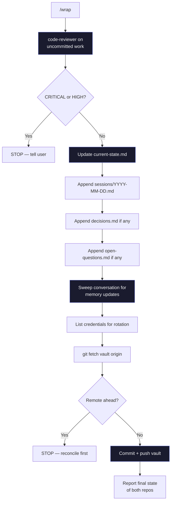

# 05 — Slash commands

Zaude ships five slash commands. They're the primary interface: if a command covers your workflow, use it rather than freestyling with prompts. This doc covers each command in depth — what it does, when to use it, the agent chain under the hood, the gates that stop it, and a realistic example session.

---

## Summary

| Command | One-line purpose | Runs agents? | Writes to vault? | Commits? | Pushes? |
|---|---|---|---|---|---|
| `/start` | Report where you left off | No | No | No | No |
| `/build <desc>` | Plan → design → implement → review | Yes (orchestrator + design + reviewers) | No | No | No |
| `/review` | Read-only review of uncommitted diff | Yes (code / architect / security) | No | No | No |
| `/ship` | Review → commit → push → vault update | Yes (full review chain) | Yes (current-state, sessions, decisions) | Yes (project + vault) | Yes (project + vault) |
| `/wrap` | End-of-session housekeeping | Yes (code-reviewer only) | Yes (current-state, sessions, decisions, open-questions) | Yes (vault) | Yes (vault) |

### Typical session flow



---

## `/start` — report where you left off

### What it does

Reads the vault context the `SessionStart` hook already injected and reports a structured summary: last session, what's in flight, what's blocked, active memory rules, next concrete action. Does not re-read files and does not start building.

### When to use it

At the **beginning of every session**. Before any other command.

### Under the hood

No agents. The command file (`~/.claude/commands/start.md`) is an instruction to the model:

1. Pull the last session summary from the most recent entry in `sessions/`.
2. Pull in-flight work from `current-state.md`.
3. Pull unresolved `CRITICAL`/`HIGH` items from `open-questions.md`.
4. One-line summary of each `feedback_*.md` memory file.
5. Pull the "Next action" from `current-state.md`.

If the `=== VAULT CONTEXT FOR <slug> ===` block isn't in the system reminder, the hook didn't fire for this cwd. The command tells you to check `cwd_to_project` in `~/.zaude/config.json`.

### Gates

- If vault context is missing, `/start` reports the problem; does not try to recover by reading files one by one (that defeats the hook's mechanical guarantee).

### Example

```
You: /start

Claude:
## Where we left off — my-app (2026-04-10)

**Last session (2026-04-10):** Decided to migrate off App Router to Remix.
Scaffolded `apps/web-remix/` with Auth.js v5. No runtime code yet.

**In flight:** JWT refresh-token middleware on branch `feat/jwt-refresh`. Designed
but not merged. Stopped at the refresh endpoint, pending Q3 resolution.

**Blocking:**
- Q2 (HIGH): Admin subdomain on separate auth flow? Recommended: OAuth + mandatory TOTP.
- Q3 (HIGH): Refresh token rotation on every use? Not decided; research needed on mobile concurrency.

**Active memory rules (4):**
- Don't modify working code outside the task scope
- Always run code-reviewer + architect-review before /ship
- Design DESIGN.md compliance before every frontend commit
- Playwright verify every UI change

**Next action:** Resolve Q3 (refresh-token rotation strategy), then finish the refresh
endpoint and integration tests.

What do you want to work on?
```

---

## `/build <description>` — run the full chain

### What it does

The main workflow engine. Takes a feature description and runs: plan with `workflow-orchestrator` → design with `backend-developer` and/or `frontend-developer` (via `design-bridge` if frontend) → implement → review with `code-reviewer` / `security-auditor` / `architect-review`. Gates each step on the previous one passing.

### When to use it

For **any non-trivial feature or refactor** — anything that involves new logic, new schema, new routes, new components, or touches more than one file meaningfully.

Not for: one-line typo fixes, documentation edits, trivial config tweaks. Those are fine with direct edits.

### Under the hood



The six phases:

1. **Plan** — `workflow-orchestrator` decomposes the feature into ordered steps. Output: what changes, in what order, with what gates.
2. **Design (frontend)** — if the work touches UI, `design-bridge` loads the project's `DESIGN.md` and briefs the design rules. Then `frontend-developer` designs components (names, props, file paths, Tailwind classes). **Code is not written yet.**
3. **Design (backend)** — if the work touches backend, `backend-developer` designs the API shape, service layer, schema, error semantics. **Code is not written yet.**
4. **Implement** — the model writes the code inline, strictly following the design output. If something's underspecified, it stops and re-invokes the design agent rather than improvising.
5. **Review** — in order:
   - `code-reviewer` (always)
   - `security-auditor` (if the diff touches auth, JWT, passwords, encryption, credentials, SSH, or input validation)
   - `architect-review` in REVIEW mode (always, on structural changes)
6. **Report** — findings organized by severity with file:line references.

### Gates

- `workflow-orchestrator` flags feature as out of scope → stop
- `design-bridge` finds DESIGN.md violation → stop, ask whether to update the spec
- Any reviewer returns CRITICAL or HIGH → stop, report, do not commit
- The command **never commits on its own** — you must run `/ship` after `/build`

### Trigger rules (non-negotiable)

| Agent | Triggered by |
|---|---|
| `workflow-orchestrator` | Every `/build` |
| `design-bridge` + `frontend-developer` | Any frontend change |
| `backend-developer` | Any backend change |
| `code-reviewer` | Every `/build` |
| `security-auditor` | Auth / JWT / passwords / crypto / credentials / SSH / input validation |
| `architect-review` REVIEW | Every structural change (new service, route, middleware, schema table, major component) |

### Example

````
You: /build add a password reset flow: user requests via email, receives a
tokenized link, sets new password, all existing sessions invalidated.

Claude:
## Step 1 — Planning with workflow-orchestrator

Decomposed into:
1. Schema: add `password_reset_tokens` table (user_id, token_hash, expires_at, used_at)
2. Backend: POST /api/auth/forgot-password (request token)
3. Backend: POST /api/auth/reset-password (consume token + set password)
4. Frontend: /forgot-password page (email input)
5. Frontend: /reset-password/[token] page (new-password form)
6. Email: transactional template + send via Resend
7. Session invalidation: bump user.session_version; all JWTs validate against version

## Step 2 — Frontend design via design-bridge + frontend-developer

[design-bridge] DESIGN.md rules applying here:
- Use the existing `<AuthShell>` wrapper for both pages
- Inputs use `<Input>` from shadcn/ui; no custom input components
- Error state shown inline under the field, not as toast

[frontend-developer] Component design:
- `app/(auth)/forgot-password/page.tsx` → client component, form with email field
- `app/(auth)/reset-password/[token]/page.tsx` → client component, form with password + confirm
- `components/auth/ResetPasswordForm.tsx` → shared form logic

## Step 3 — Backend design via backend-developer

Schema: `db/schema/passwordResetTokens.ts`
API:
- POST /api/auth/forgot-password → rate-limited (5/hr/IP), always returns 200 (don't leak which emails exist)
- POST /api/auth/reset-password → validates token, checks expires_at, checks used_at, sets new password, bumps session_version, marks used_at

## Step 4 — Implementation
[... writes files ...]

## Step 5 — Review

[code-reviewer] 1 finding:
- MEDIUM: db/schema/passwordResetTokens.ts:12 — consider adding index on token_hash for lookup perf

[security-auditor] 2 findings:
- CRITICAL: app/api/auth/reset-password/route.ts:34 — token comparison uses == which is vulnerable
  to timing attack. Use `crypto.timingSafeEqual`.
- HIGH: app/api/auth/forgot-password/route.ts:21 — rate limit is per-IP only, not per-email. Attacker
  can DoS a specific user's inbox by rotating IPs.

[architect-review] REVIEW — no findings.

## STOPPING — 1 CRITICAL + 1 HIGH

Fix these before /ship:
1. Switch to timingSafeEqual for token comparison
2. Add per-email rate limit (e.g. 3 sends per 24h per email)

Ready to address?

You: yes fix both
[... applies fixes, re-runs security-auditor ...]

[security-auditor] clean on re-run. /ship when ready.
````

---

## `/review` — read-only review of the diff

### What it does

Runs the full review chain against the current uncommitted changes. Reports findings organized by severity. **Does not fix anything.** Does not commit. Purely read-only.

### When to use it

- Before running `/ship` if you want to see findings first without the commit step looming
- After you've done some work without `/build` and want a sanity check
- When someone else's PR is in your working tree and you want a quick read
- As a lightweight "does this look right?" check

### Under the hood



Report format:

```
## CRITICAL
### [reviewer] path/to/file.ts:LINE
One-sentence issue.
→ Recommendation (not the fix code).

## HIGH
...

## MEDIUM
...

## LOW
...
```

If no findings: `"Clean. N files reviewed, 0 findings."`

### Gates

None — `/review` always runs, always reports. It never modifies files.

### Example

```
You: /review

Claude:
Running /review on uncommitted changes.

Files modified:
- packages/api/src/routes/auth.ts (+32 / -4)
- packages/api/src/middleware/rateLimit.ts (+18 / -0)
- packages/api/tests/auth.test.ts (+47 / -2)

Reviewers selected: code-reviewer, security-auditor (auth changes), architect-review

## HIGH
### [security-auditor] packages/api/src/routes/auth.ts:67
JWT sign call uses default HS256 but the secret key is only 16 bytes,
below the 32-byte recommendation for HS256.
→ Either lengthen JWT_SECRET to ≥32 bytes or switch to RS256 with a key pair.

## MEDIUM
### [code-reviewer] packages/api/src/middleware/rateLimit.ts:22
Rate-limit counter uses in-memory Map; resets on every server restart.
→ Consider Redis or at least note this as a known limitation.

### [architect-review] packages/api/src/routes/auth.ts:30
Authentication logic is split between the route and the middleware; the middleware
technically validates the token but the route then re-decodes it.
→ Consolidate: middleware attaches `req.user`, route reads from `req.user`.

## LOW
### [code-reviewer] packages/api/tests/auth.test.ts:44
Test case description doesn't match assertion — says "rejects expired token"
but actually checks for malformed token.
→ Either fix the description or add a separate case for expired tokens.

1 HIGH, 2 MEDIUM, 1 LOW. Fix the HIGH before /ship.
```

---

## `/ship` — the shipping workflow

### What it does

Full shipping chain: re-runs review, commits if clean, pushes, updates the vault, commits and pushes the vault. Stops at the first CRITICAL or HIGH finding.

### When to use it

When you have a feature you've tested and are ready to commit + push. Run this **after** a `/build` that passed review, or after manual work you've verified with `/review`.

### Under the hood



The ten steps:

1. Run the full review chain (`code-reviewer` + `architect-review` + `security-auditor` if applicable)
2. If any CRITICAL or HIGH — **STOP**
3. Draft a commit message (1-2 sentences, focus on "why")
4. `git push` to `main`
5. Update `current-state.md` in the vault with the new commit hash and a paragraph summary
6. Append to today's `sessions/YYYY-MM-DD.md`
7. Append any new decisions to `decisions.md`
8. `git fetch origin` on the vault; stop if remote has newer commits
9. Commit the vault with message `session YYYY-MM-DD: <short summary>` and push
10. Report both commit hashes and any credentials exposed this session (first 4 + last 4 chars only)

### Gates

| Gate | What stops |
|---|---|
| CRITICAL or HIGH finding | Commit blocked |
| Pre-commit hook failed | Never bypass with `--no-verify` |
| Push to project rejected | Never force-push `main` |
| Vault has unrelated uncommitted changes (from another project) | Do not bundle — commit only the current project's files |
| Vault remote has newer commits | Never force-push — tell the user to reconcile |

### Example

```
You: /ship

Claude:
## Running /ship on my-app

### Step 1 — Review chain
[code-reviewer] clean
[security-auditor] clean
[architect-review] REVIEW — clean

### Step 2 — Drafting commit

Draft message:
    Add password reset flow with token-based email link

    New endpoints at /api/auth/{forgot,reset}-password, new
    password_reset_tokens table. Uses timing-safe token comparison
    and per-email rate limiting. Bumps user.session_version on reset
    to invalidate all existing sessions.

    Co-Authored-By: Claude <noreply@anthropic.com>

### Step 3 — Committing + pushing
git commit ... → `e7d9c3a`
git push origin main → pushed

### Step 4 — Updating vault

Updated ~/zaude-vault/01-projects/my-app/current-state.md:
- Bumped status to commit e7d9c3a
- Moved "password reset" from "In-flight" to "What exists"
- Updated "Next action" to: "Write e2e test with Playwright for the full reset flow"

Appended ~/zaude-vault/01-projects/my-app/sessions/2026-04-15.md:
- Summary paragraph + commit hash + no new decisions

### Step 5 — Committing + pushing vault
git fetch origin (vault) → clean, no new remote commits
git commit "session 2026-04-15: ship password reset" → `f8e4a21`
git push → pushed

## Result

- Project commit: `e7d9c3a` on main
- Vault commit: `f8e4a21` on main
- Files shipped: 7 files (+195 / -12)

## Credentials to rotate

None exposed in this session.

## Next session

Run /start to load the updated vault. Next action: Playwright e2e for the reset flow.
```

---

## `/wrap` — end-of-session housekeeping

### What it does

The comprehensive session wrap-up. Runs one final code review on any uncommitted work, updates the vault, writes a session log, appends decisions and open questions, sweeps the conversation for new memory, lists credentials for rotation, and pushes the vault. Leaves everything clean.

### When to use it

**At the end of every session**, even if nothing shipped. Especially if nothing shipped — `/wrap` captures the state of in-flight work so the next session can pick it up.

If you already ran `/ship`, you can still run `/wrap` — it's idempotent and cheap. But the main use case for `/wrap` is "session ending without a ship", e.g. you explored an idea, talked through tradeoffs, didn't land code.

### Under the hood



The eleven steps:

1. `code-reviewer` on uncommitted changes (if any)
2. Update `current-state.md` — refresh status line, known issues, next action, mark done items
3. Write or append to `sessions/YYYY-MM-DD.md` — summary, commits, decisions, lessons, credentials
4. Append any new decisions to `decisions.md`
5. Append any new open questions to `open-questions.md` (numbered QN)
6. Persist new feedback memory from this session into `~/.claude/projects/<cwd>/memory/`
7. List credentials exposed this session (first 4 / last 4 chars only)
8. `git fetch origin` on vault — stop if remote has newer commits
9. `git commit -m "session YYYY-MM-DD: <summary>"`
10. `git push`
11. Run `git status` on both repos, report both clean (or exactly what's dirty and why)

### Gates

- `code-reviewer` returns CRITICAL or HIGH on uncommitted work → STOP, don't touch the vault yet
- Vault has unrelated uncommitted changes (from another project) → do not bundle them
- Vault remote has newer commits → never force-push; ask user to reconcile
- Never skip the memory sweep or credential scan "to save tokens"

### Example

```
You: /wrap

Claude:
## Running /wrap on my-app

### Step 1 — code-reviewer on uncommitted work
No uncommitted changes. Skipping.

### Step 2 — Updating current-state.md
- Refreshed status: commit e7d9c3a on main (no new commits this session)
- Removed "password reset e2e test" from "In-flight" (now captured as next action)
- Added known issue: "Forgot-password rate limit counter resets on dyno restart"
  (new finding from /review, not critical, keeping as MEDIUM)

### Step 3 — Writing sessions/2026-04-15.md
Session summary covers:
- Password reset shipped this morning (already logged via /ship earlier)
- This afternoon: explored moving rate-limit to Redis
- Decided not to — see new decision entry

### Step 4 — Appending decisions.md
New entry: "2026-04-15 — Stay on in-memory rate limiter for now"
Rationale: We only have 1 dyno in production; Redis adds complexity for negligible value.
Revisit when we scale to multiple dynos.
Implications: Accept that aggressive attackers can bypass rate limit by timing restarts.

### Step 5 — Appending open-questions.md
New Q4: "When we scale past 1 dyno, do we use Upstash Redis or self-host?" — LOW priority.

### Step 6 — Memory sweep
One new feedback file:
- ~/.claude/projects/-home-you-my-app/memory/feedback_rate_limit_complexity.md
  "Don't introduce Redis / service infra unless current scale demands it"

MEMORY.md updated with pointer.

### Step 7 — Credentials to rotate

STRIPE_WEBHOOK_SECRET (whsec_...xyz) — ROTATE — pasted inline while debugging webhook signatures.

### Step 8 — Vault state check
git fetch origin → clean
git status → 4 files modified (expected)

### Step 9 + 10 — Committing + pushing vault
git commit "session 2026-04-15: wrap-up — rate limit decision, password reset live"
→ `b2c5d11`
git push → pushed

### Step 11 — Final state
- my-app: clean on main @ e7d9c3a
- zaude-vault: clean on main @ b2c5d11
- Credentials to rotate: STRIPE_WEBHOOK_SECRET (see above)

Session wrapped. Safe to close.
```

---

## Gates at a glance

The full list of things that STOP each command. Useful to skim before you run one.

| Command | Stops on |
|---|---|
| `/start` | Missing vault context → reports diagnostic, doesn't recover |
| `/build` | Orchestrator flags feature as blocked; design-bridge finds DESIGN.md violation; any reviewer returns CRITICAL or HIGH |
| `/review` | Never stops — always reports |
| `/ship` | Reviewer CRITICAL or HIGH; pre-commit hook failed; project push rejected; vault has unrelated changes; vault remote has newer commits |
| `/wrap` | code-reviewer returns CRITICAL or HIGH on uncommitted work; vault remote has newer commits |

None of these commands force-push. None of them skip pre-commit hooks with `--no-verify`. If you want to override any of these guards, you edit the command file or tell the model in plain language to override a specific step — never implicitly.

---

## Command authoring tips

If you want to write your own slash commands to extend Zaude, the existing ones are the template. Patterns that work:

| Pattern | Why |
|---|---|
| State the command's role in the first paragraph | Model reads top-down; first paragraph anchors behavior |
| List the under-the-hood steps explicitly | Easier to audit than "do the right thing" |
| Define gates with a STOP clause | Makes the gating behavior unambiguous |
| Name the exact agent to invoke at each step | Reduces "which agent?" ambiguity |
| End with "wait for explicit approval" if it's non-destructive | Prevents the command from accidentally shipping |

Anti-patterns to avoid in command files:

- "Use your best judgment" without listing the options — the model doesn't share your judgment
- Listing 20 steps without gates — every command needs failure modes
- Mixing reviewer and fixer — separate `/review` (read-only) from `/build` (fix-and-review)
- Skipping the "what doesn't trigger this" rules — the trigger rules are what keep the chain cheap

---

## What's next

| Topic | Go to |
|---|---|
| Understand what the vault looks like and when commands write to it | [04 — Vault pattern](./04-vault.md) |
| See the architecture end-to-end | [03 — Architecture](./03-architecture.md) |
| Install Zaude and try the commands | [02 — Installation](./02-installation.md) |
| Read the motivation | [01 — Introduction](./01-introduction.md) |

See also the source of each command:
- [`start.md`](../templates/claude-config/commands/start.md)
- [`build.md`](../templates/claude-config/commands/build.md)
- [`review.md`](../templates/claude-config/commands/review.md)
- [`ship.md`](../templates/claude-config/commands/ship.md)
- [`wrap.md`](../templates/claude-config/commands/wrap.md)
