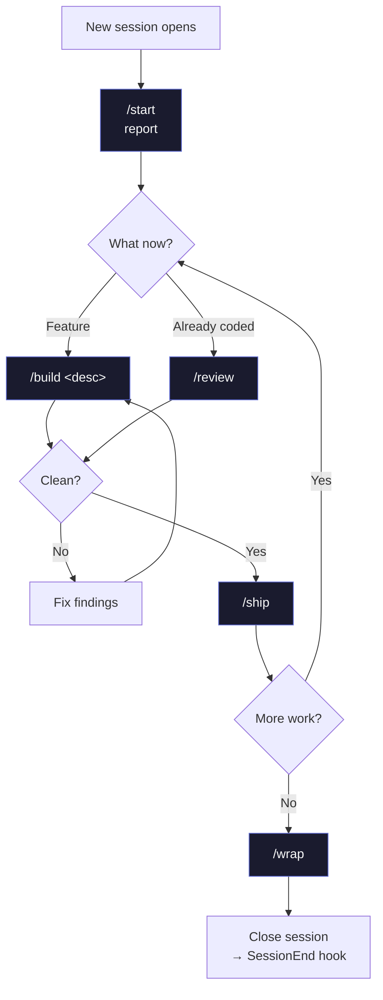
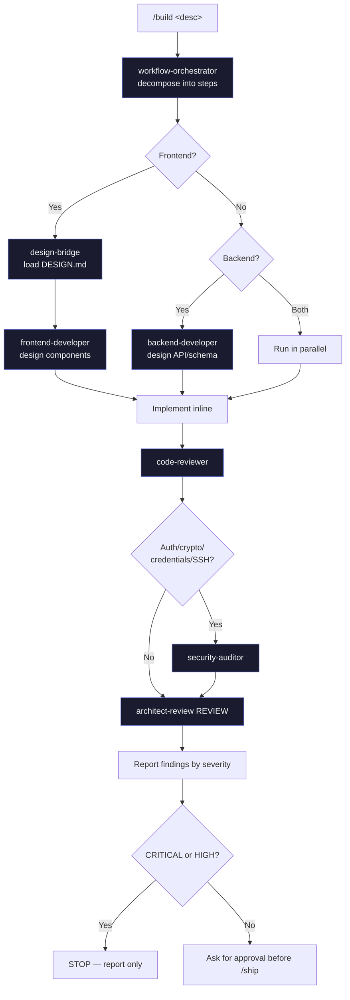
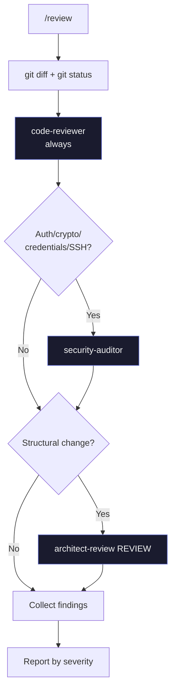
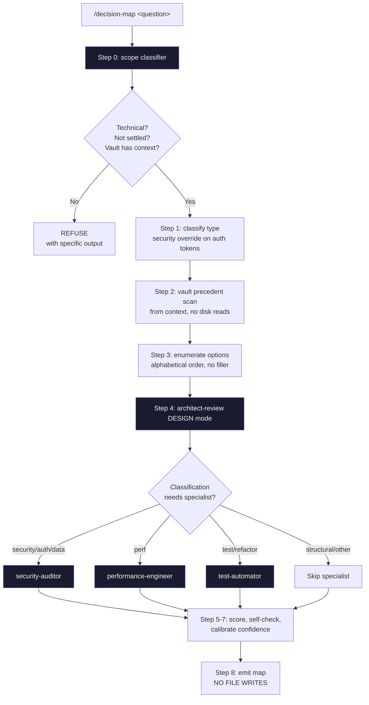
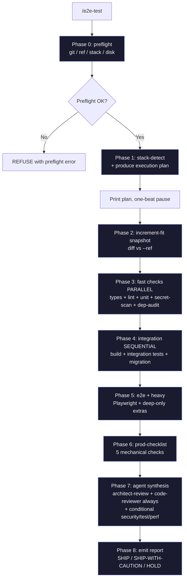
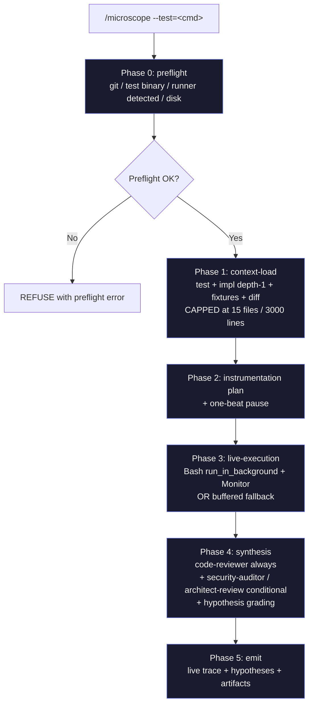
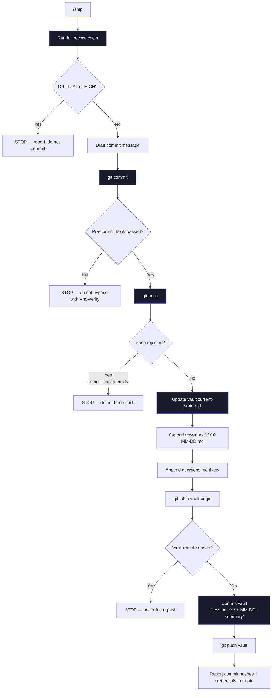
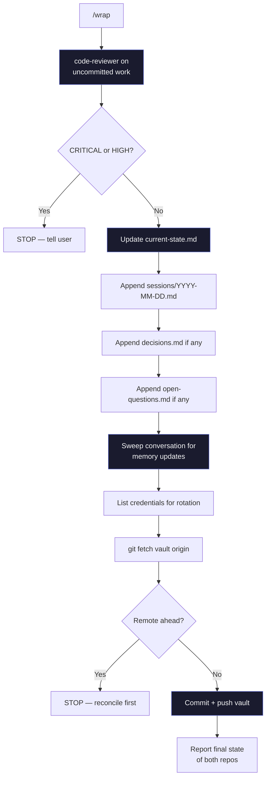

# 05 — Slash commands

Zaude ships eight slash commands. They're the primary interface: if a command covers your workflow, use it rather than freestyling with prompts. This doc covers each command in depth — what it does, when to use it, the agent chain under the hood, the gates that stop it, and a realistic example session.

---

## Summary

| Command | One-line purpose | Runs agents? | Writes to vault? | Commits? | Pushes? |
|---|---|---|---|---|---|
| `/start` | Report where you left off | No | No | No | No |
| `/build <desc>` | Plan → design → implement → review | Yes (orchestrator + design + reviewers) | No | No | No |
| `/review` | Read-only review of uncommitted diff | Yes (code / architect / security) | No | No | No |
| `/decision-map <question>` | Structured analysis of a stuck technical decision | Yes (architect-review + one specialist max) | No (print-only draft blocks) | No | No |
| `/e2e-test` | Production-readiness gate: every applicable test layer + prod checklist + specialist review | Yes (2 always-on + 3 conditional) | No (writes only to gitignored artifact dir) | No | No |
| `/microscope <test>` | Live-audit a test run: pre-load context, stream events, emit ranked root-cause hypotheses | Yes (code-reviewer always + 2 conditional) | No (writes only to gitignored artifact dir) | No | No |
| `/ship` | Review → commit → push → vault update | Yes (full review chain) | Yes (current-state, sessions, decisions) | Yes (project + vault) | Yes (project + vault) |
| `/wrap` | End-of-session housekeeping | Yes (code-reviewer only) | Yes (current-state, sessions, decisions, open-questions) | Yes (vault) | Yes (vault) |

### Typical session flow



---

## `/start` — report where you left off

### What it does

Reads the vault context the `SessionStart` hook already injected and reports a structured summary: last session, what's in flight, what's blocked, active memory rules, next concrete action. Does not re-read files and does not start building.

### When to use it

At the **beginning of every session**. Before any other command.

### Under the hood

No agents. The command file (`~/.claude/commands/start.md`) is an instruction to the model:

1. Pull the last session summary from the most recent entry in `sessions/`.
2. Pull in-flight work from `current-state.md`.
3. Pull unresolved `CRITICAL`/`HIGH` items from `open-questions.md`.
4. One-line summary of each `feedback_*.md` memory file.
5. Pull the "Next action" from `current-state.md`.

If the `=== VAULT CONTEXT FOR <slug> ===` block isn't in the system reminder, the hook didn't fire for this cwd. The command tells you to check `cwd_to_project` in `~/.zaude/config.json`.

### Gates

- If vault context is missing, `/start` reports the problem; does not try to recover by reading files one by one (that defeats the hook's mechanical guarantee).

### Example

```
You: /start

Claude:
## Where we left off — my-app (2026-04-10)

**Last session (2026-04-10):** Decided to migrate off App Router to Remix.
Scaffolded `apps/web-remix/` with Auth.js v5. No runtime code yet.

**In flight:** JWT refresh-token middleware on branch `feat/jwt-refresh`. Designed
but not merged. Stopped at the refresh endpoint, pending Q3 resolution.

**Blocking:**
- Q2 (HIGH): Admin subdomain on separate auth flow? Recommended: OAuth + mandatory TOTP.
- Q3 (HIGH): Refresh token rotation on every use? Not decided; research needed on mobile concurrency.

**Active memory rules (4):**
- Don't modify working code outside the task scope
- Always run code-reviewer + architect-review before /ship
- Design DESIGN.md compliance before every frontend commit
- Playwright verify every UI change

**Next action:** Resolve Q3 (refresh-token rotation strategy), then finish the refresh
endpoint and integration tests.

What do you want to work on?
```

---

## `/build <description>` — run the full chain

### What it does

The main workflow engine. Takes a feature description and runs: plan with `workflow-orchestrator` → design with `backend-developer` and/or `frontend-developer` (via `design-bridge` if frontend) → implement → review with `code-reviewer` / `security-auditor` / `architect-review`. Gates each step on the previous one passing.

### When to use it

For **any non-trivial feature or refactor** — anything that involves new logic, new schema, new routes, new components, or touches more than one file meaningfully.

Not for: one-line typo fixes, documentation edits, trivial config tweaks. Those are fine with direct edits.

### Under the hood



The six phases:

1. **Plan** — `workflow-orchestrator` decomposes the feature into ordered steps. Output: what changes, in what order, with what gates.
2. **Design (frontend)** — if the work touches UI, `design-bridge` loads the project's `DESIGN.md` and briefs the design rules. Then `frontend-developer` designs components (names, props, file paths, Tailwind classes). **Code is not written yet.**
3. **Design (backend)** — if the work touches backend, `backend-developer` designs the API shape, service layer, schema, error semantics. **Code is not written yet.**
4. **Implement** — the model writes the code inline, strictly following the design output. If something's underspecified, it stops and re-invokes the design agent rather than improvising.
5. **Review** — in order:
   - `code-reviewer` (always)
   - `security-auditor` (if the diff touches auth, JWT, passwords, encryption, credentials, SSH, or input validation)
   - `architect-review` in REVIEW mode (always, on structural changes)
6. **Report** — findings organized by severity with file:line references.

### Gates

- `workflow-orchestrator` flags feature as out of scope → stop
- `design-bridge` finds DESIGN.md violation → stop, ask whether to update the spec
- Any reviewer returns CRITICAL or HIGH → stop, report, do not commit
- The command **never commits on its own** — you must run `/ship` after `/build`

### Trigger rules (non-negotiable)

| Agent | Triggered by |
|---|---|
| `workflow-orchestrator` | Every `/build` |
| `design-bridge` + `frontend-developer` | Any frontend change |
| `backend-developer` | Any backend change |
| `code-reviewer` | Every `/build` |
| `security-auditor` | Auth / JWT / passwords / crypto / credentials / SSH / input validation |
| `architect-review` REVIEW | Every structural change (new service, route, middleware, schema table, major component) |

### Example

````
You: /build add a password reset flow: user requests via email, receives a
tokenized link, sets new password, all existing sessions invalidated.

Claude:
## Step 1 — Planning with workflow-orchestrator

Decomposed into:
1. Schema: add `password_reset_tokens` table (user_id, token_hash, expires_at, used_at)
2. Backend: POST /api/auth/forgot-password (request token)
3. Backend: POST /api/auth/reset-password (consume token + set password)
4. Frontend: /forgot-password page (email input)
5. Frontend: /reset-password/[token] page (new-password form)
6. Email: transactional template + send via Resend
7. Session invalidation: bump user.session_version; all JWTs validate against version

## Step 2 — Frontend design via design-bridge + frontend-developer

[design-bridge] DESIGN.md rules applying here:
- Use the existing `<AuthShell>` wrapper for both pages
- Inputs use `<Input>` from shadcn/ui; no custom input components
- Error state shown inline under the field, not as toast

[frontend-developer] Component design:
- `app/(auth)/forgot-password/page.tsx` → client component, form with email field
- `app/(auth)/reset-password/[token]/page.tsx` → client component, form with password + confirm
- `components/auth/ResetPasswordForm.tsx` → shared form logic

## Step 3 — Backend design via backend-developer

Schema: `db/schema/passwordResetTokens.ts`
API:
- POST /api/auth/forgot-password → rate-limited (5/hr/IP), always returns 200 (don't leak which emails exist)
- POST /api/auth/reset-password → validates token, checks expires_at, checks used_at, sets new password, bumps session_version, marks used_at

## Step 4 — Implementation
[... writes files ...]

## Step 5 — Review

[code-reviewer] 1 finding:
- MEDIUM: db/schema/passwordResetTokens.ts:12 — consider adding index on token_hash for lookup perf

[security-auditor] 2 findings:
- CRITICAL: app/api/auth/reset-password/route.ts:34 — token comparison uses == which is vulnerable
  to timing attack. Use `crypto.timingSafeEqual`.
- HIGH: app/api/auth/forgot-password/route.ts:21 — rate limit is per-IP only, not per-email. Attacker
  can DoS a specific user's inbox by rotating IPs.

[architect-review] REVIEW — no findings.

## STOPPING — 1 CRITICAL + 1 HIGH

Fix these before /ship:
1. Switch to timingSafeEqual for token comparison
2. Add per-email rate limit (e.g. 3 sends per 24h per email)

Ready to address?

You: yes fix both
[... applies fixes, re-runs security-auditor ...]

[security-auditor] clean on re-run. /ship when ready.
````

---

## `/review` — read-only review of the diff

### What it does

Runs the full review chain against the current uncommitted changes. Reports findings organized by severity. **Does not fix anything.** Does not commit. Purely read-only.

### When to use it

- Before running `/ship` if you want to see findings first without the commit step looming
- After you've done some work without `/build` and want a sanity check
- When someone else's PR is in your working tree and you want a quick read
- As a lightweight "does this look right?" check

### Under the hood



Report format:

```
## CRITICAL
### [reviewer] path/to/file.ts:LINE
One-sentence issue.
→ Recommendation (not the fix code).

## HIGH
...

## MEDIUM
...

## LOW
...
```

If no findings: `"Clean. N files reviewed, 0 findings."`

### Gates

None — `/review` always runs, always reports. It never modifies files.

### Example

```
You: /review

Claude:
Running /review on uncommitted changes.

Files modified:
- packages/api/src/routes/auth.ts (+32 / -4)
- packages/api/src/middleware/rateLimit.ts (+18 / -0)
- packages/api/tests/auth.test.ts (+47 / -2)

Reviewers selected: code-reviewer, security-auditor (auth changes), architect-review

## HIGH
### [security-auditor] packages/api/src/routes/auth.ts:67
JWT sign call uses default HS256 but the secret key is only 16 bytes,
below the 32-byte recommendation for HS256.
→ Either lengthen JWT_SECRET to ≥32 bytes or switch to RS256 with a key pair.

## MEDIUM
### [code-reviewer] packages/api/src/middleware/rateLimit.ts:22
Rate-limit counter uses in-memory Map; resets on every server restart.
→ Consider Redis or at least note this as a known limitation.

### [architect-review] packages/api/src/routes/auth.ts:30
Authentication logic is split between the route and the middleware; the middleware
technically validates the token but the route then re-decodes it.
→ Consolidate: middleware attaches `req.user`, route reads from `req.user`.

## LOW
### [code-reviewer] packages/api/tests/auth.test.ts:44
Test case description doesn't match assertion — says "rejects expired token"
but actually checks for malformed token.
→ Either fix the description or add a separate case for expired tokens.

1 HIGH, 2 MEDIUM, 1 LOW. Fix the HIGH before /ship.
```

---

## `/decision-map <question>` — structured analysis of a stuck technical decision

### What it does

You're stuck between two (or more) technical options. `/decision-map` reads the vault for precedent, enumerates the options honestly, scores them on the five criteria that actually matter (reversibility, blast radius, impl cost, hard-rule compliance, primary risk), invokes `architect-review` in DESIGN mode and at most one specialist agent, and produces a structured recommendation with explicit confidence and a rollback plan.

It is **read-only**: never writes to `decisions.md`, never auto-appends to `open-questions.md`, never commits. The output is a markdown report you copy from.

### When to use it

- You're about to make a structural choice and the vault has no precedent
- You're about to re-open a settled decision and want to pressure-test the move first
- You asked yourself "should I use A or B?" and the honest answer is "I don't know"
- You want a second read on a choice you're leaning toward (anti-sycophancy is a design goal — if your named option is wrong, the command says so)

Do **not** use it for: product decisions, timing decisions, hiring decisions, or any non-technical decision. The scope classifier will refuse those outright.

### Under the hood



> **Note on the dispatch branches above.** The flowchart shows the unconditional dispatches. The full matrix in the skill file is conditional for `data`, `api`, `refactor`, and `dependency` — e.g. a `data` decision only dispatches `security-auditor` when the schema includes PII/auth/credentials/tokens; a `refactor` only dispatches `test-automator` when it crosses module boundaries or touches >10 files. See the dispatch matrix in `templates/claude-config/commands/decision-map.md` for the authoritative conditions.

The nine steps (0 through 8):

0. **Scope classifier** — refuses product/process/people decisions, already-settled decisions (without `--revisit`), and cases where vault context is too thin. Prompt-level judgment, zero agent calls.
1. **Classify decision type** — one of `structural | data | api | security | perf | test | refactor | dependency | other`. **Security override:** tokens `auth`, `token`, `password`, `crypto`, `ssh`, `credential`, `secret`, `session`, `jwt`, `oauth`, `encryption` force `security` regardless. (Authoritative list lives in the skill file; update it there first.)
2. **Vault precedent scan** — reads from already-loaded context (`decisions.md`, `open-questions.md`, `CLAUDE.md`, `spec.md`). Surfaces up to 3 closest prior decisions. If precedent contradicts the user's phrasing, it leads.
3. **Enumerate options** — user-named + "do nothing" + "defer with concrete trigger" + at most one hybrid. Refuses filler. Presented alphabetically by assigned name to neutralize phrasing bias.
4. **Specialist dispatch** — `architect-review` DESIGN always, plus at most one specialist sequentially (never parallel, hard cap of two agents).
5. **Score** — five load-bearing criteria always + up to three situational (user impact, maintenance burden, migration safety).
6. **Anti-sycophancy self-check** — asks: did I pick this because the user named it first? Am I hedging to avoid contradicting them?
7. **Confidence calibration** — `high` requires precedent-agrees AND hard-rules-unambiguous AND low-to-medium risk. Skipped specialist caps confidence at `medium`. `--force` (insufficient-context bypass) and `--revisit` with a thin rationale both cap confidence at `low`. Caps stack; the lowest ceiling wins. See the skill file for the full stacking rules.
8. **Emit** — read-only. `--draft-decision` flag adds a pre-formatted `decisions.md` entry block to the output, still print-only.

### Arguments

- `$ARGUMENTS` — the decision question
- `--revisit` — bypass the "already-settled" refusal. Requires a rationale clause in the question (signal words: `because`, `since`, `now that`, `new constraint`, `new information`, `changed`, `different`, `no longer`, `has fired`).
- `--force` — bypass the "insufficient context" refusal. Confidence is automatically capped at `low`.
- `--draft-decision` — include a pre-formatted `decisions.md` entry block in the output (still print-only)

### Gates

- `$ARGUMENTS` empty → stop, emit usage
- Scope classifier flags non-technical decision → refuse, do not analyze
- `decisions.md` has settled entry and `--revisit` not passed → refuse, surface the prior entry
- Vault context too thin → refuse with list of missing pieces
- Every option FAILs on hard-rule compliance → stop, tell the user the option space is empty under current constraints
- Specialist agent errors or not installed → degrade gracefully (partial map + flag missing dimension), never halt
- **NEVER writes to `decisions.md`** — that file is human-authored, append-only
- **NEVER auto-appends to `open-questions.md`** — draft block is printed only

### Composition with other commands

- **`/build`** does not auto-invoke `/decision-map`. If `workflow-orchestrator` surfaces an ambiguous architectural choice during `/build`, it may suggest `/decision-map <question>` in its plan output. The user decides whether to break off.
- **`/review`** and **`/decision-map`** have no interaction — different time slots (post-facto code vs. pre-facto question).
- **`/ship`** may mention `/decision-map` in reviewer remediation advice when a finding is architectural rather than a defect. Not automated.
- **`/wrap`** does not currently wire an automatic prompt for decisions adopted from `/decision-map`. If you adopt a recommendation this session, add the entry to `decisions.md` yourself before `/wrap` runs its "append decisions" step. A future release may wire this handshake explicitly.

### Example

```
You: /decision-map should the rate limiter move to Redis or stay in-memory?

Claude:
## Decision: Should the rate limiter move to Redis or stay in-memory?

**Classification:** perf
**Analyzed by:** architect-review, performance-engineer

---

### Context
The forgot-password endpoint has an in-memory rate-limit counter that resets on dyno restart.
We're currently on 1 dyno. The question is whether to move to Redis (distributed, persistent)
or accept the in-memory limitation.

**Hard rules that apply:**
- "No shortcuts that trade production quality for speed" (CLAUDE.md) — constrains any option
  that knowingly leaves a security gap in production.

**Precedent in vault:**
- 2026-04-15 decisions.md: "Stay on in-memory rate limiter for now." Rationale: single dyno,
  Redis adds complexity for negligible value. Revisit when we scale past 1 dyno. — relevance:
  directly on point; this is a revisit.

**Related open questions:**
- Q4 (LOW): "When we scale past 1 dyno, do we use Upstash Redis or self-host?" — bundling
  opportunity: yes, answering this decision answers Q4.

---

### Options
(Presented alphabetically by name, not in your phrasing order.)

**A — In-memory (status quo)**
Keep the Map-based counter. Resets on every dyno restart. Zero ops cost, zero dependencies.

**B — Self-hosted Redis**
Run Redis as a Heroku add-on or on the same VPS. Fixed monthly cost, we manage failover.

**C — Upstash Redis (managed)**
Serverless Redis at Upstash. Per-request pricing, no ops burden, global replication. ~$0.20/1000
requests at our volume.

**Defer**
Trigger to revisit: when we add the second dyno. Cost of deferring: attackers can currently
reset the rate-limit by forcing a dyno restart (low exploitability today, 1 dyno = rare).

---

### Analysis

| Criterion | A (In-memory) | B (Self-hosted) | C (Upstash) | Defer |
|---|---|---|---|---|
| Reversibility | 2-way | 1-way (migration cost) | 2-way | 2-way |
| Blast radius | S (0 files changed) | L (infra + 1 service) | M (1 service + envs) | — |
| Impl cost | 0 | ~1d | ~3h | 0 |
| Hard-rule compliance | TRADEOFF (rate limit bypassable on restart) | PASS | PASS | TRADEOFF (same as A) |
| Primary risk | Attacker abuses restart timing (low, 1 dyno) | Redis ops burden falls on us | Upstash outage = no rate limiting | Pressure builds if we scale unexpectedly |

---

### Draft entry for open-questions.md

## Q6 — Rate limiter: when we scale past 1 dyno, Upstash or self-host? (LOW, revisit trigger: second dyno)

**What:** In-memory rate limiter is acceptable on 1 dyno. When we scale, pick Upstash or self-host.
**Why it matters:** Dyno restart currently lets an attacker reset the counter. Low exploitability on 1 dyno; high on N dynos with load balancing.
**Options:**
1. Upstash Redis (managed, ~$0.20/1000 req)
2. Self-hosted Redis (Heroku addon or VPS)
**Recommended:** Upstash. No ops burden; cost is marginal; one-way switch is cheap to reverse later.

---

### Note on what I did NOT do

- I did NOT write to decisions.md.
- I did NOT commit anything.
- I did NOT append to open-questions.md (the draft block above is for you to copy).
- Options are presented alphabetically by assigned name, not in the order you named them.

---

### Recommendation

**Defer** (confidence: medium)

**Why:** Precedent from 2026-04-15 is directly on point and the underlying facts haven't changed
— we're still on 1 dyno and the exploit window is narrow. Blast radius on A/B/C is real; the
cost of waiting is low.

**Primary tradeoff:** You accept continued theoretical exposure until you scale. The window is
narrow (1 dyno, restart-timing-dependent), but it is non-zero.

**Taste / principles note:** I weighted the "don't add infrastructure you don't yet need" signal
from the 2026-04-15 decision. If you're optimizing for a future multi-dyno world, C is the clear
answer — but you're not there yet.

**Rollback plan:** If you adopt Defer and hit an abuse incident, switch to C (Upstash) in ~3h
via an env-var toggle and a deploy. No data migration required.

**Revisit trigger:** Second dyno is provisioned, OR a rate-limit abuse incident is reported.

**Reply `go` to adopt Defer. Reply `go with <letter-or-name>` to adopt a different option, or redirect with a new constraint to re-analyze.**
```

### Post-recommendation behavior

The Recommendation is always the **last** section of the output — that's where the user's eye lands. The adoption signal is invited at the close of the Recommendation section and fires on the user's **very next reply turn**.

#### Adoption signals — strict token match

Case-insensitive, whitespace-trimmed, trailing punctuation stripped. Must be the **entire reply** — nothing else.

| Reply (entire message, case-insensitive) | Behavior |
|---|---|
| `go`, `yes`, `approved`, `implement it` | Adopt the **recommended option**. Start implementing (or acknowledge, if the recommendation is Defer — see Defer special case). |
| `go with <X>` (X is a letter A/B/C/... or option name, including `Defer`; case-insensitive) | Adopt **option X**. If X is the recommendation, identical to bare `go`. If X differs — including `go with defer` on a non-Defer recommendation — adopt X instead (triggers the Defer special case if X is Defer). |
| `no`, `reject`, `try again`, `revisit with <new constraint>` | Do NOT implement. Wait for new direction. |
| Anything else (including `go check the README`, `yes but option A`, `proceed`, `ship it`, `do it`, `adopt <X>`) | Wait. `proceed`/`ship it`/`do it` are explicitly NOT in the adoption set because they collide with Zaude's destructive-action closer and `/ship` command. `adopt <X>` is also NOT in the set — `go with <X>` is the single canonical named-adoption form. |

#### Scope rule — turn-adjacent only

The adoption signal fires ONLY if the user's reply is the **very next user turn** after the `/decision-map` emit. Any intervening user turn — even a clarifying question like "what does blast radius mean here?" — closes the adoption window. A later `go` is ambiguous; Claude asks what it refers to.

This means: if you want to ask a clarifying question and then adopt, you need to re-confirm after the clarification. A bare `go` after an intervening turn is no longer an adoption signal — Claude will ask what the `go` refers to before proceeding.

#### Defer special case

When the adopted option is **Defer** (as the recommendation or a named alternative), there is no implementation. Claude acknowledges the defer, prints the revisit trigger from the Draft entry for `open-questions.md`, and does NOT write to disk. User copies the Q&lt;N&gt; block manually per the file-writes prohibition.

#### Two-step authorization

| Step | What authorizes it |
|---|---|
| Implementation (code/doc changes) | Adoption signal (`go`, etc.) after `/decision-map` output |
| Commit + push | `/ship` invocation, OR explicit `commit` / `commit and push` request |

A second `go` after implementation completes is NOT an adoption signal — the scope window closed when implementation started. Claude asks for commit intent explicitly.

Implementation runs under `/build` semantics: non-trivial work invokes `architect-review` DESIGN mode + `code-reviewer` + specialists per `/build` trigger rules; trivial work skips to direct implementation.

---

## `/e2e-test` — production-readiness gate

### What it does

Runs every applicable testing layer the project supports (types, lint, unit, integration, e2e, build, dep-audit, secret-scan, prod-checklist, plus opt-in a11y / perf / license on `--profile=deep`), computes an increment-fit analysis against a git ref, dispatches 2 always-on + up to 3 conditional specialist agents for synthesis, and produces a **SHIP / SHIP-WITH-CAUTION / HOLD** verdict.

This is the heaviest command in Zaude — expect 5–45 minutes depending on profile. It answers: "if we deployed this exact state to production right now, would it survive?"

### When to use it

- Before shipping a high-stakes increment (major feature, breaking change, new public surface)
- Before cutting a release tag
- When you're unsure whether recent changes broke something you haven't tested manually
- As a local pre-CI gate on a branch you're about to merge

Do NOT run this for every commit — `/review` covers fast pre-commit discipline. `/e2e-test` is too slow for that cadence.

### Under the hood



> **Continue-on-fail by design.** No phase cancels downstream phases. A failed Phase 3 layer marks Phase 5 layers that depended on it as `INCONCLUSIVE`, but the command still runs everything it can — the user gets a full picture on every run, not the first-failure-only view that a CI pipeline would produce.

### Arguments

| Flag | Default | Semantics |
|---|---|---|
| `--profile` | `default` | Target durations: `quick` <3 min, `default` 5–15 min, `deep` 15–45 min. Exact layer membership per profile is the **Profile × Layer matrix** in the skill file (authoritative). |
| `--scope` | auto from profile | Comma-separated layer override: `types,lint,format,unit,integration,e2e,build,dep-audit,secret-scan,prod-checklist,a11y,perf,license` |
| `--ref` | merge-base with default branch | Anchor for increment-fit. Auto-detects via `git symbolic-ref refs/remotes/origin/HEAD`; falls back to `main`, then `master`, then preflight-refuses. |
| `--offline` | auto-detected | Skip network-dependent layers (dep-audit, license). Auto-set if registry probe fails. |
| `--timeout` | `600` | Per-phase timeout in seconds. Exceeded phases are killed; layer status → `TIMEOUT`. |

### Stack detection (v1)

Supported ecosystems in v1: **Node.js, Python, Go**. Triggered by lockfile/config-file presence (`package.json`, `pyproject.toml`, `go.mod`). Monorepos with multiple ecosystems run per-ecosystem with prefixed layer names (`node/types`, `python/lint`). Rust / Ruby / Java / PHP / .NET are deferred to v1.1+ — projects in those stacks get a preflight refusal pointing to the optional `./.zaude/e2e-test.config.json` override.

Per-layer detection is by config-file presence (tsconfig.json → tsc, .eslintrc → eslint, playwright.config → playwright, etc.) and user-declared scripts in `package.json` / `pyproject.toml` are preferred over canonical invocations.

### Verdict thresholds

**HOLD** if any: CRITICAL finding, unit/integration test failure, build failure, secret-scan finding in tracked files, HIGH+ dep-audit in **prod** dep, non-reversible forward migration, or increment-fit breaking change without CHANGELOG diff / version field bump / git tag on HEAD (any one sufficient).

**SHIP-WITH-CAUTION** if any: HIGH finding (not breaking change), HIGH dep-audit in **dev** dep, `e2e`/`integration` SKIP **scoped** to whether Phase 2 surfaced relevant changes (a project with no integration tests that changed only an internal utility is SHIP, not CAUTION — the trigger fires only when the skipped layer would have covered the changed surface), `--offline` forced skip, `--profile=quick` used (automatic downgrade — quick is not a production verdict), coverage drop >5pp, or no tests at all.

**SHIP** if all clean — only MEDIUM/LOW findings allowed.

### Gates

- Missing `.git/` → preflight refusal
- `--ref` unresolvable → preflight refusal
- Zero supported ecosystems detected with source present → preflight refusal
- Disk free <500 MB → preflight refusal
- Detached HEAD without explicit `--ref` → preflight refusal
- Project has no test runners but has source → `NOTHING-TO-TEST` advisory + SHIP-WITH-CAUTION
- Uncommitted changes → proceed as-is (do NOT stash); output header notes the state
- **NEVER commits, NEVER pushes, NEVER modifies source files.** Only filesystem writes are the timestamped artifact dir + announce-and-proceed append to `.gitignore`.

### Composition with other commands

- **`/build`** and **`/ship`** do not auto-invoke `/e2e-test`. Manual only — the command is too slow for every-ship cadence.
- **`/review`** is orthogonal: fast pre-commit reviews vs. slow stack-executing gate.
- **`/wrap`** does not commit `./.zaude/e2e-test/` (it's gitignored).

### Artifacts

Each run lands at `./.zaude/e2e-test/<ISO-timestamp>/`:

```
.zaude/e2e-test/2026-04-18T14-30-00Z/
├── run.log                  — full raw log
├── plan.json                — Phase 1 execution plan
├── findings.json            — machine-readable findings
├── report.md                — same report emitted to the user
├── coverage/                — unit test coverage output
├── junit/                   — JUnit XML if produced
└── playwright-trace/        — if e2e ran
```

### Example

```
You: /e2e-test

Claude:
[e2e-test 0m:00s] Phase 0/8 preflight — done (git OK, ref OK → origin/main, stack OK: node, disk OK)

### Execution plan

| Layer | Planned | Reason if SKIP |
|---|---|---|
| types | YES | tsconfig.json detected |
| lint | YES | eslint.config.js detected |
| format | YES | .prettierrc detected |
| unit | YES | vitest.config.ts detected |
| integration | SKIP | no integration test dir |
| e2e | YES | playwright.config.ts detected |
| build | YES | package.json scripts.build |
| dep-audit | YES | npm |
| secret-scan | YES | always applicable |
| prod-checklist | YES | |
| a11y | SKIP | --profile=default (opt-in via deep) |
| perf | SKIP | --profile=default |
| license | SKIP | --profile=default |

Proceeding in one beat.

[e2e-test 0m:02s] Phase 1/8 stack-detect — done (1 ecosystem, 13 layers planned, 9 will run)
[e2e-test 0m:05s] Phase 2/8 increment-fit — done (12 files changed, 2 public surfaces touched)
[e2e-test 0m:42s] Phase 3/8 fast-checks — done (types PASS, lint PASS, format PASS, unit 147/150 PASS, secret-scan 0 findings, dep-audit 2 MEDIUM)
[e2e-test 1m:08s] Phase 4/8 integration — done (build PASS 24s, integration SKIP: not configured, migrations N/A)
[e2e-test 1m:12s] Phase 5/8 e2e-heavy — running Playwright (expected ~8 min)
[e2e-test 9m:31s] Phase 5/8 e2e-heavy — done (e2e 22/22 PASS)
[e2e-test 9m:38s] Phase 6/8 prod-checklist — done (5 items, 1 MEDIUM finding: DATABASE_URL referenced in src/db.ts but not in .env.example)
[e2e-test 10m:04s] Phase 7/8 synthesis — done (2 agents dispatched: architect-review + code-reviewer)

## /e2e-test — production readiness report

**Verdict:** SHIP-WITH-CAUTION
**Profile:** default
**Ref compared against:** origin/HEAD → a3f9c21 (5 commits behind HEAD)
**Duration:** 10m 12s

[... full report table + findings + recommendation ...]

**SHIP WITH CAUTION.** Integration tests are not configured for this project. Proceed if you have manually verified the integration paths this increment touches. Do not proceed if the changed files (`src/db.ts`, `src/api/users.ts`) depend on untested integration behavior.

Full report: ./.zaude/e2e-test/2026-04-18T14-30-00Z/report.md
```

---

## `/microscope <test-command>` — live-audit a test run

### What it does

Attaches to an in-progress test run and produces a live trace with a ranked root-cause hypothesis list. Pre-loads the test file, the function(s) under test, fixtures, relevant config, and recent git diff *before* the test runs — so when events stream during execution, there's enough context to interpret them in real time.

Read-only: never writes source, never applies fixes, never re-runs the test after emitting hypotheses. Single output — a report with three grades of confidence (HIGH / MEDIUM / LOW) where each hypothesis cites file:line, streamed event timestamp, fix sketch, and exact verification command.

### When to use it

- A test is failing and the stack trace alone isn't enough to find the root cause
- You've applied a fix and want to verify the expected code path ran
- `/e2e-test` reported a layer failure — use `/microscope --test="<failing layer's command>"` to drill
- A test is intermittently failing and you want a live trace the next time it fails

### Under the hood



Six phases:

0. **Preflight** — git exists, `--test` resolves (from flag or scrollback's most recent failed test command), test binary resolvable, recognized runner (vitest/jest/mocha/pytest/go test/playwright/cypress in v1), disk ≥500MB. Unrecognized runner → falls back to `raw` mode with reduced narration signal. Unknown layer flag or `--rerun >1` → refusal.
1. **Context-load** — test file + config (always full); function-under-test at **depth-1 imports only, capped at 15 files or 3000 lines**; fixtures/mocks adjacent to test (cap 5); git diff `HEAD~5..HEAD` on loaded paths (cap 2000 lines). Cap-hit flagged in output.
2. **Instrumentation plan** — which layers will be observed (runner/code/types/logs in v1; http/db/fs deferred to v1.1+); one-beat pause for user to abort.
3. **Live execution** — `Bash run_in_background=true` + `Monitor`-equivalent streaming. Falls back to synchronous + buffered output if streaming unavailable, flagged as `Streaming mode: degraded-buffered`. Rate-limited narration: one annotation per event class per event; console noise silently collapsed (still lands in `run.log` + `events.jsonl`).
4. **Synthesis** — `code-reviewer` always-on (unless `--no-agents`); `security-auditor` if auth-context path matched; `architect-review` REVIEW mode if hypothesis cites ≥2 modules. Max 3 agents. Hypothesis grading: HIGH = event↔context link + (diff corroboration OR structural bug visible); MEDIUM = event link only; LOW = reasoned guess.
5. **Emit** — single report, not incremental. Artifacts land in `./.zaude/microscope/<timestamp>/`.

### Arguments

| Flag | Default | Semantics |
|---|---|---|
| `--test` | scrollback's most recent failed runner command | Test command. Passed verbatim to bash; Claude does not rewrite. |
| `--focus` | auto-extracted from `--test` | Narrow Phase 1 to a specific path or `<file>::<test-name>`. |
| `--layers` | all v1-detectable | CSV of `runner`, `code`, `types`, `logs`. Unknown values → refusal. |
| `--timeout` | `600` | Per-phase seconds; exceeded → kill process-tree, verdict `TIMEOUT`. |
| `--rerun` | `1` | v1 honors `--rerun=1` only; higher values refuse (flake detection v1.1). |
| `--no-agents` | off | Skip Phase 4 agent dispatch; Claude-only synthesis. |

### Supported runners (v1)

vitest, jest, mocha, pytest, go test, playwright, cypress. Each has a concrete regex row in the skill file defining start-of-run / test-start / pass / fail / assertion / hook detection. ANSI escape codes and CRLF normalized before matching.

Unrecognized runners fall back to `raw` mode: narration emits only process start + exit code + last 3 stderr lines. Phase 4 still runs, relying on the buffered output + Phase 1 pre-loaded context.

### Streaming-mechanism contract

| Tier | Mechanism | User-visible |
|---|---|---|
| Ideal | `Bash run_in_background=true` + `Monitor` | Live narration per rate-limit rules |
| Fallback | `Bash` synchronous + full buffer | Phase 3 jumps start→done; annotations derived post-hoc; `Streaming mode: degraded-buffered` in header |

No sleep-and-poll. Ever.

### Hypothesis grading

| Grade | Requires |
|---|---|
| HIGH | Streamed event directly cites a specific line in pre-loaded context AND (line is in recent diff OR structural bug visible without execution) |
| MEDIUM | Event↔context link exists but no diff corroboration, no visible structural bug |
| LOW | Reasonable guess not directly supported by streamed events |

Max 5 hypotheses per run. Each cites file:line + code snippet, streamed event timestamp, fix sketch (prose, not a diff), verification command.

### Gates

- Preflight refusals: missing `.git/`, no `--test`+no scrollback match, test binary not resolvable, disk <500MB, unknown `--layers` value, `--rerun >1`. Unrecognized runner is NOT a preflight refusal — it downgrades to `raw` mode in Phase 2's plan and continues.
- **NEVER commits, NEVER pushes, NEVER modifies source files.** Exceptions: artifact dir `.zaude/microscope/<timestamp>/` + one-time `.gitignore` append
- **NEVER applies fixes.** Hypothesis section includes fix sketches; user authors.
- **NEVER re-runs the test after emitting hypotheses.** User drives iteration.

### Composition with other commands

- **`/build`**, **`/review`**, **`/ship`**, **`/wrap`**, **`/decision-map`** — all orthogonal. No auto-invocation in either direction.
- **`/e2e-test`** — orthogonal in v1. `/e2e-test`'s HOLD verdict output now includes a `Drill further: /microscope --test="..."` copy-paste suggestion line, but nothing auto-invokes. A v1.1 `/e2e-test --drill-on-fail=<layer>` opt-in may be added later.

### Artifacts

Each run lands at `./.zaude/microscope/<ISO-timestamp>/`:

```
.zaude/microscope/2026-04-18T14-30-00Z/
├── run.log              — full raw stdout+stderr
├── plan.json            — Phase 2 instrumentation plan
├── hypotheses.json      — machine-readable hypothesis list
├── report.md            — markdown report
├── events.jsonl         — every streamed event, JSON lines
└── context/             — every file loaded in Phase 1 (reproducibility snapshot)
```

Gitignored on first run via announce-and-proceed append.

### Example

```
You: /microscope --test="vitest auth.spec.ts"

Claude:
[microscope 0m:00s] Phase 0/5 preflight — done (runner: vitest, ecosystem: node, binary resolved)
[microscope 0m:02s] Phase 1/5 context-load — done (test + config + 9 impl files + 2 fixtures + 342 diff lines)
[microscope 0m:04s] Phase 2/5 instrumentation-plan — done (runner+code+types+logs instrumented; http/db/fs skipped — v1)

Proceeding in one beat. Ctrl+C to abort.

[microscope 0m:05s] Phase 3/5 live-execution — starting (vitest auth.spec.ts)
[microscope 0m:06s]   beforeAll hook started
[microscope 0m:06s]   test "rejects invalid email" PASSED
[microscope 0m:06s]   test "accepts valid email" FAILED at auth.spec.ts:23
[microscope 0m:07s]   afterAll hook ran
[microscope 0m:08s] Phase 3/5 live-execution — FAIL (1/2 passed, exit 1)
[microscope 0m:10s] Phase 4/5 synthesis — done (1 agent dispatched, 2 hypotheses: 1 HIGH / 0 MEDIUM / 1 LOW)

## /microscope — vitest auth.spec.ts

**Outcome:** FAIL
**Runner:** vitest
**Streaming mode:** live
**Duration:** 0m 10s

### Root-cause hypotheses

#### 1. HIGH — `validateEmail` returns undefined on valid input

**Evidence:**
- Streamed event `test "accepts valid email" FAILED at auth.spec.ts:23` at `0m:06s`
- Source `src/auth/validate.ts:10-15`:
  ```typescript
  export function validateEmail(email: string) {
    if (!email.includes('@')) return false;
    // missing: return true;
  }
  ```
- Recent diff: commit `a3f9c21` (2h ago) deleted line 14 — "refactor validate.ts for brevity"

**Fix sketch:** Add `return true;` after the if-check at src/auth/validate.ts:14.

**Verify:** `vitest auth.spec.ts -t "accepts valid email"`

[... LOW hypothesis + agent findings + context snapshot + artifacts paths ...]

Full report: ./.zaude/microscope/2026-04-18T14-30-00Z/report.md
```

---

## `/ship` — the shipping workflow

### What it does

Full shipping chain: re-runs review, commits if clean, pushes, updates the vault, commits and pushes the vault. Stops at the first CRITICAL or HIGH finding.

### When to use it

When you have a feature you've tested and are ready to commit + push. Run this **after** a `/build` that passed review, or after manual work you've verified with `/review`.

### Under the hood



The ten steps:

1. Run the full review chain (`code-reviewer` + `architect-review` + `security-auditor` if applicable)
2. If any CRITICAL or HIGH — **STOP**
3. Draft a commit message (1-2 sentences, focus on "why")
4. `git push` to `main`
5. Update `current-state.md` in the vault with the new commit hash and a paragraph summary
6. Append to today's `sessions/YYYY-MM-DD.md`
7. Append any new decisions to `decisions.md`
8. `git fetch origin` on the vault; stop if remote has newer commits
9. Commit the vault with message `session YYYY-MM-DD: <short summary>` and push
10. Report both commit hashes and any credentials exposed this session (first 4 + last 4 chars only)

### Gates

| Gate | What stops |
|---|---|
| CRITICAL or HIGH finding | Commit blocked |
| Pre-commit hook failed | Never bypass with `--no-verify` |
| Push to project rejected | Never force-push `main` |
| Vault has unrelated uncommitted changes (from another project) | Do not bundle — commit only the current project's files |
| Vault remote has newer commits | Never force-push — tell the user to reconcile |

### Example

```
You: /ship

Claude:
## Running /ship on my-app

### Step 1 — Review chain
[code-reviewer] clean
[security-auditor] clean
[architect-review] REVIEW — clean

### Step 2 — Drafting commit

Draft message:
    Add password reset flow with token-based email link

    New endpoints at /api/auth/{forgot,reset}-password, new
    password_reset_tokens table. Uses timing-safe token comparison
    and per-email rate limiting. Bumps user.session_version on reset
    to invalidate all existing sessions.

    Co-Authored-By: Claude <noreply@anthropic.com>

### Step 3 — Committing + pushing
git commit ... → `e7d9c3a`
git push origin main → pushed

### Step 4 — Updating vault

Updated ~/zaude-vault/01-projects/my-app/current-state.md:
- Bumped status to commit e7d9c3a
- Moved "password reset" from "In-flight" to "What exists"
- Updated "Next action" to: "Write e2e test with Playwright for the full reset flow"

Appended ~/zaude-vault/01-projects/my-app/sessions/2026-04-15.md:
- Summary paragraph + commit hash + no new decisions

### Step 5 — Committing + pushing vault
git fetch origin (vault) → clean, no new remote commits
git commit "session 2026-04-15: ship password reset" → `f8e4a21`
git push → pushed

## Result

- Project commit: `e7d9c3a` on main
- Vault commit: `f8e4a21` on main
- Files shipped: 7 files (+195 / -12)

## Credentials to rotate

None exposed in this session.

## Next session

Run /start to load the updated vault. Next action: Playwright e2e for the reset flow.
```

---

## `/wrap` — end-of-session housekeeping

### What it does

The comprehensive session wrap-up. Runs one final code review on any uncommitted work, updates the vault, writes a session log, appends decisions and open questions, sweeps the conversation for new memory, lists credentials for rotation, and pushes the vault. Leaves everything clean.

### When to use it

**At the end of every session**, even if nothing shipped. Especially if nothing shipped — `/wrap` captures the state of in-flight work so the next session can pick it up.

If you already ran `/ship`, you can still run `/wrap` — it's idempotent and cheap. But the main use case for `/wrap` is "session ending without a ship", e.g. you explored an idea, talked through tradeoffs, didn't land code.

### Under the hood



The thirteen steps:

1. `code-reviewer` on uncommitted changes (if any)
2. Update `current-state.md` — refresh status line, known issues, next action, mark done items
3. Write or append to `sessions/YYYY-MM-DD.md` — summary, commits, decisions, lessons, credentials
4. Append any new decisions to `decisions.md`
5. Append any new open questions to `open-questions.md` (numbered QN)
6. Persist new feedback memory from this session into `~/.claude/projects/<cwd>/memory/`
7. List credentials exposed this session (first 4 / last 4 chars only)
8. **Regenerate the status-freshness block** — `python ~/.claude/hooks/lib/regen-freshness.py`. Parses today's session log for verified claims and rewrites the `<!-- status-freshness -->` block at the top of `current-state.md`.
9. **Validator gate** — `FRESHNESS_ENFORCE=1 python ~/.claude/hooks/current-state-freshness.py --check --cwd "$(pwd)"`. **Non-zero exit stops the wrap.** The validator's stderr tells you exactly what to fix; usually re-run step 8 after correcting the underlying issue (session log date, missing required field, etc.). This is the real gate — SessionEnd hooks cannot block per Claude Code docs, so the gate lives here in `/wrap` where Claude is still engaged.
10. `git fetch origin` on vault — stop if remote has newer commits
11. `git commit -m "session YYYY-MM-DD: <summary>"`
12. `git push`
13. Run `git status` on both repos, report both clean (or exactly what's dirty and why)

### Gates

- `code-reviewer` returns CRITICAL or HIGH on uncommitted work → STOP, don't touch the vault yet
- **Freshness validator returns non-zero → STOP, re-run regen with a clean session log**
- Vault has unrelated uncommitted changes (from another project) → do not bundle them
- Vault remote has newer commits → never force-push; ask user to reconcile
- Never skip the memory sweep or credential scan "to save tokens"

### Example

```
You: /wrap

Claude:
## Running /wrap on my-app

### Step 1 — code-reviewer on uncommitted work
No uncommitted changes. Skipping.

### Step 2 — Updating current-state.md
- Refreshed status: commit e7d9c3a on main (no new commits this session)
- Removed "password reset e2e test" from "In-flight" (now captured as next action)
- Added known issue: "Forgot-password rate limit counter resets on dyno restart"
  (new finding from /review, not critical, keeping as MEDIUM)

### Step 3 — Writing sessions/2026-04-15.md
Session summary covers:
- Password reset shipped this morning (already logged via /ship earlier)
- This afternoon: explored moving rate-limit to Redis
- Decided not to — see new decision entry

### Step 4 — Appending decisions.md
New entry: "2026-04-15 — Stay on in-memory rate limiter for now"
Rationale: We only have 1 dyno in production; Redis adds complexity for negligible value.
Revisit when we scale to multiple dynos.
Implications: Accept that aggressive attackers can bypass rate limit by timing restarts.

### Step 5 — Appending open-questions.md
New Q4: "When we scale past 1 dyno, do we use Upstash Redis or self-host?" — LOW priority.

### Step 6 — Memory sweep
One new feedback file:
- ~/.claude/projects/-home-you-my-app/memory/feedback_rate_limit_complexity.md
  "Don't introduce Redis / service infra unless current scale demands it"

MEMORY.md updated with pointer.

### Step 7 — Credentials to rotate

STRIPE_WEBHOOK_SECRET (whsec_...xyz) — ROTATE — pasted inline while debugging webhook signatures.

### Step 8 — Vault state check
git fetch origin → clean
git status → 4 files modified (expected)

### Step 9 + 10 — Committing + pushing vault
git commit "session 2026-04-15: wrap-up — rate limit decision, password reset live"
→ `b2c5d11`
git push → pushed

### Step 11 — Final state
- my-app: clean on main @ e7d9c3a
- zaude-vault: clean on main @ b2c5d11
- Credentials to rotate: STRIPE_WEBHOOK_SECRET (see above)

Session wrapped. Safe to close.
```

---

## Gates at a glance

The full list of things that STOP each command. Useful to skim before you run one.

| Command | Stops on |
|---|---|
| `/start` | Missing vault context → reports diagnostic, doesn't recover |
| `/build` | Orchestrator flags feature as blocked; design-bridge finds DESIGN.md violation; any reviewer returns CRITICAL or HIGH |
| `/review` | Never stops — always reports |
| `/decision-map` | Empty question; scope classifier rejects non-technical; settled decision without `--revisit`; vault context too thin; every option FAILs hard-rule compliance |
| `/e2e-test` | Missing `.git/`; `--ref` unresolvable; no supported ecosystem detected; disk free <500 MB; detached HEAD without explicit `--ref`. All are preflight errors (not verdicts). |
| `/microscope` | Missing `.git/`; no `--test` and no scrollback match; test binary not resolvable; disk <500 MB; unknown `--layers` value; `--rerun >1`. All are preflight errors (not verdicts). Unrecognized runner degrades to `raw` mode, doesn't halt. |
| `/ship` | Reviewer CRITICAL or HIGH; pre-commit hook failed; project push rejected; vault has unrelated changes; vault remote has newer commits |
| `/wrap` | code-reviewer returns CRITICAL or HIGH on uncommitted work; vault remote has newer commits |

None of these commands force-push. None of them skip pre-commit hooks with `--no-verify`. If you want to override any of these guards, you edit the command file or tell the model in plain language to override a specific step — never implicitly.

---

## Command authoring tips

If you want to write your own slash commands to extend Zaude, the existing ones are the template. Patterns that work:

| Pattern | Why |
|---|---|
| State the command's role in the first paragraph | Model reads top-down; first paragraph anchors behavior |
| List the under-the-hood steps explicitly | Easier to audit than "do the right thing" |
| Define gates with a STOP clause | Makes the gating behavior unambiguous |
| Name the exact agent to invoke at each step | Reduces "which agent?" ambiguity |
| End with "wait for explicit approval" if it's non-destructive | Prevents the command from accidentally shipping |

Anti-patterns to avoid in command files:

- "Use your best judgment" without listing the options — the model doesn't share your judgment
- Listing 20 steps without gates — every command needs failure modes
- Mixing reviewer and fixer — separate `/review` (read-only) from `/build` (fix-and-review)
- Skipping the "what doesn't trigger this" rules — the trigger rules are what keep the chain cheap

---

## What's next

| Topic | Go to |
|---|---|
| Understand what the vault looks like and when commands write to it | [04 — Vault pattern](./04-vault.md) |
| See the architecture end-to-end | [03 — Architecture](./03-architecture.md) |
| Install Zaude and try the commands | [02 — Installation](./02-installation.md) |
| Read the motivation | [01 — Introduction](./01-introduction.md) |

See also the source of each command:
- [`start.md`](../templates/claude-config/commands/start.md)
- [`build.md`](../templates/claude-config/commands/build.md)
- [`review.md`](../templates/claude-config/commands/review.md)
- [`decision-map.md`](../templates/claude-config/commands/decision-map.md)
- [`e2e-test.md`](../templates/claude-config/commands/e2e-test.md)
- [`microscope.md`](../templates/claude-config/commands/microscope.md)
- [`ship.md`](../templates/claude-config/commands/ship.md)
- [`wrap.md`](../templates/claude-config/commands/wrap.md)
