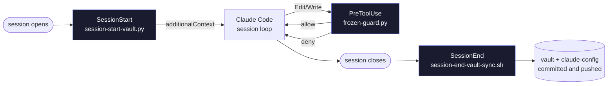
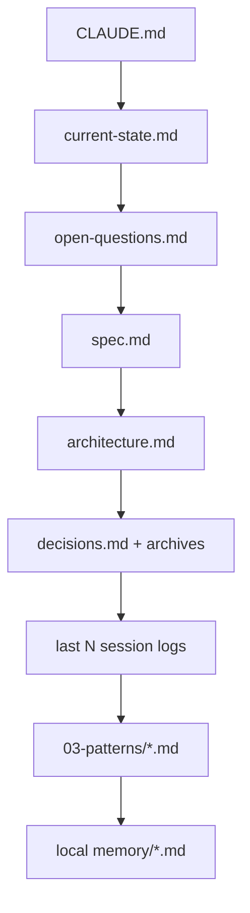
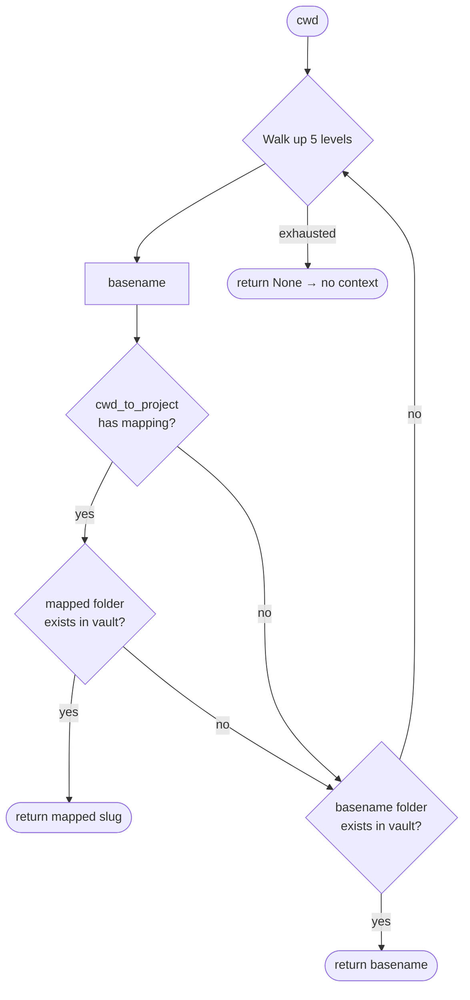

# 06 — Hooks

Hooks are the load-bearing pieces of Zaude. Everything the framework *guarantees* — context on every session, auto-sync of the vault, blocked writes to frozen paths — lives in a hook, not in a slash command.

> **The rule you should internalize:**
> **Hooks enforce. Skills suggest.**
> Slash commands are documentation Claude can silently skip. Hooks are executed by the Claude Code harness *before* Claude sees the turn. If you need a "never happens by accident" guarantee, it belongs in a hook.

---

## Why hooks, not prompts

| | Prompt / skill | Hook |
|---|---|---|
| Runs every time? | Only if the model decides to | Always, by the harness |
| Can be skipped? | Yes — model may forget, context may be pruned | No — it's shell/Python executed by Claude Code |
| Good for | Workflow suggestions, reporting templates | Mechanical guarantees |
| Failure mode | Silent drift over many sessions | Loud exit code + log file |

A skill that says *"read the vault on every session"* works until it doesn't. A `SessionStart` hook that *injects* the vault into `additionalContext` works on turn one, every session, with no model judgement required.

---

## The three hooks Zaude ships



| Hook | File | Fires | Purpose |
|---|---|---|---|
| **SessionStart** | `~/.claude/hooks/session-start-vault.py` | When a new Claude Code session opens | Inject the project vault, pattern files, and local memory as `additionalContext` |
| **PreToolUse** | `~/.claude/hooks/frozen-guard.py` | Before every `Edit` or `Write` tool call | Deny writes to paths listed in `frozen_zones` |
| **SessionEnd** | `~/.claude/hooks/session-end-vault-sync.sh` | When the session is closed | Auto-commit and push the vault + claude-config repos |

All three are wired in `~/.claude/settings.json`.

---

## SessionStart — auto-loads the vault

**File:** `~/.claude/hooks/session-start-vault.py`

### What it does

On every session open, the hook:

1. Reads `~/.zaude/config.json`.
2. Detects which project you're in by walking the cwd up 5 levels and matching against folders under `01-projects/`.
3. Builds one big Markdown block from the project's vault files + cross-project patterns + local memory.
4. Returns that block as `hookSpecificOutput.additionalContext`, which Claude Code prepends to the first turn's system context.

### Reading order (what gets injected)



Each file becomes a section titled by filename. Missing files are silently skipped — no failure cascades.

### Config keys it reads

| Key | Default | Purpose |
|---|---|---|
| `vault_path` | *(required)* | Absolute path to your vault |
| `projects_subdir` | `01-projects` | Sub-folder holding per-project directories |
| `patterns_subdir` | `03-patterns` | Sub-folder holding cross-project `.md` rules |
| `cwd_to_project` | `{}` | Override map — `cwd-basename` → `vault-project-slug` |
| `recent_session_logs` | `3` | How many `sessions/*.md` to inject |
| `claude_config_path` | `~/.claude` | Where Claude Code stores per-project memory |

If the config is missing or malformed, the hook exits with `{}` — your session starts with zero added context, never with an error.

### Outputs

- **stdout:** One JSON object. Either `{}` (no-op) or:
  ```json
  {
    "hookSpecificOutput": {
      "hookEventName": "SessionStart",
      "additionalContext": "=== VAULT CONTEXT FOR <project> ===\n\n## CLAUDE.md\n…"
    }
  }
  ```
- **exit code:** Always `0`. The hook never blocks session start.

### Project detection logic



If detection returns `None`, the hook prints `{}` and exits. You'll see no added context — that means Zaude couldn't map your cwd to a vault project. Fix with a `cwd_to_project` entry.

---

## PreToolUse — frozen-zone guard

**File:** `~/.claude/hooks/frozen-guard.py`

### What it does

Before every `Edit` or `Write` tool call, the hook compares `tool_input.file_path` against every substring in `frozen_zones`. On a hit, it returns a `deny` permission decision with a reason. On no hit (or empty list), it exits silently and the write proceeds.

### When it fires

The `matcher` in `settings.json` is `Edit|Write`. Only those two tools trigger it. Bash-level file writes (`echo > file`) aren't covered — use it as a *soft* guard against model error, not a security boundary.

### Config keys it reads

| Key | Default | Purpose |
|---|---|---|
| `frozen_zones` | `[]` | List of path substrings to block |

Zones are simple substring matches. `"host-once-hub"` blocks any path containing that string — so `/repos/host-once-hub/src/app.ts` is denied, and so is `D:\work\host-once-hub\README.md`. Keep the strings unambiguous.

### Outputs

- **stdout on deny:**
  ```json
  {
    "hookSpecificOutput": {
      "hookEventName": "PreToolUse",
      "permissionDecision": "deny",
      "permissionDecisionReason": "BLOCKED: <path> is inside the frozen zone '<zone>'. …"
    }
  }
  ```
- **stdout on allow:** nothing (the hook returns `0` silently).
- **exit code:** Always `0`. An exception reading the config falls through to allow-all, never blocks by mistake.

### Overriding a freeze

The deny reason tells Claude what to do: *"tell Claude in plain language to override the frozen guard and retry, or remove the zone from `~/.zaude/config.json`"*.

You have two ways to unblock:

1. **Session-scoped:** ask Claude to stop and confirm with you before retrying. Then tell it in plain language to proceed — Claude will retry the write and the guard still blocks, so you temporarily edit the config *or* pivot the change to a different file.
2. **Permanent:** remove the substring from `frozen_zones` and restart the session (so the PreToolUse hook reloads the config on its next fire — it's read lazily per call, so you don't strictly need a restart).

### When to use frozen zones

- Legacy code you've decided is read-only.
- Vendored / generated directories (`node_modules` is already ignored, but think `dist/`, `.next/`, codegen output).
- Production repos you only want touched via a PR, never by an in-session edit.
- Paths Lovable / another AI tool owns directly — Zaude shouldn't double-write.

---

## SessionEnd — auto-commit and push

**File:** `~/.claude/hooks/session-end-vault-sync.sh`

### What it does

When the session closes, the hook:

1. Reads `vault_path` and `claude_config_path` from `~/.zaude/config.json`.
2. For each path: `git add -A`, check for staged changes, `git commit -m "auto-commit YYYY-MM-DD-HHMM"`, `git push`.
3. Logs everything to `~/.claude/hooks/session-end-vault-sync.log`.
4. Always exits `0` — session close never fails because of a sync problem.

### Config keys it reads

| Key | Default | Purpose |
|---|---|---|
| `vault_path` | *(required)* | Vault repo to sync |
| `claude_config_path` | `~/.claude` | Claude-config repo to sync (includes memory + hooks + commands) |

### Outputs

- **Log file:** `~/.claude/hooks/session-end-vault-sync.log` — appended to, never cleared. Inspect it when a push silently failed.
- **Git side-effects:** two auto-commits, two `git push` calls.
- **exit code:** Always `0`.

### Why this is a shell script, not Python

The SessionEnd budget is 30 seconds. Shell + `git` is the lowest-latency path and doesn't require Python on `PATH` for a basic sync. The script does fall back to `python3`/`python`/`grep+sed` in that order for reading the JSON config, so it works on stock macOS, Linux, WSL, and Git Bash.

### Failure modes (and how to read them in the log)

| Log line | Meaning |
|---|---|
| `path not set or directory not found, skipping` | Config key missing or path doesn't exist |
| `not a git repo, skipping` | The folder exists but has no `.git/` |
| `no staged changes, nothing to commit` | Clean tree — no-op |
| `commit failed, leaving staged` | Pre-commit hook failed, or signing failed |
| `push failed, commit kept locally` | Network / auth issue — you'll catch up next session |
| `synced` | Success |

---

## How `~/.zaude/config.json` wires it all together

The config file is the single source of truth for every hook. Here's the sample:

```jsonc
{
  "vault_path": "~/zaude-vault",
  "projects_subdir": "01-projects",
  "patterns_subdir": "03-patterns",

  "cwd_to_project": {
    // "CwdBasenameThatDoesntMatch": "vault-project-slug"
  },

  "frozen_zones": [
    // "legacy-app",
    // "production-vendor-dir"
  ],

  "recent_session_logs": 3,
  "claude_config_path": "~/.claude"
}
```

Tilde (`~`) expansion happens in the hooks, so you can write `~/zaude-vault` and it resolves to your home directory on every OS.

And here's `~/.claude/settings.json` that actually registers the hooks with Claude Code:

```json
{
  "hooks": {
    "SessionStart": [
      {
        "hooks": [
          { "type": "command", "command": "python \"$HOME/.claude/hooks/session-start-vault.py\"", "timeout": 10 }
        ]
      }
    ],
    "PreToolUse": [
      {
        "matcher": "Edit|Write",
        "hooks": [
          { "type": "command", "command": "python \"$HOME/.claude/hooks/frozen-guard.py\"", "timeout": 5 }
        ]
      }
    ],
    "SessionEnd": [
      {
        "hooks": [
          { "type": "command", "command": "bash \"$HOME/.claude/hooks/session-end-vault-sync.sh\"", "timeout": 30 }
        ]
      }
    ]
  }
}
```

Two files, three hooks, no plugin required.

---

## Customization recipes

### Change how many session logs are injected

Edit `~/.zaude/config.json`:

```jsonc
{
  "recent_session_logs": 7
}
```

Effect is immediate on the *next* session — the hook reads the config on every fire.

Tradeoff: more logs = more context = slower first token and more token cost. Three is usually enough to re-establish "where were we." Bump to 5–7 if you routinely work on a project across multi-day gaps; drop to 1 if your session logs are dense.

### Add a cwd → project mapping

Your cwd is `D:\Workspace\my-app` but your vault folder is `01-projects/my-app-v2/`.

```jsonc
{
  "cwd_to_project": {
    "my-app": "my-app-v2"
  }
}
```

Key is the **basename** of any folder in your cwd's ancestry. Value is the folder name under `01-projects/`.

### Enable the frozen-zone guard

Zones are *disabled by default* (empty list = guard off). To turn it on:

```jsonc
{
  "frozen_zones": [
    "legacy-monolith",
    "vendor/third-party-sdk",
    "production-infra"
  ]
}
```

Substring matches are global — `"auth"` would block `my-auth-lib/` too. Use the most specific path you can.

### Turn a hook off temporarily

Comment out or delete the block in `~/.claude/settings.json`. Hooks aren't loaded until the next session begins.

### Change the vault path

```jsonc
{
  "vault_path": "/Users/you/Documents/knowledge-vault"
}
```

Absolute paths work. Tilde works. Forward slashes on Windows work too (Python `os.path.expanduser` normalizes them).

---

## Debugging a hook that doesn't fire

### Step 1 — Check the log

```bash
# SessionEnd writes here
cat ~/.claude/hooks/session-end-vault-sync.log | tail -50
```

If the log is empty or missing, the hook never fired. Check `settings.json` spelling of the `command` path.

If the log has entries but your commits aren't showing up, read the last session entry — you'll see exactly which step failed.

### Step 2 — Run the hook manually with mocked stdin

**SessionStart:**

```bash
echo '{"cwd":"/path/to/your/project"}' | python ~/.claude/hooks/session-start-vault.py
```

Expected output on success: one JSON object with `hookSpecificOutput.additionalContext` containing your vault.
Expected output on "project not detected": `{}`.

**PreToolUse / frozen-guard:**

```bash
echo '{"tool_input":{"file_path":"/repos/legacy-monolith/src/a.ts"}}' | python ~/.claude/hooks/frozen-guard.py
```

Expected on hit: JSON with `permissionDecision: "deny"`. Expected on miss: empty output, exit `0`.

**SessionEnd:**

```bash
bash ~/.claude/hooks/session-end-vault-sync.sh
cat ~/.claude/hooks/session-end-vault-sync.log | tail -20
```

### Step 3 — Check Python / Bash availability

The hooks use `python` (not `python3`) in the default settings, because on Windows the launcher is `python`. If you're on Linux or macOS and only have `python3`, either:

- Symlink `python3` to `python` in your `PATH`, or
- Edit `settings.json` to say `python3 "$HOME/.claude/hooks/..."`.

Similarly the SessionEnd hook uses `bash`. On Windows it assumes Git Bash is on `PATH`. If not, install Git for Windows.

### Step 4 — Validate the JSON

```bash
python -m json.tool ~/.zaude/config.json
python -m json.tool ~/.claude/settings.json
```

A trailing comma in `config.json` is the #1 reason SessionStart silently returns `{}`. Python's `json` module rejects them; the hook catches the exception and exits with no context.

### Step 5 — Confirm the hook path

```bash
ls -la ~/.claude/hooks/
```

All three scripts should be executable (`chmod +x` on Unix) — though Claude Code invokes them via `python` / `bash`, not by exec bit, so this matters mostly for manual debugging.

---

## Adding your own hook

Claude Code supports several hook events besides the three Zaude uses. You can register new ones the same way.

### Event types you can target

| Event | When it fires | Common uses |
|---|---|---|
| `SessionStart` | Session opens | Context injection |
| `PreToolUse` | Before a tool call | Guards, policy |
| `PostToolUse` | After a tool call | Lint-on-save, auto-format, secret scan |
| `UserPromptSubmit` | User hits Enter | Prompt logging, input rewriting |
| `SessionEnd` | Session closes | Sync, telemetry, cleanup |
| `Stop` | Model stops turn | Status reporting |

See the Claude Code hooks docs for the full list and payload schemas.

### Recipe 1 — Lint-on-save

Run Biome / Prettier / ESLint after every edit to a JS/TS file. Create `~/.claude/hooks/lint-on-save.sh`:

```bash
#!/usr/bin/env bash
# Post-write hook: lint the file that was just edited.
set -eu

PAYLOAD=$(cat)
FILE=$(printf '%s' "$PAYLOAD" | python -c "import json,sys; print(json.load(sys.stdin).get('tool_input',{}).get('file_path',''))")

case "$FILE" in
  *.ts|*.tsx|*.js|*.jsx)
    npx --no-install biome format --write "$FILE" 2>/dev/null || true
    ;;
esac

exit 0
```

Wire it in `settings.json`:

```json
{
  "hooks": {
    "PostToolUse": [
      {
        "matcher": "Edit|Write",
        "hooks": [
          { "type": "command", "command": "bash \"$HOME/.claude/hooks/lint-on-save.sh\"", "timeout": 15 }
        ]
      }
    ]
  }
}
```

Merge into the existing `hooks` object — don't overwrite it.

### Recipe 2 — Pre-prompt context enrichment

Inject today's date into every prompt, or strip credentials before they hit the model:

```python
#!/usr/bin/env python3
# ~/.claude/hooks/pre-prompt.py
import json, sys, datetime

data = json.load(sys.stdin)
prompt = data.get("prompt", "")

# Example: prepend the date
enriched = f"[today is {datetime.date.today().isoformat()}]\n{prompt}"

json.dump({
    "hookSpecificOutput": {
        "hookEventName": "UserPromptSubmit",
        "additionalContext": enriched
    }
}, sys.stdout)
```

Wire in `settings.json` under `UserPromptSubmit`.

### Hook authoring rules of thumb

1. **Exit `0` even on internal failure.** Non-zero can break Claude Code for the user. Log the failure instead.
2. **Respect the timeout.** SessionStart budget is ~10s, PreToolUse ~5s, SessionEnd ~30s. Long work → spawn a background process.
3. **Never write a credential to a log.** If your hook inspects `tool_input`, assume it can contain secrets.
4. **Fall back to allow/no-op.** Config missing? Python not installed? Exit `0` with empty output. Don't block work.
5. **Stdout is the protocol.** Anything on stdout is parsed as JSON by Claude Code. Write all diagnostics to stderr or a log file, never stdout.
6. **Test with mocked stdin.** Every hook should run cleanly with `echo '{}' | python your-hook.py`.

---

## What's next

- [`./07-memory.md`](./07-memory.md) — the memory system the SessionStart hook reads from
- [`./09-mcps.md`](./09-mcps.md) — complementary MCP servers you can wire up alongside hooks
- [`./12-troubleshooting.md`](./12-troubleshooting.md) — more "hook doesn't fire" scenarios
- [`./13-customization.md`](./13-customization.md) — beyond the defaults: workflows, agents, hooks
