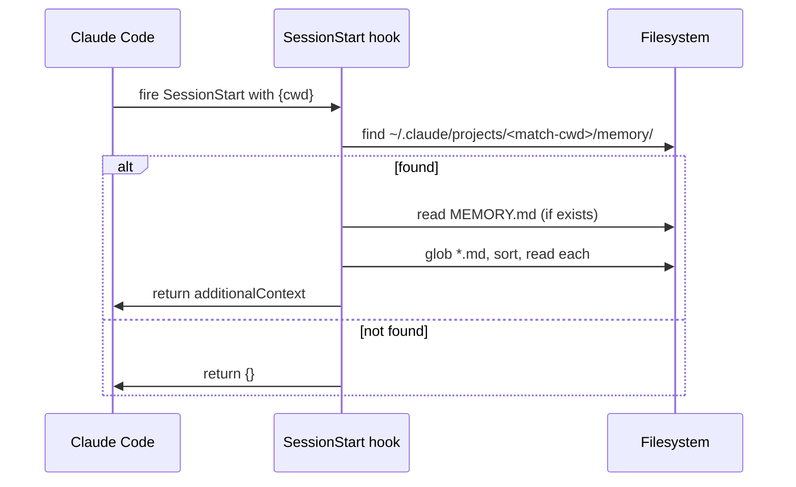
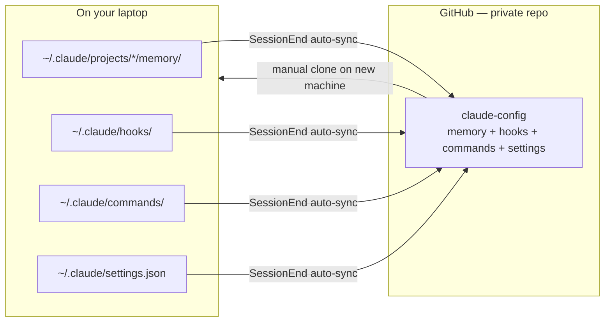

# 07 — Memory System

Claude Code ships with a local memory system most users never notice. Zaude leans on it hard.

Memory files are short Markdown notes stored per-project on disk. The `SessionStart` hook reads *all* of them into context on every session, so lessons Claude learned on Monday still apply on Friday.

---

## Where memory lives

```
~/.claude/projects/<encoded-cwd>/memory/
├── MEMORY.md                         ← index (optional but recommended)
├── feedback_agent_usage_rules.md     ← "always-invoke these agents"
├── feedback_verify_ui_changes.md     ← "screenshot every frontend change"
├── project_database_schema.md        ← "the users table has these columns"
├── user_timezone.md                  ← "user is in Europe/Warsaw"
└── reference_stripe_account_ids.md   ← "live = acct_abc, test = acct_xyz"
```

Claude Code encodes your working directory into a folder name. For example, `D:\workspace\my-app` becomes something like `D--workspace-my-app` under `~/.claude/projects/`.

Zaude's SessionStart hook finds the right folder by substring-matching the basename of your current working directory against every directory under `~/.claude/projects/`. See [`./06-hooks.md`](./06-hooks.md) for details.

---

## The 4 memory types

Every memory file is prefixed with a type. The prefix is a convention, not a hard constraint — but sticking to it keeps the index scannable and helps future-you search.

| Prefix | Purpose | Example |
|---|---|---|
| `feedback_*` | How Claude should behave — corrections, rules, norms you've enforced in past sessions | `feedback_never_commit_without_review.md` |
| `project_*` | Facts about the project that don't change often — schema, endpoints, domain jargon | `project_users_table_schema.md` |
| `user_*` | Facts about you — timezone, editor, preferences | `user_prefers_bun_over_npm.md` |
| `reference_*` | Pointers to external systems — account IDs, URLs, runbooks, credentials (*first-4 / last-4 only*) | `reference_prod_cluster_url.md` |

### `feedback_*` — behavioral rules

These are the most load-bearing. Write one every time you correct Claude on something you don't want to correct again.

**Good example** (`feedback_agent_usage_rules.md`):

```markdown
---
name: agent-usage-rules
description: Always-invoke architect-review, code-reviewer, security-auditor. Task-match triggers for others. No exceptions when a diff is involved.
type: feedback
---

# Agent Usage Rules

- `code-reviewer` runs on every diff, no exceptions.
- `architect-review` runs REVIEW on every structural change. DESIGN mode before writing new services/routes/middleware.
- `security-auditor` runs on any diff touching auth, crypto, credential storage, input validation.
- `workflow-orchestrator` runs at the start of `/build`.
- Task-match agents (`typescript-pro`, `performance-engineer`, etc.) run when the task specifically fits.

When in doubt: invoke more, not fewer.
```

**Bad example** — too vague to act on:

```markdown
# Be careful

Remember to review code before shipping.
```

### `project_*` — project facts

Things Claude should know about *this codebase* that aren't in the repo:

**Good example** (`project_database_conventions.md`):

```markdown
---
name: project-database-conventions
description: Supabase schema conventions for this project. snake_case columns, UUID primary keys, RLS on every table.
type: project
---

# Database Conventions

- All tables use UUID primary keys (`uuid_generate_v4()`).
- Column names are snake_case; model fields are camelCase — the DTO layer bridges.
- Every public.* table has RLS enabled. New tables must include at least one policy.
- Migrations live in `supabase/migrations/` and are named `YYYYMMDDHHMM_<slug>.sql`.
- Don't add columns with defaults — always explicit NOT NULL + backfill.
```

### `user_*` — user profile

Personal to you, applies across all your projects on this machine:

```markdown
---
name: user-editor-preferences
description: User uses VSCode + Vim keybindings, prefers tabs over spaces in Go, spaces in TS.
type: user
---

# Editor Preferences

- Editor: VSCode with Vim keybindings.
- Go: tabs, gofmt defaults.
- TypeScript / React: 2 spaces, Prettier defaults.
- Shell: bash on WSL, PowerShell on native Windows.
- When generating config for tools that ask "which format", default to the above.
```

### `reference_*` — external pointers

IDs, URLs, operational facts:

```markdown
---
name: reference-deployment-targets
description: Production, staging, and dev cluster addresses + their purpose.
type: reference
---

# Deployment Targets

| Env | URL | Cluster |
|---|---|---|
| prod | https://api.example.com | `eks-prod-use1` |
| staging | https://staging.api.example.com | `eks-stg-use1` |
| dev | https://dev.api.example.com | local docker-compose |

Tokens (first-4 / last-4 only — rotate if leaked):
- prod admin: `sk_l****************3f21`
- staging admin: `sk_t****************a9e0`
```

**Never write a full credential.** Store the first 4 and last 4 characters so you can confirm identity later without exposing the secret.

---

## Auto-memory — Claude writes these for you

When Claude learns something mid-session that would be useful later, it can write a memory file on its own. Typical triggers:

- You correct Claude (*"no, in this project we use X, not Y"*) — it writes a `feedback_*.md`.
- You explain a domain concept — it writes a `project_*.md`.
- You paste a reference URL or ID multiple times — it writes a `reference_*.md`.

Auto-memory files have the same frontmatter and format as hand-written ones. The `MEMORY.md` index is updated at the same time.

You don't have to ask for auto-memory. When it happens, Claude announces it: *"writing this to memory as `feedback_commit_discipline.md`"*. You can approve or override.

> Auto-memory is a Claude-side behavior, not a hook. It relies on Claude's judgment. Treat it like a helpful assistant taking notes — review what got written, rewrite what's wrong, delete what's stale.

---

## `MEMORY.md` — the index

`MEMORY.md` is an optional but recommended file at the root of the memory directory. It gives Claude (and you) a table of contents.

**Template:**

```markdown
# Memory Index

Quick map of what lives here. Kept rough — update whenever a new memory file is added or an old one is retired.

## Feedback (behavioral rules)
- [Agent usage rules](./feedback_agent_usage_rules.md) — always-invoke, task-match triggers
- [Verify UI after changes](./feedback_verify_ui_changes.md) — Playwright screenshot before committing
- [Docker + CI/CD lessons](./feedback_docker_ci_lessons.md) — 8 rules for monorepo Docker builds

## Project facts
- [Database conventions](./project_database_conventions.md) — schema, naming, RLS
- [API shape](./project_api_shape.md) — REST conventions, error format

## User profile
- [Editor preferences](./user_editor_preferences.md)
- [Timezone](./user_timezone.md)

## Reference
- [Deployment targets](./reference_deployment_targets.md)
- [Third-party account IDs](./reference_third_party_accounts.md)
```

Maintain it in 1-line bullet form. Full explanations go in the linked files, not the index.

---

## Frontmatter format

Every memory file starts with YAML frontmatter:

```yaml
---
name: short-slug-matching-filename
description: One sentence — what this file tells Claude, why it matters. Shown in search results and tool output.
type: feedback | project | user | reference
---
```

| Field | Required | Notes |
|---|---|---|
| `name` | Yes | Kebab-case slug; match the filename without prefix/extension |
| `description` | Yes | One sentence. Be specific — this is what shows up when Claude is searching memory |
| `type` | Yes | One of `feedback`, `project`, `user`, `reference` |

Keep it tight. The frontmatter is metadata, not content.

---

## How the SessionStart hook reads memory



The hook does **not** read files on demand or filter by relevance. It injects every `.md` in the folder, in sorted order, into every session. That's intentional:

- **Predictable.** You know exactly what Claude sees.
- **No retrieval step.** No embedding, no vector DB, no ranking — just a file dump.
- **Self-pruning.** If the folder gets too big, you rewrite or delete files. The hook doesn't do it for you.

The tradeoff is token cost. A memory folder with 40 files at 500 tokens each adds 20k tokens to every session's system context. That's fine up to a point — rewrite or consolidate when you notice latency.

---

## When to save a memory vs. let it be ephemeral

Not every correction deserves a memory file. Rule of thumb:

| Save to memory when… | Let it stay ephemeral when… |
|---|---|
| You've corrected Claude on the same thing twice | It's a one-off typo or misreading |
| The rule applies to every session on this project | It's specific to the current feature |
| It's a fact that would take >30s to look up next time | It's in the README / CLAUDE.md and will be re-read |
| It's a personal preference (tool choice, format) | It's already a language / framework convention |

**Bad memory entries:**

- "Claude should be more careful" — too vague.
- "Use Bun" — belongs in CLAUDE.md, not memory.
- "Fixed the auth bug on 2026-03-11" — that's a session log, not memory.
- A 500-line transcript of a debugging session — summarize the lesson, throw away the transcript.

**Good memory entries:**

- *"When you write a new React component, default to server components unless it needs interactivity — the project uses Next.js App Router and the bundle budget is tight."*
- *"Our Postgres enums are PascalCase, not snake_case. Don't auto-convert when generating migrations."*
- *"Session stalled 3x because `npm test` hangs on watch mode — always pass `--run` when invoking it."*

---

## Editing, removing, updating

Memory files are just Markdown. You edit them the same way you edit any file:

```bash
# Open in your editor
code ~/.claude/projects/<encoded-cwd>/memory/feedback_agent_usage_rules.md

# Delete a stale rule
rm ~/.claude/projects/<encoded-cwd>/memory/feedback_old_workflow.md

# Consolidate
# (manually merge two files into one, update MEMORY.md)
```

When you delete a file, also remove the line from `MEMORY.md` so the index stays honest.

When you edit a file, bump the `description` if the scope changed. The description is what Claude sees in short listings, so stale descriptions are worse than a stale body.

---

## Why memory files are tracked in the claude-config repo

Memory on a single laptop is fragile. Lose the laptop, reformat the disk, switch machines — all your lessons are gone.

Zaude solves this by version-controlling `~/.claude/` as a separate git repo. The SessionEnd hook auto-commits and pushes both the vault and the claude-config repos on every session close. See [`./06-hooks.md`](./06-hooks.md).

So the picture looks like:



On a new machine:

```bash
cd ~
rm -rf .claude   # or back up first
git clone git@github.com:you/claude-config.git .claude
```

And every lesson you've ever persisted is back.

> The vault (project-level state) and claude-config (cross-project memory + hooks) are intentionally separate repos. Vault is about projects; claude-config is about how *you* work across projects. Keep them separate so you can share the vault with a collaborator without leaking personal preferences, and vice versa.

---

## What memory is NOT

Memory is easy to misuse. Here's what it's not for:

| Don't use memory for | Use this instead |
|---|---|
| Raw conversation history | Session logs (`vault/01-projects/*/sessions/*.md`) |
| Per-project instructions | `CLAUDE.md` in the project vault |
| Decisions with rationale | `decisions.md` (append-only) |
| Unresolved questions | `open-questions.md` |
| Secrets | Nowhere. Reference them by first-4 / last-4 only |
| Temporary state of a task | Nothing — let it be ephemeral |
| Documentation for humans | The project's own README |

The rule: if it's cross-session and cross-feature, it's memory. If it's scoped to the project's current-state or this week's work, it's vault. If it's per-file context for the codebase, it's the `CLAUDE.md` in that project.

---

## Common patterns

### The "correction → memory" loop

```
session 1:  [you correct Claude on X]
            [Claude writes feedback_X.md with your rule]

session 2:  [SessionStart hook injects feedback_X.md]
            [Claude applies X correctly the first time]
            → lesson is mechanical now
```

Zaude's workflow is built around this loop. The `/wrap` command sweeps the current session for corrections you made and prompts you to persist them. The `/start` command cites memory files when it reports ground rules.

### The "memory pruning" loop

After ~20 sessions, memory files drift — some are duplicated, some are stale. At the end of a session:

1. Open `MEMORY.md` and scan for duplicates.
2. Merge two that overlap into one file; delete the other; update the index.
3. Delete anything that's been superseded (e.g., a stale tooling preference after switching stacks).

Do this every month or two. It's 10 minutes and keeps memory sharp.

### The "project bootstrap" memory

Starting a new project? Seed the memory folder with 3–5 files before your first real session:

- `feedback_project_workflow.md` — the build / test / deploy loop
- `project_stack.md` — languages, frameworks, versions
- `project_conventions.md` — naming, folder layout, import rules
- `user_preferences.md` — anything personal you want applied here

You'll iterate on these. That's expected — the point is to start with context instead of cold.

---

## Good vs. bad memory — side by side

| | Bad | Good |
|---|---|---|
| **filename** | `notes.md` | `feedback_react_component_rules.md` |
| **description** | "some notes" | "Always use server components in Next.js App Router unless interactivity requires 'use client'" |
| **body** | A 2000-word dump | 8 bullet points, under 300 words |
| **scope** | "Be careful with JS" | "In this project, avoid `useEffect` for data fetching — use server components or TanStack Query" |
| **evergreen?** | "Tomorrow's meeting is at 3pm" | "The team standup is 9am UTC daily" |

When in doubt, compress. A memory file you'll re-read in 3 months is worth 50 you won't.

---

## See also

- [`./06-hooks.md`](./06-hooks.md) — how the SessionStart hook reads memory
- [`./04-vault.md`](./04-vault.md) — the difference between vault state and memory
- [`./08-agents.md`](./08-agents.md) — agents that rely on memory files for their behavior
- [`./11-best-practices.md`](./11-best-practices.md) — the "don't vibe code" philosophy behind disciplined memory
