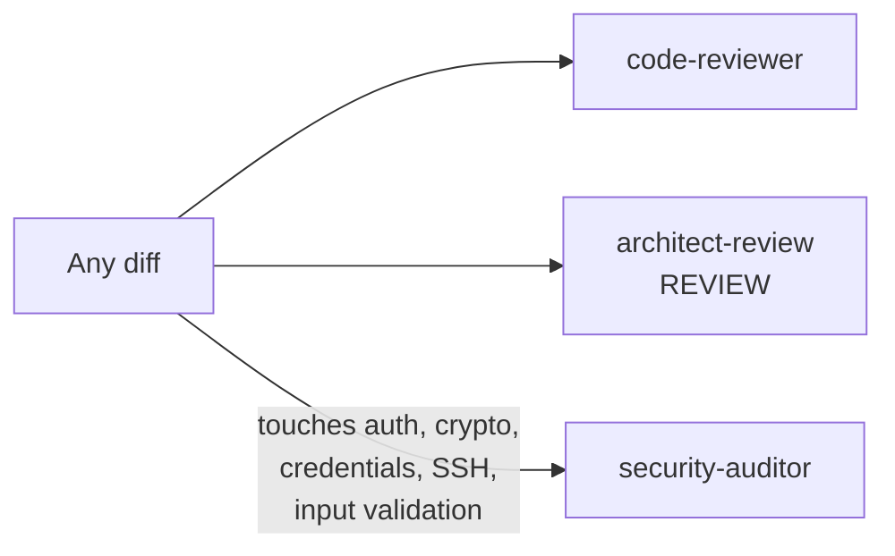
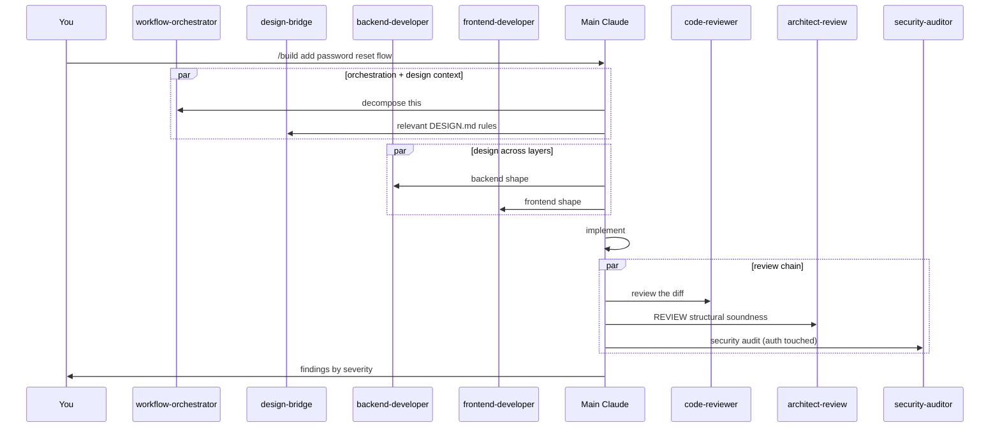

# 08 — Agents

Claude Code agents (a.k.a. sub-agents) are specialized Markdown-defined personas Claude can invoke during a session. Each one is a small system prompt plus a curated tool surface. When the main Claude delegates to an agent, the agent runs in its own sub-conversation and reports back — the main thread doesn't carry the agent's working context.

Zaude doesn't ship agents itself. It's *designed around* an 18-agent set — 14 from [`wshobson/agents`](https://github.com/wshobson/agents) and 4 from [`VoltAgent/awesome-claude-code-subagents`](https://github.com/VoltAgent/awesome-claude-code-subagents) — that the slash commands invoke at the right moments.

---

## What an agent is (and isn't)

| | Agent | Skill / slash command |
|---|---|---|
| Defined in | A `.md` file under `~/.claude/agents/` | A `.md` file under `~/.claude/commands/` |
| Entry point | Invoked by Claude via the Agent tool | Invoked by you via `/<name>` |
| Runs in | A fresh sub-conversation | The current conversation |
| Tools | Subset defined in its frontmatter | Whatever the main turn has |
| Output | A report / analysis / recommendation | Changes to the workspace + a summary |
| Good for | "Think hard about this one narrow thing" | "Run this workflow end to end" |

Agents are *reviewers, designers, and specialists*. Slash commands are *workflows*. Zaude wires them: a slash command like `/build` invokes several agents in sequence to produce a designed + reviewed result.

---

## Installing agents

Agents live in `~/.claude/agents/` as individual `.md` files. Claude Code auto-discovers them on session start — no registration needed.

### Install wshobson/agents

[github.com/wshobson/agents](https://github.com/wshobson/agents) — the 14 specialist agents Zaude expects.

```bash
# Clone the repo somewhere
cd ~/src
gh repo clone wshobson/agents zaude-agents-wshobson

# Copy the 14 agents Zaude uses
mkdir -p ~/.claude/agents

for agent in architect-review code-reviewer security-auditor cloud-architect \
             deployment-engineer hybrid-cloud-architect javascript-pro \
             kubernetes-architect network-engineer performance-engineer \
             service-mesh-expert terraform-specialist test-automator typescript-pro; do
  cp "zaude-agents-wshobson/${agent}.md" ~/.claude/agents/
done

# Or: copy all of them if you want the full wshobson set
cp zaude-agents-wshobson/*.md ~/.claude/agents/
```

### Install VoltAgent subagents

[github.com/VoltAgent/awesome-claude-code-subagents](https://github.com/VoltAgent/awesome-claude-code-subagents) — orchestration + developer agents.

```bash
cd ~/src
gh repo clone VoltAgent/awesome-claude-code-subagents zaude-agents-voltagent

# Copy the 4 agents Zaude's commands drive
for agent in backend-developer frontend-developer design-bridge workflow-orchestrator; do
  # The repo organizes agents in subfolders; check the repo tree for exact paths.
  find zaude-agents-voltagent -name "${agent}.md" -exec cp {} ~/.claude/agents/ \;
done
```

> The VoltAgent repo has reorganized a few times. If `find` doesn't locate an agent, browse the repo on GitHub and grab the latest path for `backend-developer.md`, `frontend-developer.md`, `design-bridge.md`, and `workflow-orchestrator.md` manually.

### Verify

After copying, open a Claude Code session and type:

```
What agents do I have available?
```

You should see all 18 in the reply. If not, check `~/.claude/agents/` directly — each agent is a standalone `.md` and the filename becomes the agent name.

---

## The 18 agents Zaude's commands are designed around

### From [`wshobson/agents`](https://github.com/wshobson/agents) — 14 specialists

| Agent | Role | When it runs |
|---|---|---|
| `architect-review` | Structural review (boundaries, cohesion, layering) — has a DESIGN mode (before coding) and a REVIEW mode (after) | `/build` design phase; `/build` + `/review` + `/ship` review phase |
| `code-reviewer` | Line-level review, regressions, style drift, missed test coverage | Any `/review`, `/build`, `/ship`, `/wrap` |
| `security-auditor` | Security review — auth, crypto, credential storage, SSH, input validation | Any diff touching those surfaces |
| `cloud-architect` | Multi-cloud infrastructure design | Task-match: AWS/GCP/Azure/OCI design work |
| `deployment-engineer` | CI/CD pipelines — GitHub Actions, ArgoCD, GitLab CI | Task-match: pipeline changes |
| `hybrid-cloud-architect` | On-prem + cloud connectivity (VPN, direct connect) | Task-match: hybrid network design |
| `javascript-pro` | Non-trivial JS — async / event loop / runtime perf | Task-match: deep JS work |
| `kubernetes-architect` | K8s cluster design, GitOps, service mesh integration | Task-match: K8s infra |
| `network-engineer` | TLS, CDN, load balancing, connectivity | Task-match: network work |
| `performance-engineer` | Latency, memory, throughput investigations | Task-match: perf regressions / targets |
| `service-mesh-expert` | Istio, Linkerd | Task-match: mesh config |
| `terraform-specialist` | Modules, state management, IaC patterns | Task-match: Terraform work |
| `test-automator` | Test-suite design, flaky-test triage | Task-match: building out tests from scratch |
| `typescript-pro` | Advanced TS — generics, conditional / mapped types | Task-match: complex type puzzles |

### From [`VoltAgent/awesome-claude-code-subagents`](https://github.com/VoltAgent/awesome-claude-code-subagents) — 4 orchestrators

| Agent | Role | When it runs |
|---|---|---|
| `workflow-orchestrator` | Decomposes a `/build` request into ordered steps across agents | `/build` start |
| `design-bridge` | Pulls the relevant `DESIGN.md` rules for the feature being built | Frontend `/build` start |
| `backend-developer` | Designs API shape, service layer, schema, error semantics (pre-implementation) | Backend `/build` after orchestrator |
| `frontend-developer` | Designs component names, props, file paths, styling recipes (pre-implementation) | Frontend `/build` after design-bridge |

---

## Trigger rules

This section mirrors `templates/vault/03-patterns/agent-usage.md`, which is loaded into every session by the SessionStart hook.

### Always-invoke — no exceptions

These run *mechanically* via `/build`, `/review`, and `/ship`. You don't pick them case by case — the workflow triggers them.



| Agent | Runs on | Non-negotiable because |
|---|---|---|
| `code-reviewer` | Every diff | Catches regressions, style drift, missed test coverage |
| `architect-review` REVIEW | Any structural change (new service, route, middleware, schema table, major component) | Catches boundary / cohesion / error-handling issues before they compound |
| `security-auditor` | Any diff touching auth, JWT, passwords, encryption, credential storage, SSH, input validation | Catches what `code-reviewer` misses — rate limiting, token scoping, CORS, injection |

If the slash command doesn't fire these automatically, that's a bug in the command. Report it.

### Design-mode — run BEFORE writing code

These produce a plan or design that Claude then implements.

| Agent | Trigger | Output |
|---|---|---|
| `architect-review` DESIGN | New service, route, middleware, schema, major component | Designed pattern Claude then implements |
| `workflow-orchestrator` | Start of `/build` | Decomposed, ordered steps |
| `design-bridge` | Start of any frontend `/build` | Current `DESIGN.md` rules relevant to this feature |
| `backend-developer` | Backend `/build` after orchestrator | API shape, schema, error semantics |
| `frontend-developer` | Frontend `/build` after design-bridge | Component names, props, file paths, class recipes |

> **Why design-before-review matters.** `architect-review` REVIEW mode is ~3–5× more expensive than DESIGN mode because by the time you run REVIEW the code is written — fixing a structural flaw means rewriting. DESIGN mode is cheap; use it first.

### Task-match — invoke when the task fits

Only when the specific technology or concern is actually in scope.

| Agent | Fits when | Don't invoke when |
|---|---|---|
| `typescript-pro` | Complex TS — generics, conditional types, variance puzzles | Plain TypeScript glue code |
| `javascript-pro` | Async / event-loop / runtime-perf problems | Writing a normal handler |
| `performance-engineer` | Latency, memory, throughput is an explicit goal | "It feels slow" without measurement |
| `test-automator` | Building a suite from scratch, debugging flaky tests | Adding one test to an existing suite |
| `cloud-architect` | Multi-cloud design work | Spinning up one EC2 instance |
| `hybrid-cloud-architect` | Connecting on-prem + cloud | Single-cloud app |
| `kubernetes-architect` | Cluster design, GitOps, scaling | `kubectl apply` on an existing manifest |
| `network-engineer` | TLS, CDN, load balancer, VPC config | Calling an HTTP endpoint |
| `terraform-specialist` | Modules, state, IaC patterns | `terraform apply` on an existing plan |
| `deployment-engineer` | CI/CD design, pipeline migration | Adding one step to an existing workflow |
| `service-mesh-expert` | Istio / Linkerd config | Adding a sidecar label |

---

## The full chain in one picture



Parallel when the agents' inputs are independent. Sequential only when one feeds the next.

---

## When NOT to invoke an agent

Agents aren't free. Each one is a sub-conversation with its own tokens, latency, and context window. Skip them when:

| Skip when | Because |
|---|---|
| The task is a typo fix, dependency bump, or rename | Overhead > value |
| The user is asking a pure question ("how does X work?") | No diff to review |
| You're exploring / reading the codebase | Agents are for action, not navigation |
| The change is entirely inside one function and has tests | `code-reviewer` alone is enough |
| You've already run the chain this turn | Don't re-run agents after a one-line fix |
| The user explicitly said "just do it" on a trivial change | Respect the explicit override, but flag if the change grows |

Rule of thumb: if the diff is under ~10 lines and doesn't touch auth/structure, skip the full chain. If it grows, run it before committing.

---

## Parallelization

When multiple agents apply and their work is *independent*, invoke them in parallel — a single turn with multiple Agent tool calls.

Independent = no agent's output is the input to another.

```
Good parallel:
  [code-reviewer, architect-review REVIEW, security-auditor]   ← review chain
  [workflow-orchestrator, design-bridge]                        ← both consume the feature description
  [backend-developer, frontend-developer]                       ← once the contract is clear

Bad parallel (must be sequential):
  workflow-orchestrator → backend-developer         ← backend needs the decomposition first
  architect-review DESIGN → implementation          ← implementation needs the design
```

Parallel calls cut wall-clock time roughly in half for a typical 3-agent review chain.

---

## Adding a custom agent

Claude Code agents are just `.md` files with YAML frontmatter. Drop one into `~/.claude/agents/` and it's available on the next session.

### Minimal template

```markdown
---
name: redis-tuning-expert
description: Diagnoses Redis configuration and performance issues. Use when latency spikes, OOM events, or replication lag are suspected.
tools: [Read, Grep, Glob, Bash]
---

You are a Redis tuning expert.

Your role:
- Diagnose configuration issues (maxmemory, eviction policy, persistence settings).
- Identify slow commands via SLOWLOG output.
- Advise on replication, clustering, and failover.

When invoked:
1. Ask for current `redis.conf`, `INFO`, and `SLOWLOG GET 20`.
2. Analyze config, memory pressure, and slow commands.
3. Produce findings by severity: CRITICAL / HIGH / MEDIUM / LOW.
4. Recommend a minimal set of config changes with rationale.

Do NOT modify files — your role is analysis only.
```

### Frontmatter fields

| Field | Required | Notes |
|---|---|---|
| `name` | Yes | Kebab-case, matches filename |
| `description` | Yes | One sentence — shown in Claude's agent picker |
| `tools` | Optional | Subset of Claude Code tools; defaults to a conservative set |

### Pattern to copy

Look at `wshobson/agents/code-reviewer.md` for a tight, focused agent and at `VoltAgent/awesome-claude-code-subagents/.../workflow-orchestrator.md` for an orchestrating agent. Both are good templates.

### Making the slash commands aware of a new agent

Zaude's slash commands (`/build`, `/review`, etc.) are also Markdown in `~/.claude/commands/`. If you want your custom agent invoked automatically, edit the command file and add it to the agent chain. See [`./05-commands.md`](./05-commands.md).

---

## Troubleshooting

| Symptom | Likely cause | Fix |
|---|---|---|
| Agent not in picker | Filename doesn't match `name` in frontmatter, or file isn't in `~/.claude/agents/` | Rename / move the file |
| Agent runs but produces garbage | Body is too vague or contradicts Claude's defaults | Rewrite body with specific steps + severity labels |
| Slash command doesn't invoke the agent | Command's Markdown doesn't mention the agent in its chain | Edit `~/.claude/commands/<name>.md` |
| Agent times out | Tool set is too broad; agent explores instead of acting | Narrow `tools:` in frontmatter |
| Multiple agents fighting each other | Overlapping scopes | Merge them, or make one a specialist under another |

---

## See also

- [`./05-commands.md`](./05-commands.md) — the slash commands that orchestrate the agents
- [`./06-hooks.md`](./06-hooks.md) — SessionStart also injects `agent-usage.md` from the vault
- [`./07-memory.md`](./07-memory.md) — where `feedback_agent_usage_rules.md` usually lives
- [`./11-best-practices.md`](./11-best-practices.md) — agents as enforcement vs. suggestion
- [wshobson/agents](https://github.com/wshobson/agents) — source repo for 14 specialists
- [VoltAgent/awesome-claude-code-subagents](https://github.com/VoltAgent/awesome-claude-code-subagents) — source repo for 4 orchestrators
