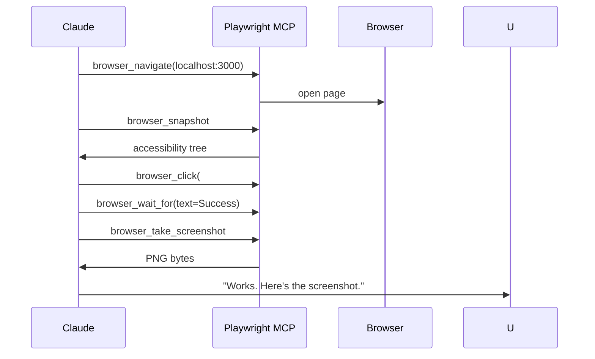
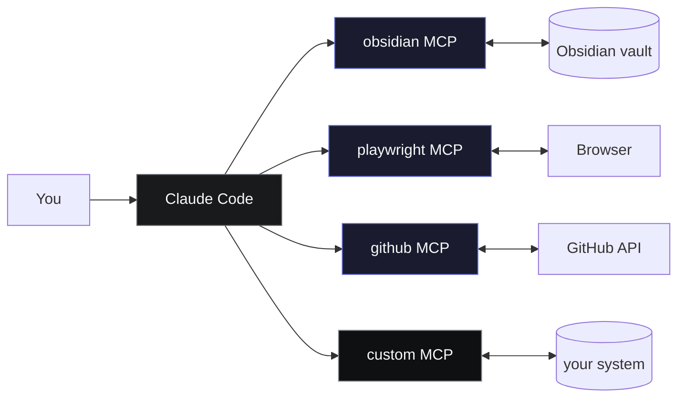

# 09 — MCP Servers

MCP (Model Context Protocol) is an open protocol for connecting Claude Code to tools, data sources, and APIs beyond its built-in file + bash capabilities. An MCP server exposes a set of typed tools; Claude Code connects over stdio or HTTP and can invoke them like any other tool in the turn.

Zaude's slash commands work fine without MCPs — the core discipline is files + hooks + agents. But three MCPs make the framework noticeably better. This doc covers them plus a short list of alternatives worth knowing.

---

## What MCP adds over bash

| | Bash + CLI | MCP |
|---|---|---|
| Tool surface | Whatever's on `PATH` | Explicit typed tools with JSON schemas |
| Error surface | Exit codes + parse `stderr` | Structured errors |
| Token cost per call | Full command + full output | Just the structured fields Claude asked for |
| Authentication | Manual in shell | Usually wired into the MCP config once |
| Discoverability | Claude has to remember flags | Tools have descriptions + schemas |

You don't *have* to use MCP — `gh` + `curl` + `bash` will always work. But MCPs are structured, cached, and cheaper to call. When a dedicated MCP exists for the job, prefer it.

---

## The three Zaude recommends

| MCP | Source | Purpose | Install status |
|---|---|---|---|
| **obsidian-mcp** | [StevenStavrakis/obsidian-mcp](https://github.com/StevenStavrakis/obsidian-mcp) | Read / write / search your Obsidian vault | Optional (if vault is in Obsidian) |
| **playwright-mcp** | [microsoft/playwright-mcp](https://github.com/microsoft/playwright-mcp) | Browser automation for frontend verification | Strongly recommended for frontend work |
| **github-mcp-server** | [github/github-mcp-server](https://github.com/github/github-mcp-server) | GitHub repo / PR / issue operations | Recommended for anyone working with PRs |

---

## obsidian-mcp

**Repo:** [github.com/StevenStavrakis/obsidian-mcp](https://github.com/StevenStavrakis/obsidian-mcp)

### Why you'd use it

Zaude's vault is plain Markdown — it works in any editor. But if you also read / write the vault through [Obsidian](https://obsidian.md/), the Obsidian MCP lets Claude drive notes the same way you would: create notes, edit them, search the vault, manage tags, move files across folders.

Use when:

- Your vault is actually an Obsidian vault (`.obsidian/` folder present).
- You want Claude to create a new note without you having to think about the exact path.
- You want tag management (add, remove, rename) across many notes at once.
- You want full-text search over the vault without globbing.

If your vault is a plain git repo (no Obsidian), skip this MCP — bash + file tools are equivalent.

### Tools it exposes

| Tool | Purpose |
|---|---|
| `list-available-vaults` | Enumerate all Obsidian vaults on the machine |
| `create-note` | Create a new note at a path, with frontmatter |
| `read-note` | Read a note by path |
| `edit-note` | Edit a note in place |
| `delete-note` | Delete a note |
| `move-note` | Move / rename |
| `create-directory` | Create a new folder |
| `search-vault` | Full-text search across the vault |
| `add-tags` / `remove-tags` / `rename-tag` | Tag management |

### Install

```bash
# Install the server globally
npm install -g @stevenstavrakis/obsidian-mcp

# Register it with Claude Code
claude mcp add obsidian \
  -- npx -y @stevenstavrakis/obsidian-mcp \
  --vault "/path/to/your/obsidian/vault"
```

The `--vault` flag tells the server which vault to operate on. If you have multiple, omit it and use `list-available-vaults` to pick.

Verify:

```bash
claude mcp list
# obsidian: connected
```

### When NOT to use it

- Your vault isn't Obsidian — `Read` / `Write` / `Grep` do the job.
- You only write to the vault via `/wrap` and `/ship` — those flows use file tools directly.
- You work on Linux servers without a GUI — Obsidian sync won't reach there.

---

## playwright-mcp

**Repo:** [github.com/microsoft/playwright-mcp](https://github.com/microsoft/playwright-mcp)

### Why you'd use it

Frontend changes need to be *verified*, not just compiled. A TypeScript build passing doesn't tell you the button aligns right, the form submits, or the modal closes. Playwright MCP gives Claude a real browser it can drive — screenshots, clicks, form fills, console capture — so it can validate what it just built.

Use when:

- You work on frontend / full-stack apps.
- You want Claude to verify a change in a logged-in state.
- You want screenshots as part of `/ship` artifacts.
- You're debugging an issue that only reproduces in the browser.

### Tools it exposes

Categorized by what you usually care about:

| Category | Tools |
|---|---|
| Navigation | `browser_navigate`, `browser_navigate_back` |
| Interaction | `browser_click`, `browser_type`, `browser_fill_form`, `browser_select_option`, `browser_hover`, `browser_drag`, `browser_file_upload`, `browser_press_key` |
| Observation | `browser_snapshot`, `browser_take_screenshot`, `browser_console_messages`, `browser_network_requests` |
| Control | `browser_wait_for`, `browser_resize`, `browser_close`, `browser_tabs`, `browser_handle_dialog` |
| Scripting | `browser_evaluate`, `browser_run_code` |

`browser_snapshot` returns an accessibility-tree-based snapshot that's far cheaper to pass around than a screenshot — use it for layout/assertion work. Reserve `browser_take_screenshot` for actual visual confirmation.

### Install

```bash
# Install server via npx (no global install needed)
claude mcp add playwright \
  -- npx -y @playwright/mcp@latest

# First run will install browsers (Chromium, Firefox, WebKit)
```

Verify:

```bash
claude mcp list
# playwright: connected
```

On first use Claude will ask to install browsers if they aren't cached. Approve it once.

### Typical flow



### When NOT to use it

- Backend-only work — no frontend to verify.
- Unit-test-level assertions — use a real test runner (Vitest, Jest) instead.
- Quick sanity checks where reading the JSX is enough.
- Headless CI — run real Playwright tests in your CI, not MCP-driven ones.

---

## github-mcp-server

**Repo:** [github.com/github/github-mcp-server](https://github.com/github/github-mcp-server)

### Why you'd use it

`gh` CLI works. But piping `gh pr list --json ...` through bash every time you want to look at PRs is verbose and token-expensive. The official GitHub MCP server exposes the same operations as typed tools with narrow outputs — often 3–10× cheaper per call.

Use when:

- You regularly work with PRs, issues, reviews.
- You want Claude to open / update / merge PRs as part of `/ship`.
- You want it to read PR comments inline rather than shelling to `gh` every time.
- You want branch / file operations without cloning.

### Tools it exposes

| Category | Tools |
|---|---|
| Repositories | `create_repository`, `fork_repository`, `search_repositories`, `get_file_contents`, `push_files`, `create_or_update_file`, `create_branch`, `list_commits` |
| Pull requests | `create_pull_request`, `get_pull_request`, `list_pull_requests`, `get_pull_request_files`, `get_pull_request_comments`, `get_pull_request_reviews`, `get_pull_request_status`, `create_pull_request_review`, `merge_pull_request`, `update_pull_request_branch` |
| Issues | `create_issue`, `get_issue`, `list_issues`, `update_issue`, `add_issue_comment`, `search_issues` |
| Search | `search_code`, `search_users` |

### Install

```bash
# Authenticate gh first if you haven't
gh auth login

# Register the MCP server
claude mcp add github \
  -- npx -y @github/github-mcp-server
```

The MCP reads your GitHub token from `gh`'s stored auth, so no separate token wiring.

Verify:

```bash
claude mcp list
# github: connected
```

### When to prefer `gh` over the MCP

The MCP is great for *reading* and *standard writes*. For these, stay with `gh`:

- Anything that needs a flag the MCP tool doesn't expose (e.g., `gh pr checks --watch`).
- Interactive flows (`gh repo create` with prompts — MCP can't prompt).
- One-off admin tasks you'd Google anyway.

Rule of thumb: read operations → MCP, standard PR/issue lifecycle → MCP, exotic admin → `gh`.

---

## Alternative MCPs to consider

Not shipped with Zaude, but worth knowing.

| MCP | What it gives you | When to add it |
|---|---|---|
| **filesystem** | Scoped file access to specific folders outside the project cwd | You work across multiple repos and want Claude to reach them without `cd` |
| **fetch** | HTTP GET with content extraction (readable text from HTML) | You ask Claude to summarize docs / blog posts / spec URLs |
| **postgres** | Query a Postgres database read-only | You debug production data and want SQL without shelling to `psql` |
| **sqlite** | Query a SQLite DB | Local app development |
| **brave-search** | Web search | When your Claude Code deployment doesn't already include search |
| **memory** (Anthropic) | A persistent key-value memory separate from the filesystem | You want memory keyed by concept, not by cwd (Zaude's memory model is file-based — see [07-memory.md](./07-memory.md)) |
| **sequential-thinking** | Exposes structured multi-step reasoning as a tool | Complex planning / analysis work |
| **puppeteer** | Alternative to Playwright MCP | You already use Puppeteer elsewhere |
| **slack** | Read / post to Slack | Ops workflows, incident response |
| **sentry** | Inspect Sentry events / issues | Debugging production errors |

Browse [modelcontextprotocol.io/examples](https://modelcontextprotocol.io/examples) and the [awesome-mcp-servers](https://github.com/modelcontextprotocol/servers) list for the current catalog.

---

## How MCPs plug into Claude Code



Registered servers live in your Claude Code MCP config — `claude mcp add <name> -- <command>` writes them there. On session start, Claude Code spawns each server's process and handshakes over stdio.

### Useful commands

```bash
# List registered MCPs
claude mcp list

# Remove a server
claude mcp remove <name>

# Check server logs
claude mcp logs <name>

# Manually re-add with updated args
claude mcp remove playwright
claude mcp add playwright -- npx -y @playwright/mcp@latest --browser firefox
```

---

## Adding your own MCP

Every MCP server is just a process that speaks the protocol over stdio or HTTP. The easiest entry point is the official SDK in TypeScript or Python.

### Minimal server (TypeScript)

```ts
// my-mcp/src/index.ts
import { Server } from "@modelcontextprotocol/sdk/server/index.js";
import { StdioServerTransport } from "@modelcontextprotocol/sdk/server/stdio.js";
import {
  CallToolRequestSchema,
  ListToolsRequestSchema,
} from "@modelcontextprotocol/sdk/types.js";

const server = new Server(
  { name: "my-mcp", version: "0.1.0" },
  { capabilities: { tools: {} } }
);

server.setRequestHandler(ListToolsRequestSchema, async () => ({
  tools: [
    {
      name: "echo",
      description: "Echo back the input text",
      inputSchema: {
        type: "object",
        properties: { text: { type: "string" } },
        required: ["text"],
      },
    },
  ],
}));

server.setRequestHandler(CallToolRequestSchema, async (req) => {
  if (req.params.name === "echo") {
    const text = req.params.arguments?.text ?? "";
    return { content: [{ type: "text", text: `echo: ${text}` }] };
  }
  throw new Error("unknown tool");
});

const transport = new StdioServerTransport();
await server.connect(transport);
```

### Register it

```bash
# From the directory containing your built server
claude mcp add my-mcp -- node "$(pwd)/dist/index.js"
```

Restart Claude Code and your tools show up alongside the built-in ones.

### MCP authoring rules of thumb

1. **Narrow tool schemas.** Require only the fields you need. Required arrays + enum types beat free-form strings.
2. **Return structured content.** Text blocks are fine for prose; use JSON for anything Claude will parse.
3. **Paginate.** If a tool can return many rows, add `cursor` / `limit` params.
4. **Never log secrets.** MCP server logs are visible to the user — don't echo tokens or request bodies containing them.
5. **Time out aggressively.** A 30s MCP call is usually a bug.
6. **Document tools in their descriptions.** That's what Claude sees — make the first sentence actionable.

Full spec: [modelcontextprotocol.io](https://modelcontextprotocol.io/)

---

## Troubleshooting

| Symptom | Likely cause | Fix |
|---|---|---|
| `claude mcp list` shows `disconnected` | Server process crashed on startup | `claude mcp logs <name>` to see the error |
| Tools missing after adding MCP | Claude Code wasn't restarted | Close and reopen the session |
| Playwright MCP fails to launch browser | Browsers not installed | `npx playwright install` manually |
| GitHub MCP gets 401 | `gh` token expired | `gh auth refresh` |
| Obsidian MCP can't find vault | Wrong `--vault` path | `list-available-vaults` to enumerate, fix the path |
| MCP call times out | Server doing slow work inside a tool handler | Split the tool, or add pagination |

---

## See also

- [`./06-hooks.md`](./06-hooks.md) — hooks are enforcement; MCPs are tool surface — complementary
- [`./08-agents.md`](./08-agents.md) — agents can call MCP tools just like built-in tools
- [`./13-customization.md`](./13-customization.md) — extending Zaude with your own integrations
- [modelcontextprotocol.io](https://modelcontextprotocol.io/) — official MCP docs
- [github.com/modelcontextprotocol/servers](https://github.com/modelcontextprotocol/servers) — curated server list
