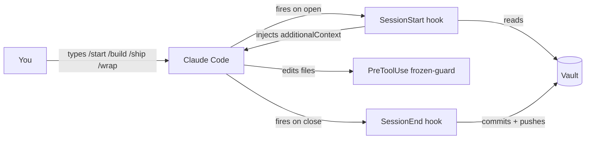
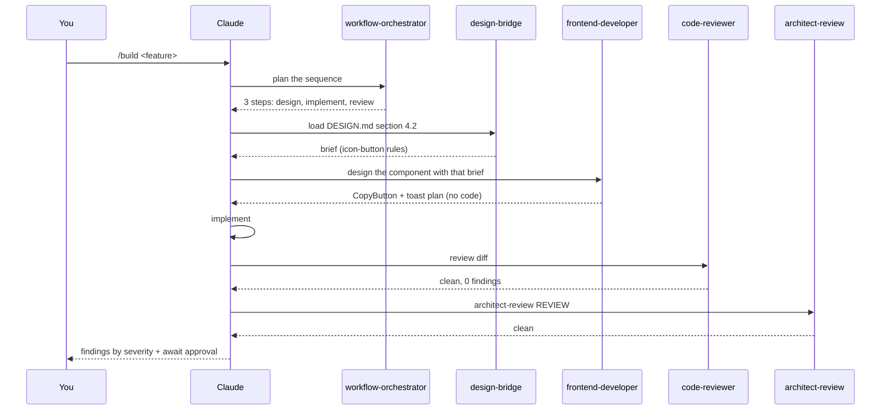
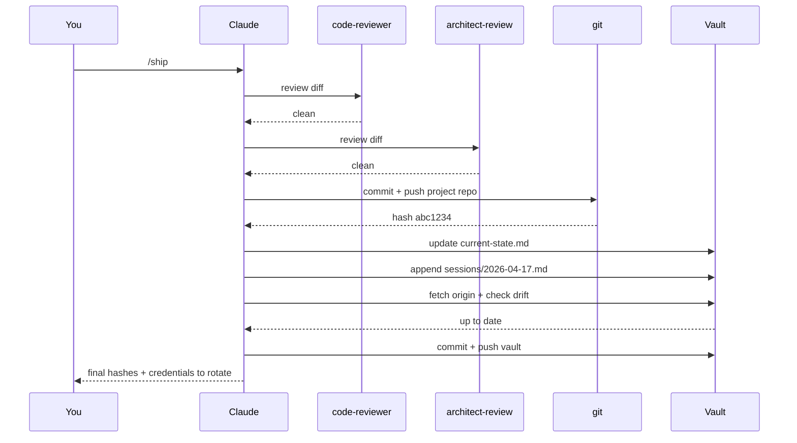
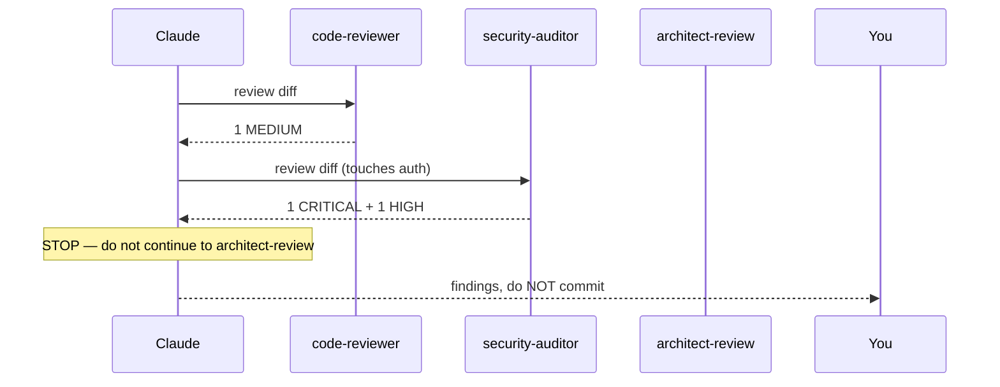
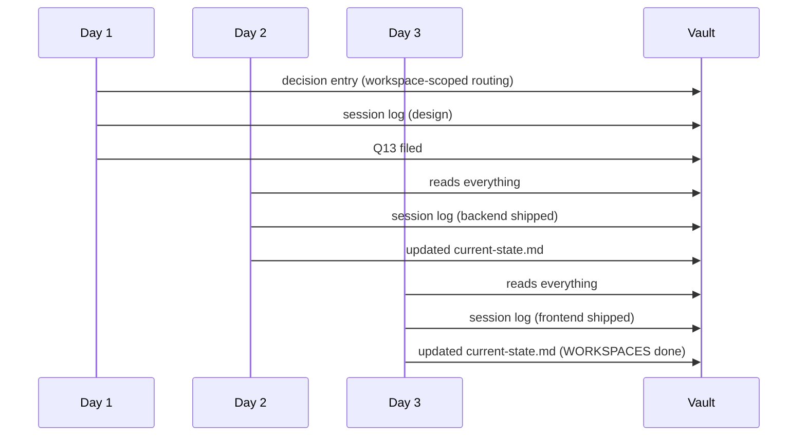

# The session lifecycle — a walkthrough

This doc shows a full working day in Zaude, end to end. Three scenarios, each a complete session from `open terminal` to `push vault`. You see what you type, what Zaude does, and where the mechanical guarantees kick in.

If you have not installed Zaude yet, start at [02-installation.md](./02-installation.md). If you want the conceptual overview first, read [01-introduction.md](./01-introduction.md) and [03-architecture.md](./03-architecture.md).

---

## The cast

Every session involves the same five actors. It helps to keep them in mind.

| Actor | What it is | Where it lives |
|---|---|---|
| **You** | The human at the keyboard | — |
| **Claude Code** | The CLI that runs your session | `claude` on your PATH |
| **SessionStart hook** | Python script that loads vault context | `~/.claude/hooks/session-start-vault.py` |
| **Slash commands** | `/start`, `/build`, `/review`, `/ship`, `/wrap` | `~/.claude/commands/*.md` |
| **Vault** | The git-tracked project memory | `~/zaude-vault/` (configurable) |



The key invariant: you never hand-load context, and you never hand-commit the vault. Both happen mechanically around every session.

---

## Scenario A — Happy path

You have an hour. You want to add a "copy to clipboard" button to one page of your app. You know what you want, nothing is broken, the day is calm.

### Opening the session

You open a terminal at `~/projects/my-app` and run `claude`. Before the prompt appears, Zaude's `SessionStart` hook fires. It:

1. Reads `~/.zaude/config.json` to find the vault path and the `cwd_to_project` map.
2. Walks up from `my-app` looking for a folder named `my-app` (or a mapped name) under `01-projects/` in the vault.
3. Finds `~/zaude-vault/01-projects/my-app/`.
4. Reads `CLAUDE.md`, `current-state.md`, `open-questions.md`, `spec.md`, `architecture.md`, `decisions.md` (plus any `decisions-archive-*.md`), the last 3 session logs, every `.md` in `03-patterns/`, and every memory file under `~/.claude/projects/<encoded-cwd>/memory/`.
5. Concatenates them into one `additionalContext` block prefixed with `=== VAULT CONTEXT FOR my-app ===`.
6. Returns the block to Claude Code, which injects it as a system reminder before the first user turn.

You see an empty prompt. The context is already there, invisible to you.

### `/start`

You type:

```
/start
```

Claude Code reads the `/start` skill and follows its instructions. It does **not** re-read the vault from disk — the hook already loaded it. It pulls from the injected context and reports:

```
## Last session (2026-04-10)
Finished the settings page redesign. Pushed commits 4c1f20a and
e7ba118. DESIGN.md updated to reflect the new card component variant.

## In-flight work
Nothing open. current-state.md shows the settings page shipped cleanly.

## Blocking issues
None. Q7 ("should we switch to Tailwind v4?") is still deferred —
no action needed this week.

## Active memory rules
- feedback_verify_ui_after_changes: Playwright screenshot every
  frontend change before committing.
- feedback_design_compliance: run code-reviewer with DESIGN.md spec,
  don't eyeball.

## Next action
Open: add a "copy to clipboard" button to the share-link dialog
on /dashboard/share. DESIGN.md section 4.2 covers icon-button variants.
```

Then it stops. It does **not** start building. `/start` is read-only reporting.

### `/build`

You have the context in your head. You type:

```
/build Add a "copy to clipboard" button next to the shareable link on
the /dashboard/share page. Use the icon-button pattern from DESIGN.md
section 4.2. Show a toast on success.
```

Claude follows the `/build` skill. The workflow is:



Claude reports back:

```
## Plan
1. Design phase: design-bridge loads DESIGN.md 4.2; frontend-developer
   produces component spec (CopyButton, props, Tailwind classes).
2. Implement in packages/web/src/components/CopyButton.tsx and wire
   into the share page.
3. Review chain: code-reviewer → architect-review REVIEW.
   (No security-auditor — no auth/crypto/credentials involved.)

## Design brief
[one paragraph on which DESIGN.md rules apply]

## Implementation
[two file paths with the exact diffs]

## Review findings
CRITICAL: 0
HIGH:     0
MEDIUM:   1  — [code-reviewer] CopyButton.tsx:34
            Toast auto-dismisses at 2s; consider 3s for
            accessibility per current convention in other toasts.
LOW:      0

Awaiting your call. /ship to commit, or ask me to fix the MEDIUM first.
```

### Accepting the finding

You decide 3s is fine:

```
Bump to 3s then /ship
```

Claude changes the one line, re-runs `code-reviewer` on the new diff, confirms clean, then runs `/ship`.

### `/ship`

The `/ship` flow:



Claude reports:

```
Shipped.

Project repo:  abc1234  "Add CopyButton to share dialog"
Vault:         4f91a0c  "session 2026-04-17: CopyButton shipped"

Credentials exposed this session: none.
```

### `/wrap`

You could stop now — `/ship` already wrote the session log. But the good habit is to close with `/wrap` even after a clean ship, because `/wrap` also sweeps for memory corrections and new open questions you might have raised in chat. You type:

```
/wrap
```

Claude:

1. Runs `code-reviewer` one more time (clean — nothing uncommitted).
2. Confirms `current-state.md` reflects `abc1234`.
3. Checks today's session log — already written by `/ship`, appends anything new.
4. Scans the conversation for corrections. You said "bump to 3s then /ship" — not a correction, just an approval. No memory update needed.
5. Scans for credentials — none.
6. `git fetch origin` on the vault, confirms no drift.
7. Nothing new to commit. Reports:

```
Session closed.

- Project: clean (abc1234)
- Vault:   clean (4f91a0c)
- Memory:  no new rules
- Credentials: none to rotate
```

You close the terminal. Total time: 45 minutes. Everything you did is captured.

---

## Scenario B — Review-blocked path

Different day, different feature. You want to add a password-reset endpoint.

### Opening + `/start`

Same hook. Same `/start`. This time the report includes something new:

```
## Active memory rules
- feedback_verify_ui_after_changes: Playwright screenshot every change.
- feedback_agent_usage_rules: always invoke security-auditor for auth.
```

### `/build`

```
/build Add a password reset flow. POST /api/auth/reset-request sends
an email with a signed token. POST /api/auth/reset-confirm takes the
token and a new password, updates the user.
```

Claude plans, invokes `backend-developer` for API design, implements. Then runs the review chain. The diff touches auth, so `security-auditor` runs too.



The report:

```
## CRITICAL
### [security-auditor] packages/api/src/routes/auth/reset.ts:42
Signed token is HMAC-SHA256 with a hardcoded secret string
'reset-secret-please-change'. Any attacker who reads source can
forge tokens.
→ Load secret from env (e.g. AUTH_RESET_SECRET), fail startup if missing.

## HIGH
### [security-auditor] packages/api/src/routes/auth/reset.ts:71
No rate limiting on /api/auth/reset-request. Enumeration vector
and SMTP-flood vector both open.
→ Add IP-based rate limit (e.g. 5/hour per IP) before invoking email.

## MEDIUM
### [code-reviewer] packages/api/src/services/email.ts:18
Email body uses string concatenation of username — not an injection
risk (plain-text email) but inconsistent with templated emails
elsewhere in this service.
→ Switch to the existing handlebars renderer for consistency.

STOP. CRITICAL finding blocks /ship. Fix and re-run /review before
shipping.
```

Claude does **not** proceed. This is a hard gate.

### Fix and re-review

You respond:

```
Load AUTH_RESET_SECRET from env, throw on boot if missing. Add
express-rate-limit with 5 per hour per IP. Leave the email
template change for a follow-up — file it as an open question.
```

Claude makes both fixes. Files an open question:

```
Appended to open-questions.md:
Q12 — Normalize email rendering across services (MEDIUM)
  What: Some emails use string concat, others use handlebars.
  Why it matters: Adding i18n later means every call site changes.
  Options: 1) migrate all to handlebars, 2) migrate all to MJML.
  Recommended: handlebars — it's already there.
```

Then runs `/review` again:

```
## CRITICAL: 0
## HIGH:     0
## MEDIUM:   0
## LOW:      0

Clean. 4 files reviewed.
```

### `/ship`

Now `/ship` runs through. Commit, push, vault update. The commit message references the findings:

```
commit abc9999
Add password reset flow with env-loaded HMAC secret + rate limiting.

Addresses security-auditor CRITICAL (hardcoded secret) and HIGH
(no rate limit) found during /build review. Q12 filed for email
template consistency.
```

### `/wrap`

Wrap-up, same as before. The memory sweep is important today: you corrected Claude once ("leave the email template change for a follow-up"). That's a validated workflow instinct worth persisting. Claude creates or updates a memory file:

```
New memory: feedback_scope_discipline.md
  When a reviewer finding is out-of-scope for the current task,
  file an open question and ship the in-scope fix — do not silently
  expand the diff.
```

The vault auto-sync fires on SessionEnd. Everything pushed. You log off knowing the CRITICAL was caught before prod ever saw it.

---

## Scenario C — Multi-session feature

A bigger feature. You want to add a "workspaces" concept — multi-tenant accounts with role-based access. This will take three sessions.

### Day 1 — design + partial implementation

You open a session. `/start` reports where you left off (an unrelated ticket shipped yesterday). You type:

```
/build Add multi-tenant workspaces. Each user can belong to many
workspaces with a role (owner, editor, viewer). All existing
routes become workspace-scoped: /ws/:slug/...
```

Claude runs `workflow-orchestrator`. The orchestrator reports back:

```
This is a 3-session feature, not a 1-session feature. Recommendation:

Session 1: Design only.
  - architect-review DESIGN mode: boundaries, migration plan
  - backend-developer: schema + migration plan
  - frontend-developer: route restructure plan
  - ship a decision log entry with the chosen shape
  - NO code yet

Session 2: Backend.
  - Implement schema, migrations, middleware, routes
  - security-auditor on the auth middleware
  - ship backend changes

Session 3: Frontend + integration.
  - Route restructure, workspace switcher UI
  - E2E tests
  - ship
```

You agree. Today, design only. Claude runs `architect-review` in DESIGN mode, `backend-developer` and `frontend-developer` for their parts. Appends to `decisions.md`:

```markdown
## 2026-04-17 — Workspace-scoped routing

**Decision:** All routes become workspace-scoped at /ws/:slug/...
Users select active workspace at login; session carries workspace_id.
Legacy /app/* routes 302-redirect to /ws/<default-workspace>/...
for one release, then 404.

**Rationale:** Prefix scoping keeps URLs self-describing and middleware
can reject cross-workspace IDs at the router level. Header-based
scoping was considered but loses the URL as shareable artifact.

**Implications:** Every frontend route needs a workspace param.
The 302 bridge keeps old bookmarks alive for 1 release. Dropping
it is a future decision to file (Q-future).
```

Nothing to commit in the project repo yet — no code was written. You type:

```
/wrap
```

Claude's wrap:

1. Runs `code-reviewer` on uncommitted work — nothing uncommitted in the project repo. Clean.
2. Updates `current-state.md`:
   ```markdown
   ## Status (2026-04-17)
   - Last commit: abc9999 (password reset, yesterday)
   - In flight: WORKSPACES design approved. Next session: backend
     implementation (schema + migrations + middleware).
   ```
3. Writes today's session log.
4. Appends the decision above to `decisions.md`.
5. Appends Q13 ("when to drop the /app/* → /ws/* bridge") to `open-questions.md`.
6. Memory sweep: you said "let's split this into sessions" — worth persisting. Creates `feedback_multi_session_plan.md`.
7. Credentials: none.
8. `git fetch origin` on vault — clean. Commits and pushes.

You log off. Day 1: no code, but the decision is now immutable in the vault.

### Day 2 — backend (two days later)

You open a session at `~/projects/my-app`. Hook fires. It loads everything, including yesterday's session log (`sessions/2026-04-17.md`) and the new decision entry. You type:

```
/start
```

The report:

```
## Last session (2026-04-17)
Designed multi-tenant workspaces. Decision logged: workspace-scoped
routing at /ws/:slug/...  No code yet. Q13 filed for the future
drop of the /app/* bridge.

## In-flight work
WORKSPACES implementation. Next up: backend. Schema, migrations,
middleware per the decision entry.

## Blocking issues
None.

## Active memory rules
- feedback_multi_session_plan: big features split across sessions.
  Design → commit decision. Backend → commit. Frontend → commit.
- [... others ...]

## Next action
/build the backend half: schema, migrations, middleware, routes.
security-auditor will run (middleware touches auth).
```

Zaude remembered. You did not have to re-explain.

```
/build
Implement the backend half of workspaces per the decision from
2026-04-17. Schema, migrations, middleware, route updates. Keep
the /app/* bridge as 302.
```

Claude implements. Review chain runs. `security-auditor` flags one MEDIUM (user can theoretically list workspace slugs via timing); you accept the finding as known (documented) and ship:

```
/ship
```

Commit + push. Vault updated. You wrap.

### Day 3 — frontend + integration

Third session. `/start` reports:

```
## Last session (2026-04-19)
Shipped workspace backend. Commit bee7654. 23 files, 3 migrations,
all reviews clean except 1 MEDIUM accepted as documented risk.

## In-flight work
WORKSPACES frontend. Route restructure, workspace switcher UI.

## Next action
/build the frontend half.
```

You `/build`, implement, `/ship`. Full feature done. The vault now has:

- 3 session logs telling the story
- 1 decision entry explaining the shape
- 1 open question tracking the bridge-drop followup
- A clean `current-state.md` saying WORKSPACES shipped

Six months later, when a new contributor asks "why is this `/ws/:slug/...` everywhere?", the answer is one `git log` away. That's the whole point.



---

## What each command is really for

You have probably noticed the commands are not interchangeable. Each one has a distinct job:

| Command | Reads? | Writes? | Commits? | Pushes? | Gates on review? |
|---|---|---|---|---|---|
| `/start` | Yes (from context, not disk) | No | No | No | — |
| `/build` | Yes | Yes (code) | No | No | Stops on CRITICAL/HIGH |
| `/review` | Yes | No | No | No | — (report only) |
| `/ship` | Yes | Yes (vault) | Yes (both) | Yes (both) | Stops on CRITICAL/HIGH |
| `/wrap` | Yes | Yes (vault) | Yes (vault) | Yes (vault) | Warns on CRITICAL/HIGH |

The common mistake is treating `/wrap` as "optional if I already `/ship`ed". But `/wrap` does things `/ship` does not:

- Final `code-reviewer` sweep on anything still uncommitted
- Memory sweep (new corrections → memory files)
- Open-questions append
- Credential scan

If you `/ship` and walk away, you may leave an uncommitted fixup in the repo, miss a correction that should have become a memory rule, or forget a pasted token. `/wrap` catches all of that.

---

## When things don't go smoothly

### The hook didn't fire

You type `/start` and see:

```
The SessionStart hook did not inject a vault context for this cwd.
That usually means cwd basename (my-app) is not a folder under
01-projects/, and there's no mapping in cwd_to_project. Want me to
suggest a config.json update?
```

That's Zaude telling you the mechanical guarantee broke. Fix it. Don't fall through and manually read files — that's exactly the vibe-coding loop Zaude exists to prevent.

See [12-troubleshooting.md](./12-troubleshooting.md#hook-not-firing) for the fix.

### A review finding you disagree with

Reviewers are opinionated. Sometimes wrong. The `/build` gate is designed so you can push back:

```
I disagree — the HIGH finding on rate limiting is overblown; this
endpoint is internal-only behind VPN. Re-review with that context.
```

Claude re-invokes the reviewer with the new context and either the reviewer downgrades the finding or holds the line with better reasoning. Either way, the conversation is captured in the transcript, which the `/wrap` memory sweep can persist as a rule if it becomes a pattern.

### You made a typo in a decision entry

Decisions are append-only. You can't edit. Add a new entry:

```markdown
## 2026-04-20 — Correction to 2026-04-17 workspace routing decision

**Decision:** The 2026-04-17 entry said "/ws/:slug" — it is actually
"/workspaces/:slug". Correction only; intent unchanged.
```

No Git history munging, no quiet fix. The log tells the truth about what happened.

---

## Summary — the minimum rhythm

If you remember nothing else:

1. Open the terminal. The hook loads everything.
2. `/start`. Read the report. Wait.
3. `/build <the thing>`. Accept findings or fix them.
4. `/ship`. The review runs again, then commit, then vault update.
5. `/wrap`. Even if you `/ship`ed. Always.

Five keystrokes per session, three files tracked in git, zero chances for context to go missing. That's the durable workflow.

---

## See also

- [05-commands.md](./05-commands.md) — every command's contract in detail
- [06-hooks.md](./06-hooks.md) — what each hook does and how to customize
- [11-best-practices.md](./11-best-practices.md) — philosophy and do's/don'ts
- [12-troubleshooting.md](./12-troubleshooting.md) — when the flow breaks

## What's next

If you have not run through a real session yet, the best thing you can do now is open Claude Code in an installed project and try Scenario A end to end. Scenarios B and C will make more sense the second or third time.
