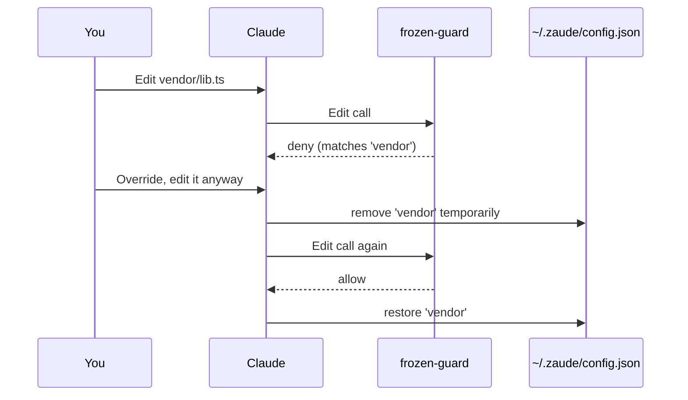

# Troubleshooting

When Zaude misbehaves, it's almost always one of a dozen specific problems. This doc is the triage flowchart. Skim the symptom table, jump to the section, apply the fix.

If nothing here matches, open an issue with the output of the diagnostics at the bottom of this doc.

---

## Quick symptom index

| Symptom | Section |
|---|---|
| `/start` reports nothing, or says "hook did not inject" | [Hook not firing](#hook-not-firing) |
| Session closed but nothing was pushed to the vault repo | [SessionEnd push failing](#sessionend-push-failing) |
| Claude says "BLOCKED: path is inside the frozen zone" for a path that should be writable | [Frozen-guard blocking valid edits](#frozen-guard-blocking-valid-edits) |
| `/start` works on one project but not another | [Hook not firing](#hook-not-firing) + [Wrong project detected](#wrong-project-detected) |
| `/build` skips the review chain | [Review chain didn't run](#review-chain-didnt-run) |
| Memory files don't load into the session | [Memory files not loading](#memory-files-not-loading) |
| `/start` reports a truncated `decisions.md` | [decisions.md truncated in report](#decisionsmd-truncated-in-report) |
| Windows: "config.json" is found but `vault_path` doesn't resolve | [Windows path issues](#windows-path-issues) |
| `settings.json` hooks section was overwritten or conflicts | [settings.json conflict](#settingsjson-conflict) |
| Vault pushed on wrong branch / wrong remote | [Wrong remote or branch](#wrong-remote-or-branch) |
| Hook runs but adds no context (empty output) | [Project not detected](#project-not-detected) |

---

## Hook not firing

**Symptom.** You open a session, type `/start`, and Claude either says something like "the SessionStart hook did not inject a vault context for this cwd" or reports generic content that clearly didn't come from your vault. The system reminder at session start lacks `=== VAULT CONTEXT FOR <project> ===`.

**Diagnostic.** Run the hook manually:

```bash
# macOS / Linux / WSL
echo '{"cwd":"'"$PWD"'"}' | python3 ~/.claude/hooks/session-start-vault.py
```

```powershell
# Windows PowerShell
$cwd = (Get-Location).Path
'{"cwd":"' + $cwd + '"}' | python "$HOME\.claude\hooks\session-start-vault.py"
```

Expected output: a JSON object with `hookSpecificOutput.additionalContext` starting with `=== VAULT CONTEXT FOR <your project> ===`.

If you see `{}` instead, one of these is wrong:

| Check | What to look for |
|---|---|
| `~/.zaude/config.json` exists | `cat ~/.zaude/config.json` returns the file |
| `vault_path` resolves | The path in the config exists on disk |
| `projects_subdir` exists under `vault_path` | Default `01-projects`; check it's there |
| Your cwd basename matches a project folder | Or is mapped via `cwd_to_project` |
| `~/.claude/settings.json` registers the hook | `SessionStart` hook entry present |

**Fix by case:**

### Config file missing

```bash
ls ~/.zaude/config.json
# -> No such file
```

Zaude never installed the config, or you deleted it. Re-run the installer, or manually copy [`config.sample.json`](../templates/claude-config/config.sample.json) into `~/.zaude/config.json` and fill in the paths.

### Config file invalid JSON

```bash
python3 -c "import json; json.load(open('$HOME/.zaude/config.json'))"
# -> json.decoder.JSONDecodeError
```

The hook silently returns `{}` on invalid JSON (by design — never blocks the session). Fix the JSON (trailing commas, unescaped backslashes on Windows) and retry.

### Vault path wrong

```bash
python3 -c "import json, os; c=json.load(open(os.path.expanduser('~/.zaude/config.json'))); print(os.path.expanduser(c['vault_path']))"
# -> prints a path
ls <that path>
# -> No such file
```

Either edit `vault_path` in `~/.zaude/config.json`, or move your vault to the configured path.

### Project not detected

Your cwd basename isn't a folder under `<vault>/01-projects/`. Two options:

**Option A — rename the vault folder** to match your cwd basename. Cheapest if you only have one machine.

**Option B — add a `cwd_to_project` entry.** In `~/.zaude/config.json`:

```json
{
  "vault_path": "~/zaude-vault",
  "cwd_to_project": {
    "my-repo-name": "vault-project-slug"
  }
}
```

The hook walks up 5 directory levels from cwd checking each basename against the map, then against direct folder matches. So if your cwd is `~/code/my-monorepo/packages/web`, and `my-monorepo` is a vault project, you don't need a map entry — the walk-up finds it.

### Hook not registered in settings.json

```bash
cat ~/.claude/settings.json
# -> should contain a "SessionStart" hook entry
```

If missing, merge the entries from [`templates/claude-config/settings.json`](../templates/claude-config/settings.json). The correct block:

```json
{
  "hooks": {
    "SessionStart": [
      {
        "hooks": [
          {
            "type": "command",
            "command": "python \"$HOME/.claude/hooks/session-start-vault.py\"",
            "timeout": 10
          }
        ]
      }
    ]
  }
}
```

On Windows, `$HOME` expands to the user profile; keep the quotes. If `python` is not on your PATH, use `python3` or the full `py.exe` path.

### Python not on PATH

```bash
python --version
# -> command not found
```

Install Python 3 and make sure `python` resolves. On macOS, `brew install python`. On Windows, use the installer from python.org and tick "Add to PATH". Then restart your terminal.

---

## SessionEnd push failing

**Symptom.** You closed a session. You expected the vault to be committed and pushed. It wasn't. Project repo may or may not be fine — this is the vault+config auto-sync.

**Diagnostic.** Read the log:

```bash
tail -n 50 ~/.claude/hooks/session-end-vault-sync.log
```

Every SessionEnd invocation appends `=== <timestamp> session-end sync ===` followed by `git` output. Look at the most recent block.

**Common causes:**

### Not authenticated to GitHub

```
remote: Support for password authentication was removed...
fatal: Authentication failed
```

Run:

```bash
gh auth status
```

If not authenticated, `gh auth login`. If you use HTTPS remotes, gh auth handles credentials; if SSH, make sure your key is loaded (`ssh-add -l`).

### Remote has newer commits

```
! [rejected] main -> main (fetch first)
hint: Updates were rejected because the remote contains work...
```

Another machine (or a merge you did on github.com) pushed to the vault. The hook never force-pushes. Resolve manually:

```bash
cd ~/zaude-vault
git pull --rebase origin main
# resolve any conflicts
git push
```

The hook will skip next time because there will be no pending changes, or it will succeed if you left work uncommitted. Either way the next session is fine.

### Nothing to commit

```
vault: no staged changes, nothing to commit
```

Benign. The hook ran, found nothing to push, exited. Not an error.

### Vault is not a git repo

```
vault: not a git repo, skipping
```

You moved the vault or installed without gh. Initialize:

```bash
cd ~/zaude-vault
git init -b main
git add -A
git commit -m "Initial vault"
git remote add origin <your repo url>
git push -u origin main
```

### Claude-config repo not set up

```
claude-config: not a git repo, skipping
```

Same fix as above, but for `~/.claude`. The installer creates a curated `.gitignore` before init; replicate from [`.gitignore`](../templates/claude-config/.gitignore) or copy from your vault repo if you lost it.

### Python missing on path during hook execution

The `session-end-vault-sync.sh` falls back to `grep`+`sed` if neither `python3` nor `python` is found. If the fallback misparses your config, add `python3` to your PATH system-wide (not just your shell rc) so the hook picks it up.

### Config path mismatch

```
vault: path not set or directory not found, skipping
```

`vault_path` in `~/.zaude/config.json` points at a directory that doesn't exist. Fix the config.

---

## Frozen-guard blocking valid edits

**Symptom.** You ask Claude to edit a file and get a response like:

```
BLOCKED: /path/to/my-file.ts is inside the frozen zone 'vendor'.
This path is read-only by Zaude configuration (~/.zaude/config.json).
```

**What's happening.** `PreToolUse` hook intercepted the Edit/Write call because the file path contains a substring listed in `frozen_zones`. The match is a simple substring check — no globbing, no regex.

**Two fixes:**

### The zone is too broad

Your config has `"frozen_zones": ["src"]` and now every file under `src/` is blocked. Narrow it:

```json
{
  "frozen_zones": ["src/vendor/", "src/legacy/"]
}
```

Use path fragments specific enough to match only what you intend. Trailing slash helps disambiguate directories from name prefixes.

### You really do want to edit it this time

Tell Claude in plain language:

```
Override the frozen guard and edit this file. I understand it's in
the vendor zone; this is a one-off upstream patch.
```

Claude will retry the edit, which goes through the hook again — the hook still blocks. **There is no flag to disable frozen-guard per call.** The override works because Claude will edit the config to temporarily remove the zone, edit your file, then restore the zone. That's intentional: the trip through the config makes the override visible in `git log`.

If you find yourself overriding the same zone frequently, that's a signal to narrow the zone.

### Override mechanics walked through



---

## Review chain didn't run

**Symptom.** You typed `/build` or `/review` and Claude implemented without invoking `code-reviewer`, `architect-review`, or `security-auditor`.

**Diagnostic.** Check whether the agents are installed:

```bash
ls ~/.claude/agents/
# Should list code-reviewer.md, architect-review.md, security-auditor.md, etc.
```

**Fix.** Agents are separate from Zaude. You need to install the wshobson + VoltAgent agent packs:

```bash
# Example — see docs/08-agents.md for current instructions
cd ~/.claude/agents
git clone https://github.com/wshobson/agents.git wshobson-agents
cp wshobson-agents/*.md .
```

After install, `/build` will find `code-reviewer`, `architect-review`, `security-auditor` and invoke them.

**Corollary.** If you have the agents but Claude still skips them:

- Check the skill file (`~/.claude/commands/build.md`) still contains the agent invocation instructions. If you customized it, you may have removed them.
- Correct Claude in the moment: "you skipped `code-reviewer` — run it now". The `/wrap` memory sweep will persist the correction as a feedback rule.

---

## Memory files not loading

**Symptom.** You set up a memory rule last session (e.g. `feedback_no_hardcoded_secrets.md`), but this session Claude behaves as if it doesn't know.

**Context.** Memory is cwd-keyed. Claude Code encodes your cwd into a directory name under `~/.claude/projects/`. The encoding replaces path separators with hyphens. If your cwd changed between sessions, the old memory doesn't match the new cwd.

**Diagnostic.**

```bash
ls ~/.claude/projects/
```

You'll see directories like `D--Z-Workspace-Hostonce-DevOps` or `Users-you-code-myapp`. Each corresponds to a cwd.

```bash
# find which directory matches your current cwd
ls ~/.claude/projects/ | grep "$(basename "$PWD")"
```

**Fix by case:**

### You moved the project

Memory was created for the old cwd. Options:

1. **Move the memory dir** to match the new cwd. If the old dir was `Users-you-code-oldname` and your new cwd is `~/code/newname`, rename to `Users-you-code-newname`.
2. **Re-teach Claude** in the new session and let `/wrap` persist the rules fresh.

Moving is cheaper if you have a lot of memory. Re-teaching is more reliable if you want to prune stale rules.

### You opened the session from a different subdirectory

If the project's memory dir was created when you opened a session at `~/code/myapp/`, but today you opened one at `~/code/myapp/packages/web/`, the memory dir won't match your new cwd.

The `SessionStart` hook's `find_memory_dir` helper searches `~/.claude/projects/*` for a directory whose name contains the **last segment** of your cwd as a substring. So `packages/web` looks for `*web*` dirs, which probably won't find the `*myapp*` memory.

Fix: either always open Claude Code from the project root, or symlink a matching dir, or copy memory files into a matching one.

### The hook didn't fire at all

See [Hook not firing](#hook-not-firing). Memory loads as part of the `SessionStart` hook; if the hook didn't run, memory didn't load even if the files exist.

---

## decisions.md truncated in report

**Symptom.** You `/start`, Claude reports recent decisions, but the list is shorter than what's actually in `decisions.md`. Maybe only the last few entries appear.

**Why it happens.** This is almost always the Read tool's line limit biting when Claude is reading files on its own (not via the hook). The Read tool defaults to 2000 lines and may truncate long logs.

**But the hook doesn't use Read.** The `SessionStart` hook loads files via Python `open()` and reads the entire file. There is no truncation.

So if you're seeing a truncated decisions list at `/start` time, the real issue is:

1. **The hook didn't fire.** Claude fell back to reading `decisions.md` via the Read tool mid-conversation, which *did* truncate. See [Hook not firing](#hook-not-firing).
2. **Claude is summarizing.** `/start`'s job is to report, not to dump. The full `decisions.md` is in context; Claude is just choosing which entries to surface. If you want the full list, ask: "list every entry in decisions.md with just the date + title".

**Fix.** Verify the hook fired:

```
Look for "=== VAULT CONTEXT FOR <project> ===" in the system
reminders at the top of the conversation. If present, the full
decisions.md is loaded; just ask Claude to list all of it.
```

If absent, it's a hook problem, not a decisions problem.

---

## Windows path issues

**Symptom.** On Windows, the hook reports `vault_path` doesn't resolve even though the directory exists. Or config.json was edited on Windows and now has `\` characters that break JSON parsing.

### Use forward slashes in config.json

Python's `os.path.expanduser` and `os.path.isdir` handle both separators on Windows, but JSON parsing fails on unescaped backslashes. Always use forward slashes:

```json
{
  "vault_path": "C:/Users/you/zaude-vault",
  "claude_config_path": "C:/Users/you/.claude"
}
```

Or escape backslashes:

```json
{
  "vault_path": "C:\\Users\\you\\zaude-vault"
}
```

Never use single backslashes — JSON will read `\Z` or `\U` as a bad escape.

### `~` expansion on Windows

Python's `expanduser` resolves `~` to `$HOME` if set, else to the user profile. On Windows inside Git Bash or WSL, `$HOME` is typically `/c/Users/you` or `/home/you`. In native PowerShell, `~` resolves to the user profile directory directly.

If the hook can't find the vault, print what the config resolves to:

```bash
python -c "import json, os; c=json.load(open(os.path.expanduser('~/.zaude/config.json'))); print(repr(os.path.expanduser(c['vault_path'])))"
```

Make sure the printed path exists. If not, edit config.json to use the absolute resolved path.

### PowerShell quoting for the hook manual test

```powershell
# this fails — PowerShell swallows the quotes
echo '{"cwd":"C:/code"}' | python $HOME\.claude\hooks\session-start-vault.py
```

Use a here-string or file-based input:

```powershell
'{"cwd":"C:/code/myapp"}' | python "$HOME\.claude\hooks\session-start-vault.py"
```

Or:

```powershell
Set-Content -Path test.json -Value '{"cwd":"C:/code/myapp"}'
Get-Content test.json | python "$HOME\.claude\hooks\session-start-vault.py"
```

### `python` vs `python3` on Windows

Windows python.org installs register `python` (not `python3`). If `settings.json` invokes `python3`, it won't find it. Either:

- Rename to `python` in settings.json
- Install py.exe and use `py -3` in the command
- Symlink / alias `python3` → `python`

---

## settings.json conflict

**Symptom.** The installer warned:

```
! /home/you/.claude/settings.json already exists. Zaude won't
  overwrite it. Compare against templates/claude-config/settings.json
  and merge the hook entries manually.
```

You kept going. Now hooks aren't firing — Zaude's entries are not actually registered.

**Fix.** Manually merge. Open your existing `~/.claude/settings.json` and the template at [`templates/claude-config/settings.json`](../templates/claude-config/settings.json). Merge the `hooks` object so it contains all three events: `SessionStart`, `PreToolUse` (with `Edit|Write` matcher), and `SessionEnd`.

Structure:

```json
{
  "hooks": {
    "SessionStart": [...your existing entries..., ...zaude entry...],
    "PreToolUse": [...your existing entries..., ...zaude entry...],
    "SessionEnd": [...your existing entries..., ...zaude entry...]
  },
  "otherExistingKeys": "..."
}
```

If you have existing SessionStart hooks that do something useful, you want both to run. Claude Code runs each entry in the array in order.

After merging, re-test:

```bash
echo '{"cwd":"'"$PWD"'"}' | python3 ~/.claude/hooks/session-start-vault.py
```

Should produce the vault-context JSON. Open a fresh Claude Code session and type `/start` to confirm end-to-end.

### JSON validation

```bash
python3 -m json.tool ~/.claude/settings.json
```

If it parses and re-prints, your JSON is valid. If it errors, fix it before Claude Code starts — Claude Code treats a broken settings.json as "no settings", which silently disables all hooks.

---

## Wrong remote or branch

**Symptom.** `SessionEnd` pushes successfully but to the wrong place. Or the vault goes to a `main` branch but your upstream is `master`.

**Diagnostic.**

```bash
cd ~/zaude-vault
git remote -v
git branch --show-current
```

**Fix.**

```bash
# Wrong remote URL
git remote set-url origin git@github.com:you/correct-repo.git

# Wrong branch (repo expects master, you're on main)
git branch -m main master
git push -u origin master
```

The hook runs `git push` with no args, which uses the upstream set by `push -u`. Once set correctly, the hook keeps pushing to the right place.

---

## Wrong project detected

**Symptom.** Hook fires, vault context is injected, but it's for the wrong project. You're working on `my-app` and the report says "Here's what happened in `other-app` last session".

**Cause.** Your cwd basename matches `other-app` somewhere in the walk-up, or `cwd_to_project` has a stale entry.

**Diagnostic.**

```bash
cat ~/.zaude/config.json
```

Check `cwd_to_project`. Make sure the current cwd basename isn't mapped to the wrong slug.

Check the walk-up by hand:

```bash
pwd
# e.g. /home/you/code/other-app/packages/my-app
```

The hook walks from the deepest basename (`my-app`) up. It stops at the first match. If `my-app` is under `01-projects/`, it picks that. If not, it tries `packages`, then `other-app`, then picks the first that matches.

If `other-app` is also a vault project, the walk stops there and that's what loads. Fix by adding a `cwd_to_project` override:

```json
{
  "cwd_to_project": {
    "my-app": "my-app-slug"
  }
}
```

That forces the deepest basename to win.

---

## Project not detected

**Symptom.** Hook runs, exits with `{}`, no context injected. You verified config.json, vault_path, everything. Still nothing.

**Cause.** Claude Code passes a cwd to the hook via stdin JSON. If cwd is empty, missing, or mangled, the hook silently exits.

**Diagnostic.** Run Claude Code with `--verbose` (if available) or check the session start logs. If Claude Code shows the hook ran with no `additionalContext`, the project was not detected.

**Fix.**

1. Make absolutely sure your project folder exists under `<vault>/01-projects/`:
   ```bash
   ls ~/zaude-vault/01-projects/
   ```
2. Make sure the folder name matches your cwd basename, OR add a `cwd_to_project` entry.
3. Run the manual diagnostic:
   ```bash
   echo '{"cwd":"'"$PWD"'"}' | python3 ~/.claude/hooks/session-start-vault.py | head -c 200
   ```
   If you see `=== VAULT CONTEXT FOR ... ===`, it's working. If still `{}`, print debug info from the hook:

Add a debug line to the hook temporarily (remember to remove after):

```python
# After detect_project():
print(f"DEBUG cwd={cwd} project={project} vault_root={vault_root}", file=sys.stderr)
```

Run the manual test again and read stderr. That tells you exactly what the hook saw.

---

## General diagnostics block

If you open an issue, include the output of these commands (sanitize any personal paths if you care):

```bash
# Zaude version / git hash
cd ~/.claude && git log -1 --oneline 2>/dev/null || echo "no git"
cd ~/zaude-vault && git log -1 --oneline 2>/dev/null || echo "no git"

# Config
cat ~/.zaude/config.json

# settings.json hooks only
python3 -c "import json; print(json.dumps(json.load(open('$HOME/.claude/settings.json')).get('hooks', {}), indent=2))"

# Python version
python3 --version
python --version 2>/dev/null

# Hook test
echo '{"cwd":"'"$PWD"'"}' | python3 ~/.claude/hooks/session-start-vault.py | head -c 500

# SessionEnd log tail
tail -n 30 ~/.claude/hooks/session-end-vault-sync.log 2>/dev/null

# Memory dirs
ls ~/.claude/projects/ 2>/dev/null

# gh auth
gh auth status 2>&1
```

Paste the output into the issue. That covers ~90% of the info needed to diagnose.

---

## Last resort: reinstall

If something is deeply wrong and you just want to start over:

```bash
# Backup your vault (contains your actual work!)
cp -R ~/zaude-vault ~/zaude-vault-backup

# Backup your memory
cp -R ~/.claude/projects ~/claude-projects-backup

# Remove Zaude's config
rm ~/.zaude/config.json
rm ~/.claude/hooks/session-start-vault.py
rm ~/.claude/hooks/frozen-guard.py
rm ~/.claude/hooks/session-end-vault-sync.sh

# Re-run the installer
curl -fsSL https://raw.githubusercontent.com/ziadmomen10/zaude/main/install/install.sh | bash
```

Your vault and memory backups are untouched. The installer creates fresh config and hook files and points back at your existing vault.

---

## See also

- [02-installation.md](./02-installation.md) — fresh install walkthrough
- [06-hooks.md](./06-hooks.md) — what each hook does and when
- [13-customization.md](./13-customization.md) — editing hooks and config safely
- [11-best-practices.md](./11-best-practices.md) — the philosophy (hooks enforce, skills suggest)

## What's next

If the fix worked, you're back to shipping. If it didn't, the diagnostics block above produces everything needed to file a useful issue — copy it into a GitHub issue on the Zaude repo with a short description of the symptom.
