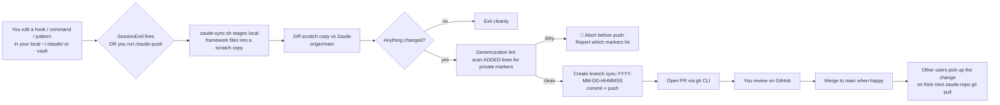

# 14 — Auto-sync: propagating framework improvements back to Zaude

Zaude is designed to be used, modified, and improved. Every time you refine a hook, sharpen a slash command, or discover a new cross-project pattern, that improvement should find its way back to the framework so other users benefit.

The auto-sync pipeline does this **safely**: it never publishes private content, never commits to `main` directly, and always goes through a reviewable pull request.

---

## The design in one diagram



---

## What gets synced

| Local path | Zaude path | What it covers |
|---|---|---|
| `~/.claude/commands/start.md` | `templates/claude-config/commands/start.md` | The `/start` skill |
| `~/.claude/commands/build.md` | `templates/claude-config/commands/build.md` | The `/build` skill |
| `~/.claude/commands/review.md` | `templates/claude-config/commands/review.md` | The `/review` skill |
| `~/.claude/commands/ship.md` | `templates/claude-config/commands/ship.md` | The `/ship` skill |
| `~/.claude/commands/wrap.md` | `templates/claude-config/commands/wrap.md` | The `/wrap` skill |
| `~/.claude/commands/zaude-push.md` | `templates/claude-config/commands/zaude-push.md` | The sync trigger |
| `~/.claude/hooks/session-start-vault.py` | `templates/claude-config/hooks/session-start-vault.py` | SessionStart hook |
| `~/.claude/hooks/session-end-vault-sync.sh` | `templates/claude-config/hooks/session-end-vault-sync.sh` | SessionEnd hook |
| `~/.claude/hooks/frozen-guard.py` | `templates/claude-config/hooks/frozen-guard.py` | PreToolUse guard |
| `~/.claude/settings.json` | `templates/claude-config/settings.json` | Hook wiring |
| `~/.claude/CLAUDE.md` | `templates/claude-config/CLAUDE.md` | Global instructions |
| `<vault>/<patterns_subdir>/*.md` | `templates/vault/03-patterns/*.md` | Cross-project patterns |

What does **not** sync: your `config.sample.json` (canonical template, we don't overwrite from users), any vault project content (your projects stay yours), any memory files, any credentials, and anything matching an entry in `sync_exclude`.

---

## How the genericization lint works

The hard safety guarantee: **no private content reaches GitHub**.

When the script has computed a diff, it extracts only the **added** lines (lines starting with `+` in the unified diff). These are the bytes that would become public if the sync proceeded. The lint runs over those lines looking for:

1. **Markers from the default list** in `zaude-sync.sh`:
   - `UltaHost`, `ultahost`, `UltaHost-Vault`
   - `host-once-hub`, `host-once-platform`
   - `devops-control-center`, `devops-dashboard`
   - `ulta2024`, `@ultahost.com`
2. **Markers from your `sync_private_markers` config** (add anything specific to your org — company name, internal project code names, customer names).
3. **Non-standard IP addresses** — any IP in added content that isn't localhost (`127.0.0.1`), broadcast (`255.255.255.255`), or an RFC 5737 documentation range (`192.0.2.*`, `198.51.100.*`, `203.0.113.*`). Internal VPS IPs trip this.

If any marker matches, the script exits with code 2 **before any push or branch creation**. The output tells you exactly which markers hit and which lines they appeared on. Nothing reaches the Zaude repo.

Your options when the lint fails:
- **Edit the file** to remove the marker. Most common path — you accidentally left a project-specific reference in a hook you were generalizing.
- **Extend `sync_private_markers`** to block more of your private vocabulary.
- **Add the file to `sync_exclude`** if it's personal and should never sync.

---

## Running it — three ways

### 1. `/zaude-push` slash command (recommended)

From inside Claude Code, in any session:

```
/zaude-push
```

Claude runs the lint, shows you what will change, asks to confirm, then opens the PR. Safest because you review each step.

### 2. `zaude-sync.sh` directly (scripting)

From a shell, any time:

```bash
# Interactive — shows plan and asks to proceed
bash ~/zaude/install/zaude-sync.sh

# Non-interactive — push without prompting (still PR, still lint-gated)
bash ~/zaude/install/zaude-sync.sh --yes

# Dry run — show what would sync, don't push
bash ~/zaude/install/zaude-sync.sh --dry-run

# Lint only — check cleanliness without diffing/pushing
bash ~/zaude/install/zaude-sync.sh --lint-only
```

### 3. SessionEnd auto-trigger (set and forget)

In `~/.zaude/config.json`:

```json
{
  "auto_sync": true,
  "zaude_repo_path": "~/zaude"
}
```

Now, at every session end, if your SessionEnd hook commits a change to a framework file (hook / command / settings.json / global CLAUDE.md / pattern), the script runs automatically in `--yes` mode. Lint gates still apply — if anything fails the lint, no PR is created.

**Recommendation:** leave `auto_sync: false` for the first week. Use `/zaude-push` manually so you learn what triggers false positives. Flip to `true` when you trust the lint for your workflow.

---

## The PR that gets created

```
Title:    sync: auto-update framework from local edits (2026-04-17)
Branch:   sync-20260417-203315  →  main
Body:
  Automated sync from local framework edits.

  Summary: 2 file(s) changed.

  Files:
  - templates/claude-config/commands/wrap.md
  - templates/claude-config/hooks/session-start-vault.py

  Genericization lint: ✅ passed (no private markers detected in diff)

  To review: open the Files tab on this PR. Each change is a file you
  edited locally since the last sync. If any change looks wrong or
  includes content that should not be public, close this PR and re-run
  zaude-sync.sh --lint-only after fixing.

  To ship: approve and merge. The next session-start elsewhere will pick
  up the new templates on the next git pull of this repo.

  🤖 Generated with Zaude auto-sync.
```

You review the PR like any other. Merge to ship. The PR branch gets auto-deleted by GitHub on merge (if you have that setting on).

---

## Worked example — a real sync

You're working on a project. Mid-session, you realize `/wrap`'s memory-sweep step is missing a case — when the user says "that was wrong" Claude should save a feedback memory even if no code correction happened. You edit `~/.claude/commands/wrap.md` to add that case.

Session ends. You've opted into `auto_sync`. Here's what happens (abbreviated log):

```
=== 2026-04-17 20:33:15 session-end sync ===
--- syncing vault (~/zaude-vault) ---
vault: no staged changes, nothing to commit
--- syncing claude-config (~/.claude) ---
[main f8d2c41] auto-commit 2026-04-17-2033
 1 file changed, 3 insertions(+)
To https://github.com/ziadmomen10/zaude-claude-config.git
   ab94321..f8d2c41  main -> main
claude-config: synced
auto_sync: claude-config commit touched framework files
auto_sync: triggering zaude-sync.sh --yes

▸ Staging local framework files for diff...
▸ Comparing against Zaude repo main branch...
1 file(s) differ from Zaude main:
   templates/claude-config/commands/wrap.md

▸ Running genericization lint on the diff (new/changed content only)...
✓ Lint passed. No private markers in the diff.
▸ Pushing branch sync-20260417-203320...
✓ PR opened: https://github.com/ziadmomen10/zaude/pull/3
✓ Sync complete.
```

You open the PR link. GitHub shows the 3-line addition to `wrap.md`. You skim, click Merge. Done. Now every Zaude user who pulls or installs gets that improvement.

---

## Worked example — a lint failure

You edit `~/.claude/commands/build.md` to add a shortcut for your team's internal service. Without thinking, you type the service name.

```
▸ Staging local framework files for diff...
▸ Comparing against Zaude repo main branch...
1 file(s) differ from Zaude main:
   templates/claude-config/commands/build.md

▸ Running genericization lint on the diff (new/changed content only)...

✗ Genericization lint FAILED. Private content detected in the diff:

  MARKER: 'acme-internal-svc' found in added content:
    +- If the feature touches acme-internal-svc, prefer the staging cluster
    +  before hitting prod. See ~/work/runbooks/acme-internal-svc.md.

✗ Sync aborted. Nothing was pushed. Options:
  1. Edit the offending files to remove the private markers, then re-run.
  2. Add the marker to 'sync_private_markers' in ~/.zaude/config.json
     if it's a legitimate framework token that happens to match a marker.
  3. If the file should never sync, add it to 'sync_exclude'.
```

Nothing reached GitHub. Your `build.md` edit still works locally — the change is in your own `~/.claude/commands/build.md`. It just won't become part of public Zaude. That's the correct outcome.

To clean up, either:
- Remove the `acme-internal-svc` line from the shared `build.md` and move it to a project-level file instead, OR
- Keep it local only — add `commands/build.md` to `sync_exclude` if you want this file to stay entirely personal

---

## Config schema (relevant fields)

```json
{
  "zaude_repo_path": "~/zaude",
  "auto_sync": false,
  "sync_private_markers": [
    "AcmeCorp",
    "acme-internal-svc",
    "your-company-name"
  ],
  "sync_exclude": [
    "commands/build.md",
    "hooks/my-team-specific-hook.py"
  ]
}
```

All four fields are optional. If `zaude_repo_path` is empty or missing, auto-sync is disabled and `/zaude-push` will exit with an error message.

---

## Safety properties

A short audit of what this pipeline guarantees:

1. **No commit to main.** The script only creates branches named `sync-*`. Never `git push origin main`. Never `git commit` on main. Verifiable by reading `zaude-sync.sh`.
2. **Lint runs before push.** The genericization check runs on the staged diff before `git push`. If the lint fails, no push happens.
3. **Only known paths sync.** The script has a hardcoded allowlist of target paths. Files outside that list (like your vault project folders, memory files, credentials) are never considered for sync.
4. **User confirmation in interactive mode.** `/zaude-push` always asks before pushing unless `--yes` is passed.
5. **PR opens, human merges.** GitHub becomes the final review gate. You can always close the PR without merging.
6. **Nothing is pulled.** This is strictly local → Zaude PR. The script never modifies your local files.

---

## Disabling auto-sync

To stop using auto-sync entirely:

```json
{
  "auto_sync": false,
  "zaude_repo_path": ""
}
```

Or delete `~/.zaude/config.json` fields entirely. The `/zaude-push` command will surface a clean error message.

---

## See also

- [11 — Best practices](./11-best-practices.md) — the "hooks enforce, skills suggest" principle that auto-sync respects
- [12 — Troubleshooting](./12-troubleshooting.md) — debugging a failed sync or missed PR
- [13 — Customization](./13-customization.md) — adding your own framework patches that SHOULD stay local
- [TRADEMARK.md](../TRADEMARK.md) — what you can and can't change about the Zaude name in your fork
