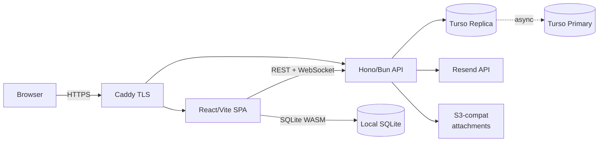
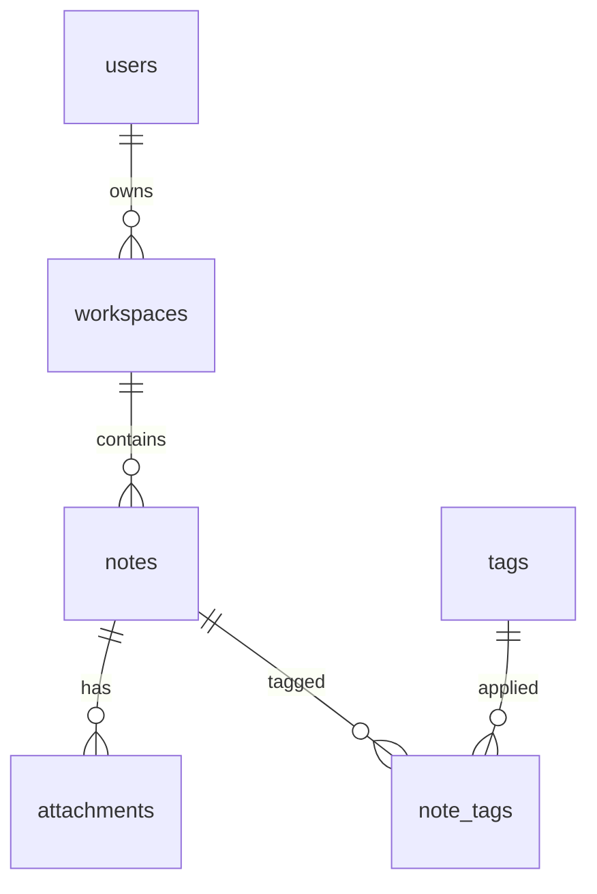

# notekit — Architecture

The architecture is HOW notekit is built. Updated when major structural choices change.

---

## System overview

## Components

- **Frontend (`packages/frontend`):** React 19 + Vite 6. Monaco editor, TanStack Query for server state, custom SQLite-WASM bindings for local storage. Bundle size target < 500KB gzipped.
- **Backend (`packages/backend`):** Hono 4 on Bun. Routes for `/auth`, `/notes`, `/sync`, `/attachments`. Drizzle ORM against Turso.
- **Sync engine (`packages/sync`):** Shared TypeScript package used by both frontend and backend. Vector-clock-based conflict detection. Exports a pure sync-delta computation function used on both sides.
- **CLI (`packages/cli`):** Bun-compiled native binary. Wraps the backend API for scripting.

## Data model

- `users(id, email, created_at, last_login_at)`
- `workspaces(id, user_id, name, created_at, synced_at)`
- `notes(id, workspace_id, title, body, vector_clock, created_at, updated_at)`
- `attachments(id, note_id, mime, storage_key, size)`
- `tags(id, workspace_id, name)`
- `note_tags(note_id, tag_id)`

Migrations live at `packages/backend/drizzle/`.

## Key flows

### Write path (local-first)

1. User types in editor.
2. Frontend buffers keystrokes (100ms debounce).
3. Frontend writes to local SQLite via WASM.
4. Background worker enqueues a sync delta.
5. Sync worker POSTs `/sync` with delta + vector clock.
6. Backend applies delta to Turso replica, returns server's vector clock.
7. Frontend reconciles its local vector clock with server's.

### Magic-link auth

1. User enters email → POST `/auth/request`.
2. Backend generates single-use token (TTL 10 min), stores hash in DB, sends email via Resend.
3. User clicks link → GET `/auth/callback?token=...`.
4. Backend verifies token, issues JWT (15 min) + httpOnly refresh cookie (30 days).
5. Frontend stores JWT in memory; refresh is automatic on 401.

### Conflict resolution (WIP — see current-state.md)

1. Client syncs, server detects vector clocks have diverged.
2. Server returns 409 + server copy.
3. Frontend shows 3-way merge UI (local / server / base).
4. User picks a resolution; frontend writes it as a new version with combined vector clock.

## External dependencies

- **Turso** — distributed SQLite. We use one replica per user. Without it, sync is down; local editing continues.
- **Resend** — transactional email for magic links. Without it, new logins fail; existing sessions continue.
- **S3-compatible storage** (Backblaze B2) — attachment storage. Without it, attachments stop loading; note bodies continue to work.

## Non-obvious decisions

See `decisions.md`:
- 2026-04-10 — Local-first, not backend-first
- 2026-04-12 — Magic-link auth, not passwords
- 2026-04-14 — Markdown as storage format
- 2026-04-16 — Promote only after conflict UI
