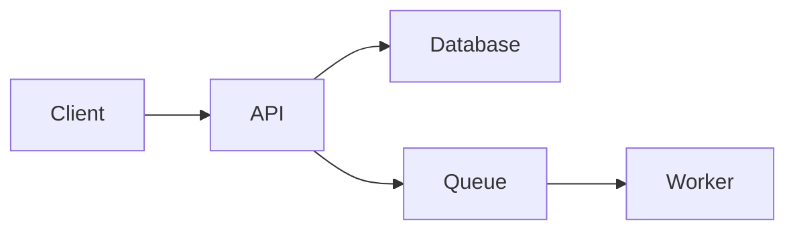

# <Project Name> — Architecture

The architecture is HOW the project is built. Update when major structural choices change.

---

## System overview

<A Mermaid diagram or prose description of the major components and how they connect.>

## Components

- **<Component 1>:** what it does, what tech stack, where it lives.
- **<Component 2>:**

## Data model

<Tables / collections / schemas and their relationships. Link to migration files.>

## Key flows

### <Flow 1 name>

1. Step
2. Step
3. Step

## External dependencies

- <Service> — what we use it for / what breaks if it's down
- <Service>

## Non-obvious decisions

<Link to specific `decisions.md` entries that shaped this architecture.>
